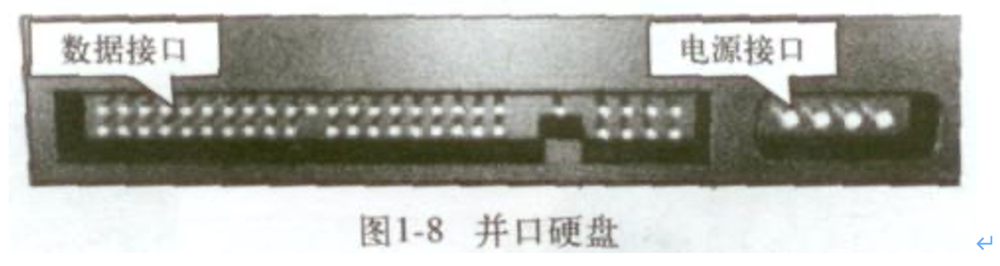

# 硬盘的基础知识介绍

20120712笔记,部分可能不适合当前环境了。

# 1.1.	硬盘历史
当前硬盘的发展趋势：体积更小，速度更快，容量更大，使用更安全。
# 1.2.	硬盘的外部结构
### 1.2.1.	硬盘介绍
硬盘主要包括：盘片、磁头，盘片主轴，控制电机、磁头控制器，数据转换器、接口、缓存等几个部分。所有的盘片都固定在一个旋转轴上，这个轴即旋转主轴。而所有的盘片之间是平行的，在每个盘片(一个盘片两个盘面)的存储面上都有一个磁头，磁头与盘片之间的距离比头发丝的直径还小许多倍。所有的磁头（一个有效盘面就有一个磁头）连在一个磁头控制器上，由磁头控制器负责各个磁头的。磁头可沿盘片的半径方向运动，而盘片以每分钟数千转的速度在高速旋转，这样磁头就能盘片指定位置进行数据的读写操作。硬盘是精密设备，灰尘是其大敌，所以需要密封。
### 1.2.2.	外部结构
IDE硬盘：
 
--------------------------
笔记本硬盘：


SSD硬盘：


线上应用的存储尽量用sas，比如，数据库、图片的线上应用，数据冷备份用sata，比如站点程序及数据库、图片的备份等。

硬盘外部结构可分成如下几个部分：



## 1.3.	硬盘的内部结构
### 1.3.1.	内部结构
硬盘内部结构由固定面板、控制电路板、磁头、盘片、主轴、电机、接口、及其它附件组成，其中磁头及盘片组件是硬盘的核心，它封装在硬盘的密封腔体内，包括有浮动磁头组件、磁头驱动装置、盘片、主轴驱动装置及前置读写控制电路这几个部分。


### 1.3.2.	磁头组件及磁头
(1)磁头组件。包括读写磁头、传动手臂、传动轴三部分组成。磁头是硬盘技术中最重要和关键的一环，实际上是集成工艺制成的多个磁头的组合，它采用了非接触式头、盘结构，加后电在高速旋转的磁盘表面移动，与盘片之间的间隙只有0.1～0.3um，这样可以获得很好的数据传输率。现在转速为7200RPM的硬盘飞高一般都低于0.3um，以利于读取较大的高信噪比信号，提供数据传输率的可靠性。
硬盘的工作原理，它是利用特定的磁粒子的极性来记录数据。磁头在读取数据时，将磁粒子的不同极性转换成不同的电脉冲信号，再利用数据转换器将这些原始信号变成电脑可以使用的数据，写的操作正好与此相反。


(2)磁头驱动机构。盘硬的寻道是靠移动磁头，而移动磁头则需要该机构驱动才能实现。磁头驱动机构由电磁线圈电机、磁头驱动小车、防震动装置构成，高精度的轻型磁头驱动机构能够对磁头进行正确的驱动和定位，并能在很短的时间内精确定位系统指令指定的磁道。

其中电磁线圈电机包含着一块永久磁铁，这是磁头驱动机构对传动手臂起作用的关键，磁铁的吸引力足起吸住并吊起拆硬盘使用的螺丝刀。防震动装置在老硬盘中没有，它的作用是当硬盘受动强烈震动时，对磁头及盘片起到一定的保护使用，以避免磁头将盘片刮伤等情况的发生。这也是为什么旧硬盘的防震能力比现在新硬盘差得多的缘故。


### 1.3.3.	磁盘片、主轴组件及前置控制电器
(3)磁盘片。盘片是硬盘存储数据的载体，现在硬盘盘片大多采用金属薄膜材料，这种金属薄膜较软盘的不连续颗粒载体具有更高的存储密度、高剩磁及高矫顽力等优点。另外，IBM还有一种被称为“玻璃盘片”的材料作为盘片基质，玻璃盘片比普通盘片在运行时具有更好的稳定性。从图11中可以发现，硬盘盘片是完全平整的，简直可以当镜子使用。


(4)主轴组件。主轴组件包括主轴部件如轴承和驱动电机等。随着硬盘容量的扩大和速度的提高，主轴电机的速度也在不断提升，有厂商开始采用精密机械工业的液态轴承电机技术。例如希捷公司的酷鱼ATA IV就是采用此电机技术，这样有利于降低硬盘工作噪音。


(5)、前置控制电路。前置电路控制磁头感应的信号、主轴电机调速、磁头驱动和伺服定位等，由于磁头读取的信号微弱，将放大电路密封在腔体内可减少外来信号的干扰，提高操作指令的准确性。
1.4.	硬盘控制电路
1.4.1.	控制电路
1.5.	硬盘拆解
1.5.1.	拆解过程
在开始解剖过程叙述之前，需要提醒用户注意：硬盘内部是绝对无尘的，在普通环境下将硬盘拆开，即意味着你的硬盘将报废，所以不要轻易将你的硬盘按笔者这样解剖。

## 1.6.	硬盘接口
硬盘接口是硬盘与主机系统间的连接部件，作用是在硬盘缓存和主机内存之间传输数据。不同的硬盘接口决定着硬盘与计算机之间的连接速度，在整个系统中，硬盘接口的优劣直接影响着程序运行快慢和系统性能好坏。IDE，SATA，SCSI和光纤通道。从整体的角度上，硬盘接口分为IDE、SATA、SCSI和光纤通道四种，IDE接口硬盘多用于家用产品中，也部分应用于服务器，SCSI接口的硬盘则主要应用于服务器市场，而光纤通道只在高端服务器上，价格昂贵。SATA主要应用于家用市场，有SATA、SATAΙΙ、SATAΙΙΙ，是现在的主流。
### 1.6.1.	IDE硬盘与IDE接口
### 1.6.2.	SATA硬盘与SATA接口
SATA（Serial ATA）口的硬盘又叫串口硬盘。Serial ATA采用串行连接方式，串行ATA总线使用嵌入式时钟信号，具备了更强的纠错能力，与以往相比其最大的区别在于能对传输指令（不仅仅是数据）进行检查，如果发现错误会自动矫正，这在很大程度上提高了数据传输的可靠性。串行接口还具有结构简单、支持热插拔的优点。
Serial ATA 1.0定义的数据传输率可达150MB/s，这比目前最新的并行ATA（即ATA/133）所能达到133MB/s的最高数据传输率还高，而在Serial ATA 2.0的数据传输率将达到300MB/s，最终SATA将实现600MB/s的最高数据传输率。

 　　
左边是串行数据传输线，右边是并行数据传输线。

### 1.6.3.	SCSI硬盘与SCSI接口
SCSI的英文全称为“Small Computer System Interface”（小型计算机系统接口），是同IDE（ATA）完全不同的接口，IDE接口是普通PC的标准接口，而SCSI并不是专门为硬盘设计的接口，是一种广泛应用于小型机上的高速数据传输技术。SCSI接口具有应用范围广、多任务、带宽大、CPU占用率低，以及热插拔等优点，但较高的价格使得它很难如IDE硬盘般普及，因此SCSI硬盘主要应用于中、高端服务器和高档工作站中。


### 1.6.4.	SAS硬盘与SAS接口

SAS(Serial Attached SCSI)即串行连接SCSI，是新一代的SCSI技术，和现在流行的Serial ATA(SATA)硬盘相同，都是采用串行技术以获得更高的传输速度，并通过缩短连结线改善内部空间等。SAS是并行SCSI接口之后开发出的全新接口。此接口的设计是为了改善存储系统的效能、可用性和扩充性，并且提供与SATA硬盘的兼容性。
```
SAS技术的优势:
(1)SAS技术降低了磁盘阵列的成本:
(2)串行接口让传输性能提高:
(3)更好的扩展性能:
(4)安装更简单:
(5)更好的兼容性:
```
### 1.6.5.	光纤通道
### 1.6.6.	SSD硬盘
固态硬盘（Solid State Drive、IDE FLASH DISK）由控制单元和存储单元（FLASH芯片）组成，简单的说就是用固态电子存储芯片阵列而制成的硬盘，固态硬盘的接口规范和定义、功能及使用方法上与普通硬盘的相同，在产品外形和尺寸上也与普通硬盘一致。其芯片的工作温度范围很宽（-40~85℃）。目前广泛应用于军事、车载、工控、视频监控、网络监控、网络终端、电力、医疗、航空、导航设备等领域。

| 项目   | 固态硬盘              | 传统硬盘 |
|------|-------------------|------|
| 容量   | 	较小               | 	大   | 
| 价格   | 	高                | 	低   | 
| 随机存取 | 	极快               | 	一般  | 
| 写入次数 | 	SLC:10万次 MLC:1万次 | 	无限制 | 
| 盘内阵列 | 	可                | 	极难  |
| 工作噪音 | 	无	               | 有    |         
| 工作温度 | 	极低               | 	较明显 |         
| 防震   | 	很好               | 	较差  |         
| 数据恢复 | 	难                | 	可以  |            
| 重量   | 	轻	               | 重    |          

### 1.6.7.	生产环境硬盘的选型和应用案例
#### 1.6.7.1.	服务器选型
DELL,HP,IBM等

#### 1.6.7.2.	硬盘选型
主流硬盘SAS，SATA,SSD(SAS SATA是主流生产环境使用SSD固态硬盘,效率最高，非机械式，电子设备，价格高)
- SAS 15000转/M,主流是300G和600G,老男孩现在多用600G,用于线上服务器，如数据库服务及相关高并发服务。
- SATA 7200-10000转/分 1T和2T,用于线下不提供服务的存储。不能用于高并发业务的存储，会死人的。
- SSD 固态硬盘，容量少，价格贵。一般用于数据量小并且超大规模高并发的业务。
- 
提示：大公司有的会根据数据热度来综合使用分层存储，以达到性价比最佳的情况。

#### 1.6.7.3.	不同类型硬盘基本数据的比较

| 类型    | 性质  | 转数           | 主流产品                                                                                                 | 价格（企业级）                                                                  |
|-------|-----|--------------|------------------------------------------------------------------------------------------------------|--------------------------------------------------------------------------|
| SATA	 | 机械  | 	7.2k-10k转/分 | 	1-2T	                                                                                               | 1400RMB(7.2K 2T)                                                         |
| SAS	  | 机械	 | 15k转/分	      | 300-600G                                                                                             | 	1200-2000RMB(15K)                                                       |
| SSD	  | 电子	 | 	            | 40G <br/>80G <br/>120G<br/> 160G<br/> 300G <br/>600G | 	600RMB  <br/>1100RMB <br/> 1500RMB <br/> 1900RMB <br/> 3800RMB <br/> 7500RMB |

#### 1.6.7.4.	淘宝CDN缓存对象分级存储策略案例
问题：
淘宝CDN缓存对象具有的特征是：18KB以下的对象数量占总数量的80%，而存储量只有不到40%；同时，80%被访问对象所占用的存储空间不到20%。

分析:
这意味着“热数据”（访问频次高的内容）占的空间其实很小，而“冷数据”（访问频次低的内容）所需存储量很大。

解决：
因此，淘宝特意为该低功耗服务器引入分层存储机制，所以单台低功耗服务器的硬盘其实是由一块80GB的SSD盘和两块500GB的SATA盘组成。这样，“热数据”存放在SSD盘上，“冷数据”就存放在SATA盘上，从而兼顾速度、容量与成本。而分层存储调度软件则由淘宝独立开发。
#### 1.6.7.5.	网站架构不同角色服务器硬盘选型策略
例如：web server 如何配置硬盘容量和个数，负载均衡器如何配置容量和个数，存储，数据库等，这些内容以后会有详细的说明。
