# 硬盘的工作原理介绍


## 1.1.	磁头、扇区、磁道和柱面
一块硬盘有1个到数个盘片不等，其中每个有效盘面对应一个读写磁头，从上往下从0开始依次编号， 不同的硬盘盘面在逻辑上被划分为磁道、柱面、以及扇区。一般在出厂时就设置好了这些。

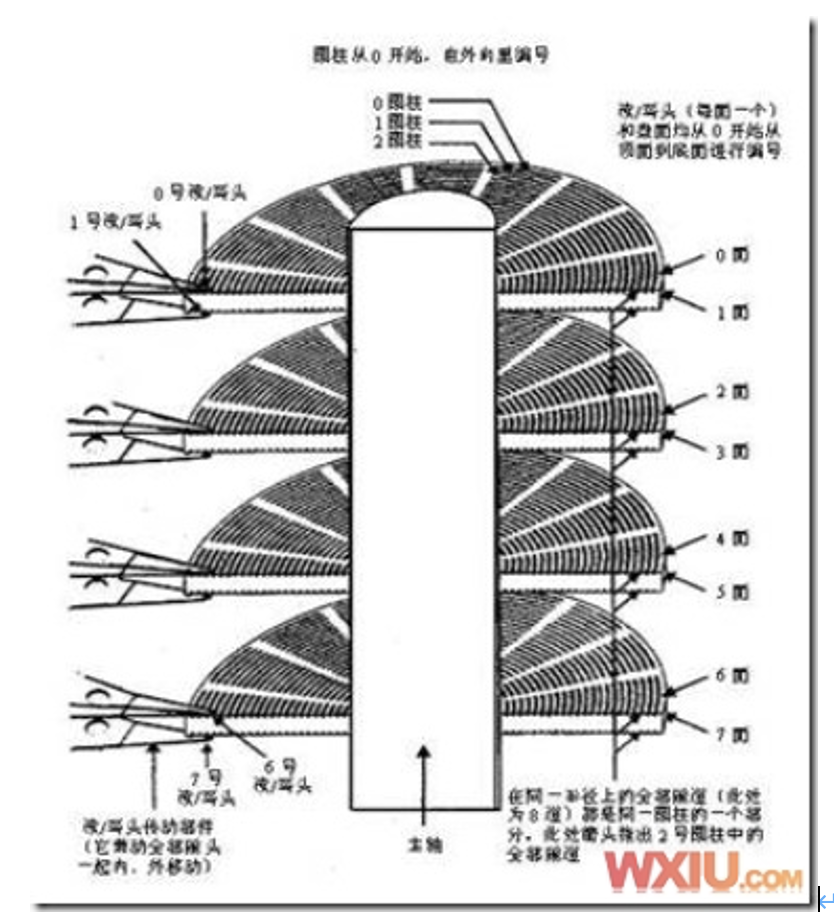

### 1.1.1.	磁头
硬盘的每个盘片的每个面都有一个读写磁头(磁头数=盘片数*2)，磁盘盘面区域的划分如图所示。

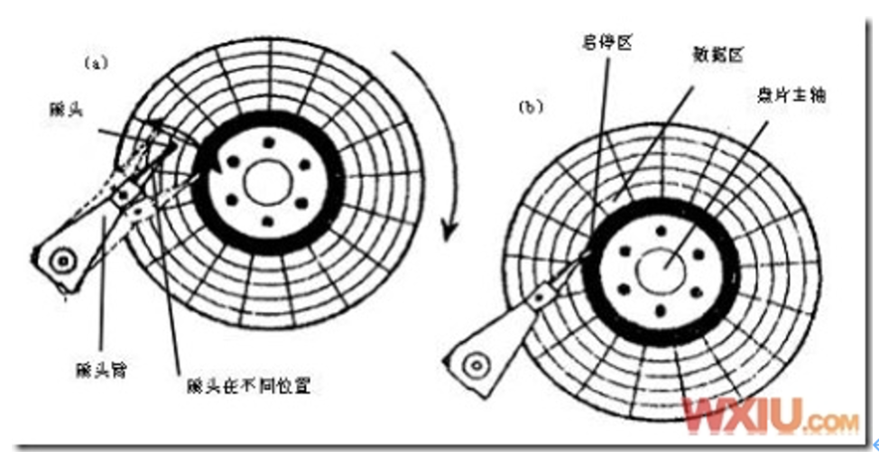
在硬盘静止时，磁头停靠在靠近主轴接触盘片的表面，即线速度最小的地方。是一个特殊的区域，它不存放任何数据，称为启停区或着陆区（landing zone），启停区外就是数据区。

在硬盘的最外圈，离主轴最远的地方是“0”磁道，硬盘数据的存放就是从最外圈开始的。那么，磁头是如何找到“0”磁道的位置的呢？在硬盘中还有一个叫“0”磁道检测器的构件，它是用来完成硬盘的初始定位。系统引导程序在磁盘的0磁道1扇区。

盘片旋转产生的气流相当强，足以使磁头托起，并与盘面保持一个微小的距离。这个距离越小，磁头读写数据的灵敏度就越高，当然对硬盘各部件的要求也越 高。早期设计的磁盘驱动器使磁头保持在盘面上方几微米处飞行。稍后一些设计使磁头在盘面上的飞行高度降到约0.1μm～0.5μm，现在的水平已经达到 0.005μm～0.01μm，这只是人类头发直径的千分之一。

气流既能使磁头脱离开盘面，又能使它保持在离盘面足够近的地方，非常紧密地跟随着磁盘表面呈起伏运动，使磁头飞行处于严格受控状态。磁头必须飞行在盘面上方，而不是接触盘面，这种位置可避免擦伤磁性涂层，而更重要的是不让磁性涂层损伤磁头。

但是，磁头也不能离盘面太远，否则，就不能使盘面达到足够强的磁化，难以读出盘上的磁化翻转（磁极转换形式，是磁盘上实际记录数据的方式）。
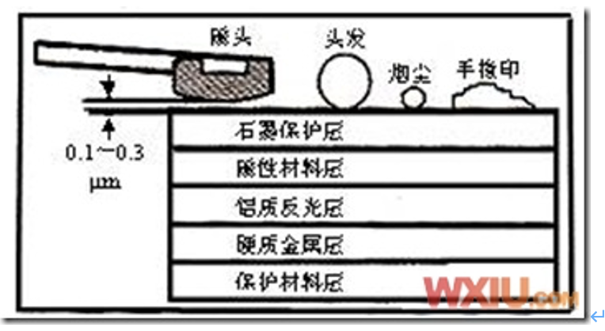

硬盘驱动器磁头的飞行悬浮高度低、速度快，一旦有小的尘埃进入硬盘密封腔内，或者一旦磁头与盘体发生碰撞，就可能造成数据丢失，形成坏块，甚至造成 磁头和盘体的损坏。所以，硬盘系统的密封一定要可靠，在非专业条件下绝对不能开启硬盘密封腔，否则，灰尘进入后会加速硬盘的损坏。另外，硬盘驱动器磁头的 寻道伺服电机多采用音圈式旋转或直线运动步进电机，在伺服跟踪的调节下精确地跟踪盘片的磁道，所以，硬盘工作时不要有冲击碰撞，搬动时要小心轻放。

### 1.1.2.	总括
硬盘的最基本组成的部分是由坚硬金属材料制成的涂以磁性介质的盘面，不同容量的硬盘的盘片。

磁道Track：每个盘片有两个面，都可记录信息。盘片表面以盘片中心为圆心，不同半径的同心圆称为磁道。

扇区Sector：盘片向由圆心向四周画直线，不同的磁道直线被人成许多扇形区域，每个弧形的区域叫做扇区，每个扇区的大小通常为512字节。

柱面Cylinder：不同的盘片相同半径的磁道从上到下所组成的圆柱型区域称为柱面。

盘片有两个面，每个面都有一个读写磁头，习惯用磁头号来区分。扇区，磁道（或柱面）和磁头数构成了硬盘结构的基本参数，通过这些参数可以得到硬盘的容量，计算公式为：

存储容量＝磁头数 × 磁道（柱面）数 × 每道扇区数 × 每扇区字节数

存储容量＝柱面大小(每磁道的扇区数x每扇区的字节数 x 磁头数) × 柱面数

提示：一块硬盘的磁道数和柱面数的数量是相等的。
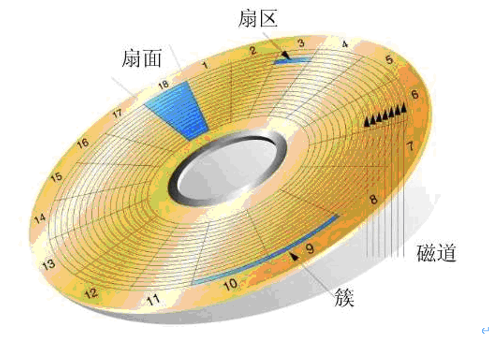

```
[root@linuxdb ~]# fdisk -l

Disk /dev/sda: 598.9 GB, 598999040000 bytes
255 heads, 63 sectors/track, 72824 cylinders
Units = cylinders of 16065 * 512 = 8225280 bytes

#Units = 255 heads * 63 sectors/track *512= 16065 * 512 = 8225280 bytes
#总容量 = Units * 72824(cylinders) = 8225280 bytes * 72824 = 598997790720 / (1000 *1000) = 598997.90720M=598.99790720G
#总容量 = 柱面大小(255 heads * 63 sectors/track) * 柱面数

要点：
（1）硬盘有1个或数个盘片，每盘片两个面，每个面对应一个读写磁头。
（2）盘片被划分为多个扇形区域即扇区(Sector)
（3）同一盘片不同半径的同心圆为磁道(Track)
（4）不同盘片相同半径构成的圆柱面即柱面(cylinder)
（5）信息记录可表示为：某磁道（柱面），某磁头，某扇区
```
### 1.1.3.	盘面
硬盘的盘片一般用铝合金材料做基片，高速硬盘也可能用玻璃做基片。硬盘的每一个盘片都有两个盘面（side），即上、下盘面，一般每个盘面都会利 用，都可以存储数据，成为有效盘片，也有极个别的硬盘盘面数为单数。每一个这样的有效盘面都有一个盘面号，按顺序从上至下从“0”开始依次编号。在硬盘系 统中，盘面号又叫磁头号，因为每一个有效盘面都有一个对应的读写磁头。硬盘的盘片组在2～14片不等，通常有2～3个盘片，故盘面号（磁头号）为0～3或 0～5。盘面数等于磁头数。
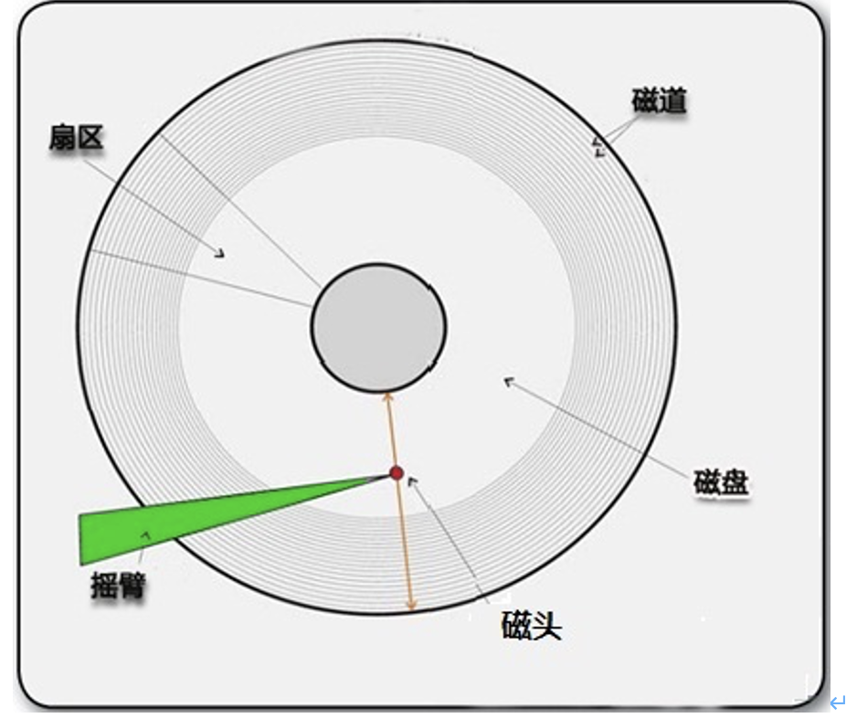

### 1.1.4.	磁道

磁盘在格式化时被划分成许多同心圆，这些同心圆轨迹叫做磁道（track）。磁道从外向内从0开始顺序编号。硬盘的每一个盘面有300～1 024个磁道，新式大容量硬盘每面的磁道数更多。信息以脉冲串的形式记录在这些轨迹中，这些同心圆不是连续记录数据，而是被划分成一段段的圆弧，这些圆弧的角速度一样。由于径向长度不一样，所以，线速度也不一样，外圈的线速度较内圈的线速度大，即同样的转速下，外圈在同样时间段里，划过的圆弧长度要比内圈 划过的圆弧长度大。每段圆弧叫做一个扇区，扇区从"1"开始编号，每个扇区中的数据作为一个单元同时读出或写入。一个标准的3.5寸硬盘盘面通常有几百到 几千条磁道。磁道是“看”不见的，只是盘面上以特殊形式磁化了的一些磁化区，在磁盘格式化时就已规划完毕。

### 1.1.5.	柱面
所有盘面上的同一磁道的圆形轨迹从上到下依次组成一个圆柱体，称做柱面（cylinder），每个圆柱上的磁头由上而下从“0”开始编号。
一块硬盘驱动器的圆柱数（或每个盘面的磁道数）既取决于每条磁道的宽窄（同样，也与磁头的大小有关），也取决于定位机构所决定的磁道间步距的大小。
### 1.1.6.	扇面
操作系统以扇区（sector）形式将信息存储在硬盘上，每个扇区包括512个字节的数据和一些其他信息。一个扇区有两个主要部分：存储数据地点的标识符和存储数据的数据段。
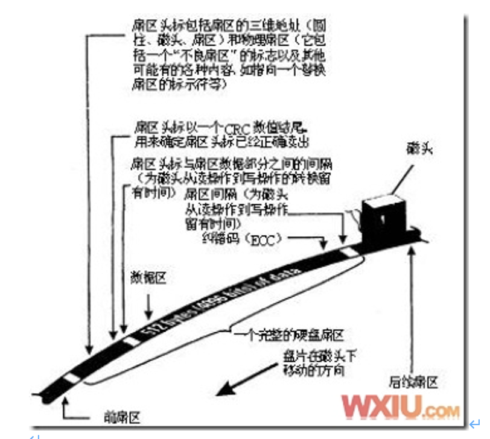

扇区的第一个主要部分是标识符。标识符就是扇区头标，包括组成扇区三维地址的三个数字：扇区所在的磁头（或盘面）、磁道（或柱面号）以及扇区在磁道上的位置即扇区号。头标中还包括一个字段，其中有显示扇区是否能可靠存储数据，或者是否已发现某个故障因而不宜使用的标记。有些硬盘控制器在扇区头标中 还记录有指示字，可在原扇区出错时指引磁盘转到替换扇区或磁道。最后，扇区头标以循环冗余校验（CRC）值作为结束，以供控制器检验扇区头标的读出情况， 确保准确无误。

扇区的第二个主要部分是存储数据的数据段，可分为数据和保护数据的纠错码（ECC）。在初始准备期间，计算机用512个虚拟信息字节（实际数据的存放地）和与这些虚拟信息字节相应的ECC数字填入这个部分。

## 1.2.	硬盘的工作原理
### 1.2.1.	硬盘的读写原理
数据的读/写一般是按柱面进行的，即磁头读写数据时首先在同一柱面内从0磁头开始进行操作，依次向下在同一柱面的不同盘面即不同磁头上操作，只在同一柱面所有的磁头全部读/写完毕后，磁头才转移到下一柱面（即寻道）。因为切换磁头只需通过电子设备切换就可以了，而切换柱面则必须通过机械设备切换。读写数据按照这种方式，能提高读写效率。

系统将文件存储到磁盘上时，按柱面、磁头、扇区的方式进行，即最先是第1磁道的第一磁头下（也就是第1盘面的第一磁道）的所有扇区，然后，是同一柱面的下一磁头，……，一个柱面存储满后就推进到下一个柱面，直到把文件内容全部写入磁盘。
系统也以相同的顺序读出数据。读出数据时通过告诉磁盘控制器要读出扇区所在的柱面号、磁头号和扇区号（物理地址的三个组成部分）进行。磁盘控制器则 直接使磁头部件步进到相应的柱面，选择相应的磁头，等待要求的扇区移动到磁头下。
扇区到来时，磁盘控制器读出每个扇区的头标，把这些头标中的地址信息与 期待检出的磁头和柱面号做比较（即寻道），然后，寻找要求的扇区号。待磁盘控制器找到该扇区头标时，根据其任务是写扇区还是读扇区，来决定是转换写电路， 还是读出数据和尾部记录。
　　找到扇区后，磁盘控制器必须在继续寻找下一个扇区之前对该扇区的信息进行后处理。如果是读数据，控制器计算此数据的ECC码，然后，把ECC码与已记录的ECC码相比较。如果是写数据，控制器计算出此数据的ECC码，与数据一起存储。在控制器对此扇区中的数据进行必要处理期间，磁盘继续旋转。

### 1.2.2.	磁盘碎片
用一张ACSII码图来解释为什么会产生磁盘碎片。
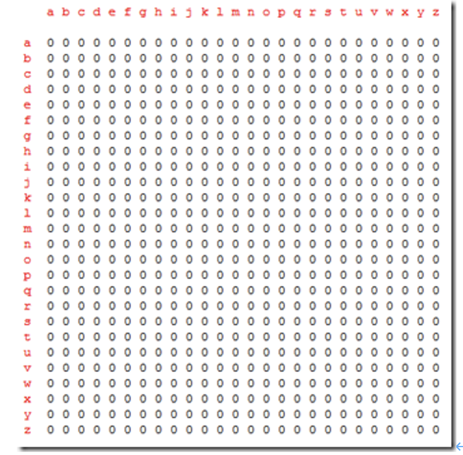


上面的ASCII图表示磁盘文件系统，由于目前上面没有任何数据文件，所以我把他表示成0。

在图的最上侧和左侧各有a-z 26个字母，这是用来定位每个数据字节的具体位置，如第1行1列是aa,26行26列是zz。

我们创建一个新文件，理所当然的，我们的文件系统就产生了变化，现在是

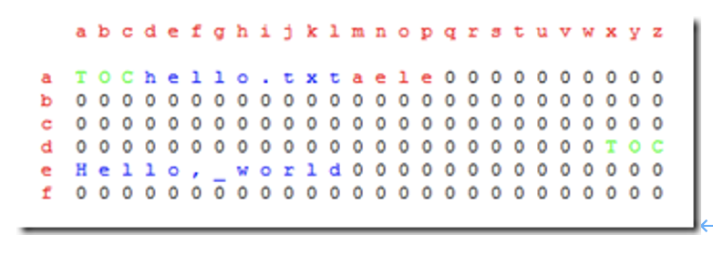

如图所示：”内容表”(TOC)占据了前四行,在TOC里存贮着每件文件在系统里所在的位置。

在上图，TOC包括了一个名字叫hello.txt的文件，其具体内容是”Hello, world”，在系统里的位置是ae到le。

接下来再新建一个文件

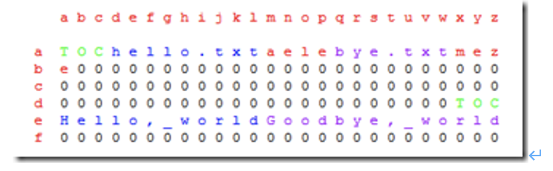

如图，我们新建的文件bye.txt紧贴着第一个文件hello.txt。

其实这是最理想的系统结构，如果你将你的文件都按照上图所表示的那样一个挨着一个，紧紧的贴放在一起的话，那么读取他们将会非常的容易和迅速，这是因为在硬盘里动得最慢的(相对来说)就是传动手臂，少位移一些，读取文件数据的时间就会快一些。

然而恰恰这就是问题的所在。现在我想在”Hello, World”后加上些感叹号来表达我强烈的感情，现在的问题是：在这样的系统上，文件所在的行就没有地方让我放这些感叹号了，因为bye.txt占据了剩下的位置。

现在有俩个方法可以选择，但是没有一个是完美的

1.我们从原位置删除文件，重新建个文件重新写上”Hello, World!!”. –这就无意中延长了文件系统的读和写的时间。

2.打碎文件，就是在别的空的地方写上感叹号，也就是”身首异处”–这个点子不错，速度很快，而且方便，但是，这就同时意味着大大的减慢了读取下一个新文件的时间。

如果你对上面的文字没概念,上图

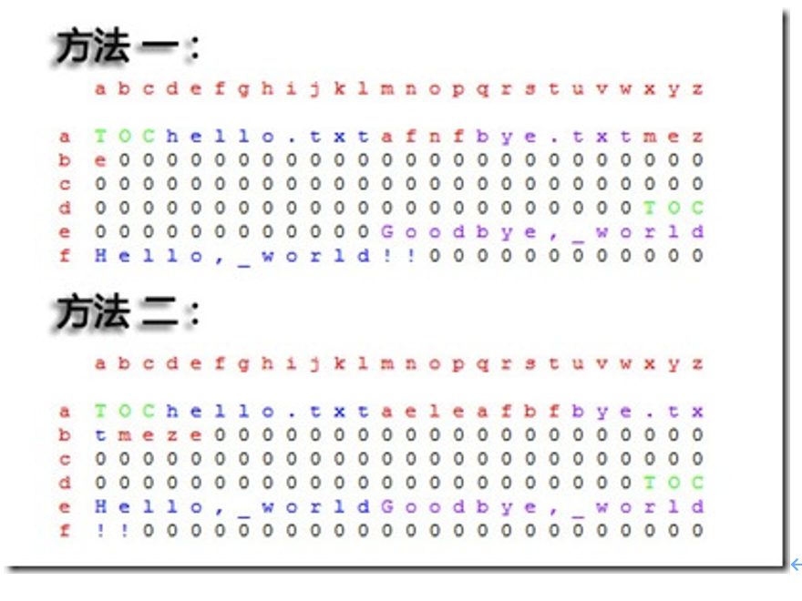

这里所说的方法二就像是我们的windows系统的存储方式，每个文件都是紧挨着的，但如果其中某个文件要更改的话，那么就意味着接下来的数据将会被放在磁盘其他的空余的地方。

如果这个文件被删除了，那么就会在系统中留下空格，久而久之，我们的文件系统就会变得支离破碎，碎片就是这么产生的。
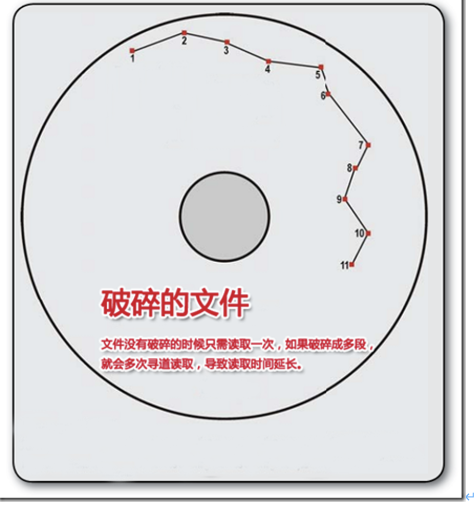
1.2.3.	硬盘读写原理图版
