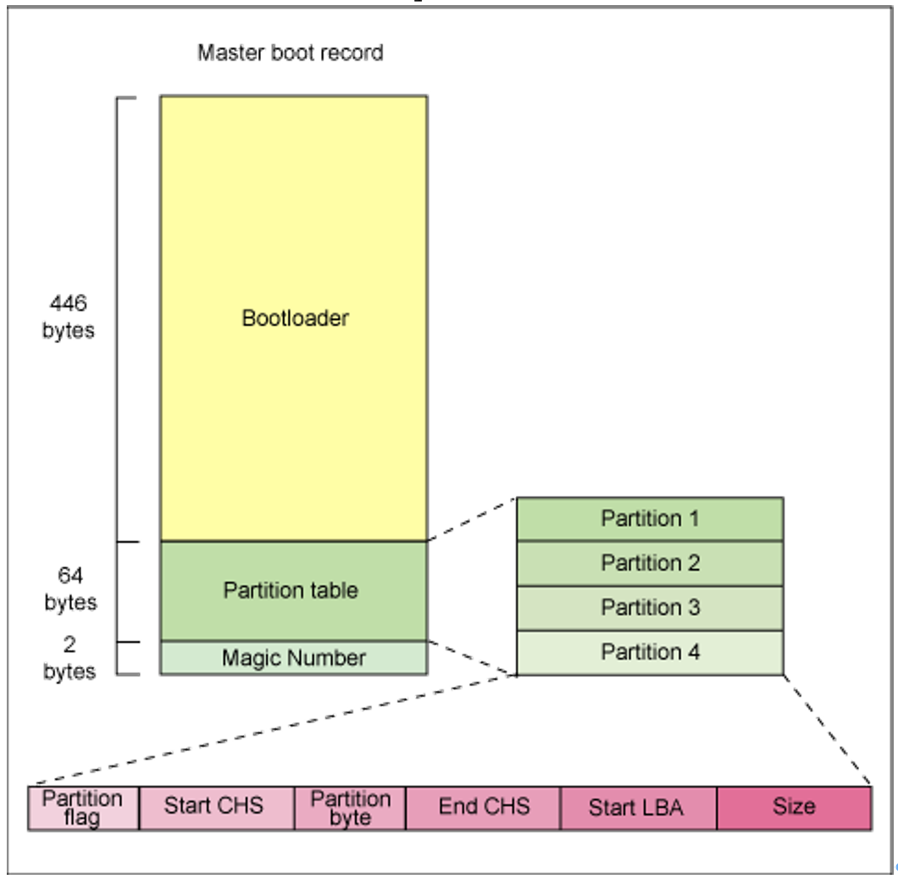
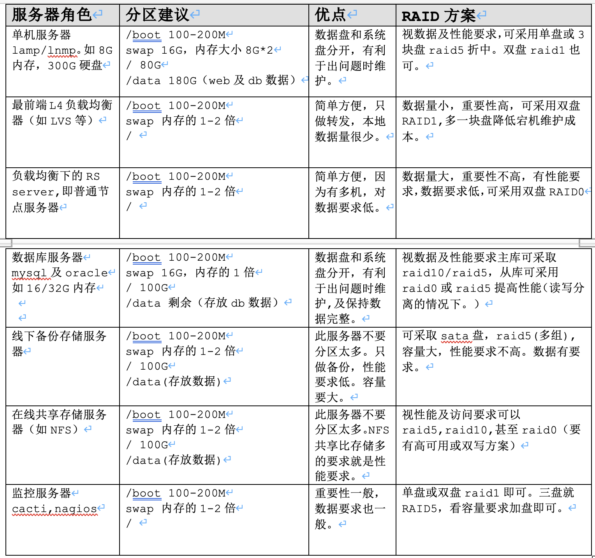

# 硬盘分区相关知识介绍

20120722 笔记，部分内容可能已经过期

## 1.1.	硬盘存储结构简图
//TODO 画图

一个硬盘的存储结构包括主引导分区，分区表，分区结束标志，及其它分区的引导信息及数据区信息。

主引导扇区在整个硬盘中是唯一的，硬盘中只能有一个。
### 1.1.1.	主引导分区
硬盘的0磁头0磁道1扇区，是硬盘上的一个非常重要的位置。在这个扇区中，存放有硬盘的主引导记录MBR（Master Boot Record）和硬盘的分区表DPT（Disk Partition Table）。在这总共512字节的扇区中，其中446字节内存放着硬盘的主引导程序，随后64字节存放着硬盘分区表DPT,最后2个字节(55 AA)是分区结束标志，446+64+2=512byte。



MBR的作用是检查分区表是否正确以及确定哪个分区为引导区，并在MBR引导结束时把该分区的启动程序(操作系统引导扇区)调入内存执行。

硬盘分区表DPT位于1扇区的末端，占用64bytes,以80H或00H为开始标志，以55AAH为结束标志。整个可以保存四个主分区（4P）或3个主分区及一个扩展分区（3P+E），每个分区占用16yte,64byte/16=4个分区。
### 1.1.2.	分区引导信息
### 1.1.3.	数据区（DATA）
数据存储的区域

## 1.2.	硬盘分区知识
硬盘为什么要分区？因为我们必须要告诉操作系统，硬盘可以访问的区域是由A柱面到B柱面，只有这样操作系统才能够控制硬盘磁头去这个分区范围去读取数据。否则，操作系统就不知道去哪里读取数据。分区的重点就是记录每一个分区的起始与结束柱面。

硬盘使用前要分区。硬盘分区有主分区、扩展分区和逻辑分区之分，一块硬盘最多有4个主分区，其中一个主分区位置可以用一个扩展分区替换，且一块硬盘只能有一个扩展分区，在这个扩展分区可以划分多个逻辑分区。
### 1.2.1.	主分区Primary
一般来说主分区是硬盘上必须的分区，一般为第一分区，我们可以在上面安装操作系统。在一个磁盘上最多只能有4个主分区。

### 1.2.2.	扩展分区Extended
严格来说，扩展分区不能算是一个正常的分区，而是一个链接。起到一个指向的作用。我们可以再扩展分区内再建立逻辑分区。扩展分区就是虚拟出来的一个小硬盘一样，但是不同的是，没有MBR,而只有扩展分区表，而这个扩展分区表没有64bytes的限制的，所以可以在扩展分区划分多个逻辑分区。

### 1.2.3.	逻辑分区logical
不能在硬盘中单独划分逻辑分区，逻辑分区必须存在于扩展分区内，在扩展分区内可以划分多个逻辑分区。

### 1.2.4.	分区要点
```
一个硬盘的分区方式之一只能为如下组合之一：
(1)	任意多个主分区，但要求(1<=主分区<=4)
(2)	扩展分区和主分区组合，但要求1<=主分区+扩展分区<=4。如：3个主分区+1个扩展分区或2个主分区+1个扩展分区或1个主分区+1个扩展分区
(3)	如果要分区成四块硬盘分区的话，那么最多就是可以：P+P+P+P或P+P+P+E。

说明：
(1)	扩展分区不是一个真正的分区，建立完扩展分区需要在上面建立逻辑分区才能使用。
(2)	对于主分区和逻辑分区在使用上是没有区别的
(3)	分区数字编号1~4留给主分区或扩展分区全长，逻辑分区编号从5开始。
(4)	对硬盘分区，实际就是修改分区表(Partition table)
硬盘也可以不分区，直接格式化使用。
```
### 1.2.5.	硬盘分区设备名
在linux中，通过设备名来访问设备，设备名存放在"/dev"目录中。

```
设备名称如下，其它的分区可以依次类推：
--第一块IDE接口的硬盘称为 /dev/hda
--第一块IDE接口的硬盘称为 /dev/hdb
--第一块SCSI接口的硬盘称为 /dev/sda
--第二块SCSI接口的硬盘称为 /dev/sdb

--第一块IDE接口的硬盘第1分区称为 /dev/hda1
--第一块IDE接口的硬盘第5分区称为 /dev/hda5
--第二块SCSI接口的硬盘第1分区称为 /dev/sdb1
--第二块SCSI接口的硬盘第5分区称为 /dev/sdb5

注意：
1.	数字编号1~4留给主分区或扩展分区使用，逻辑分区从5开始。
2.	IDE硬盘设备名均以/dev/hd开头，不同的硬盘编号依次是/dev/hda、/dev/hdb、/dev/hdc……
3.	SCSI/SAS/SATA/USB接口的设备名均以/dev/sd开头。不同的硬盘编号依次是/dev/sda、/dev/sdb、/dev/sdc…
4.	特别强调：SAS/SATA为当前2010-2012互联网生产环境主流硬盘接口，SSD固态硬盘，由于是电子设备，性能很高，也逐渐被使用。
5.	Linux环境下没有盘符的概念。要对磁盘进行操作，需要使用磁盘设备名；要操作文件则需挂载创建在分区或逻辑卷上的文件系统。
6.	划分分区之后，还要在分区上创建文件系统。
```
```
分区要求
(1)	至少有 / 及swap 两个分区.
(2)	swap大小 = 1.5 * 物理内存，大内存情况下swap可以不分。
生产环境:
16G以下内存=>	swap 1.5~2倍
16~32G内存	=> 	swap 16G
32G内存	=>  swap 16G或8G
```
(3)	建议设置独立/boot分区 ，分区大小为100~200M

本文安装即使用常规的生产线上一般服务器分区方式/boot,swap,/三个分区。
## 1.3.	如何选择文件系统类型
```
reiserfs	小文件
XFS			数据库
ext4		数据库
```
对于Centos 5.x系列，常规使用ext3文件系统就可以了。
## 1.4.	生产场景分区方法

linux系统对分区的要求：
(1)	一般要有/以及swap分区(其实swap分区也可以不分)

(2)	swap分区的作用：虚拟内存功能，swap分区的大小=1.5*物理内存容量

(3)	建议设立独立的/boot分区，分区大小100M~200M。


生产环境服务器一般使用如下分区方案：/boot, swap, / 三个分区即可。

优点：简单方便，易于维护、可批量部署，最重要的是不会因为分多个分区，有的分区满了，有的分区剩余很多空间又不能被利用的情况（LVM的情况这里就先不阐述）

特别提示：也有其它方法扩展分区，如可用fdisk删除重建分区，然后再进行扩展，数据依然不丢，不过过程复杂，操作危险。

缺点：如果系统坏了，重新装系统时，因为所有数据都在/,而导致重装系统时数据备份麻烦。
如果是集群的多个节点之一，不存在需要备份数据的情况下，本文的分区方案的优点非常明显，不需要担心某个分区爆满需其它分区不能使用的情况。
另外一个问题就是可能使某个分区过大，导致频繁读取数据时，磁头寻道震动过大，降低磁盘读写性能。

如果是小公司，架构中没有负载均衡器，只有单机的web server,把程序,DB数据库数据单独分区就更好些。如/data/www存放程序资源目录。、/data/db存放数据库数据。

提示：以上的分区方式，是可以建立在raid技术基础之上的。



说明：现在的硬盘已很便宜，硬盘空间也比以前大很多，因此，再细致的去分区的必要性就不大了。简单、易用、方便批量管理（如监控）是基本原则。

## 1.5.	生产环境负载均衡集群系统架构设备选购案例
选购的依据：价格成本、性能、冗余、维护成本。

提示：所有服务器要带独立远程管理卡。
### 1.5.1.	负载均衡器硬件选择及raid级别
LVS1 主：DELL R610 1U , CPU E5606*2, 4G*2内存，　硬盘：SAS 146G*2 RAID1

LVS2 从：DELL R610 1U , CPU E5606*2, 4G*2内存，　硬盘：SAS 146G*2 RAID1

提示：负载均衡器很重要，需要稳定，对CPU,内存要求不高，如果是haproxy/nginx,根据服务在架构中的层次和数量决定如何选硬件。

### 1.5.2.	web层硬件选择及raid级别
www 主站1 业务(两台)：DELL R710 1U,CPU E5606*2,4G*4内存，硬盘：SAS 300G*2 RAID0

www 主站2 业务(两台)：DELL R710,CPU E5606*2,4G*4内存，硬盘：SAS 300G*2 RAID0

提示：为了节省成本，也可以选1U R610。如果机房机器海量，考虑到老跑机房换硬盘装系统的成本，也可以考虑SAS 146G*3 raid5。当然这部分也可以根据业务需要，实现虚拟化服务。

### 1.5.3.	数据库硬件选择及raid级别(适合mysql和oracle)
MYSQL 主库1-1：DELL R710, CPU E5606*2, 4G*8内存，硬盘：SAS 600G*6(或146G*6) RAID10

MYSQL 主库1-2：DELL R710, CPU E5606*2, 4G*8内存，硬盘：SAS 600G*6(或146G*6) RAID10

MYSQL 从库1-1：DELL R710, CPU E5606*2, 4G*4内存，硬盘：SAS 15K 600G*4  RAID0或RAID5

MYSQL 从库1-2：DELL R710, CPU E5606*2, 4G*4内存，硬盘：SAS 15K 600G*4  RAID0或RAID5

MYSQL 从库2-1：DELL R710, CPU E5606*2, 4G*4内存，硬盘：SAS 15K 600G*4  RAID0或RAID5

MYSQL 从库2-2：DELL R710, CPU E5606*2, 4G*4内存，硬盘：SAS 15K 600G*4  RAID0或RAID5

提示：这里需要注意主从库RAID后，硬盘大小要一致。性能和维护折中考虑，从库可考虑RAID5等。从库也可以根据硬件使用情况，跟多实例数据库，提升利用率。

### 1.5.4.	存储层硬件选择及raid级别
#### 1.5.4.1.	数据备份硬件选择及raid级别
DELL R610 ,CPU E5606*2, 16G内存，　硬盘：SATA 7.2-10k 2T*4 可以不做raid交叉备份。

DELL R710 ,CPU E5606*2, 16G内存，　硬盘：SATA 7.2-10k 2T*6 raid5做raid5是折中方案。

#### 1.5.4.2.	共享存储NFS硬件选择及raid级别
NFS1：DELL R710,CPU E5606*2, 16G内存，硬盘：SAS 15k 600G*6 RAID10/RAID5/RAID0

NFS2：DELL R710,CPU E5606*2, 16G内存，硬盘：SAS 15k 600G*6 RAID10/RAID5

对于高并发业务，可以使用分布式存储MFS,GFS,FASTFS, HDFS等；

分布式一般是多台服务器，因此普通服务器配置就可以了。

淘宝CDN缓存对象分级存储策略案例：

问题：
淘宝CDN缓存对象具有的特征是：18KB以下的对象数量占总数量的80%，而存储量只有不到40%；同时，80%被访问对象所占用的存储空间不到20%。

分析:
这意味着“热数据”（访问频次高的内容）占的空间其实很小，而“冷数据”（访问频次低的内容）所需存储量很大。

解决：
因此，淘宝特意为该低功耗服务器引入分层存储机制，所以单台低功耗服务器的硬盘其实是由一块80GB的SSD盘和两块500GB的SATA盘组成。这样，“热数据”存放在SSD盘上，“冷数据”就存放在SATA盘上，从而兼顾速度、容量与成本。而分层存储调度软件则由淘宝开发。

### 1.5.5.	监控管理网关层硬件选择及raid级别
DELL R610 ,CPU E5606*1, 8G内存，　146G*2 RAID1或146G*3 RAID 即可。

提示：也可以不单独采购，和备份或共享服务器使用同一台机器。

### 1.5.6.	网络设备：[采用全千M或万交换机]
CISCO, H3C, DLINK(3000元)

### 1.5.7.	近期DELL服务器厂商产品及报价
```
Power Edge 	Dell 服务器
R210(11G)	至强四核2.4G(X3430)/2G/250G(SATA)/DVD/三年	1U
R310(11G)	至强四核2.4G(X3430)/2G/250G(SATA)/DVD/三年	1U
R410(11G)	至强四核2.13G(E5606)/2G/300G(SAS)/SAS6IR/DVD/480W单电/非热/三年	1U
R410(11G)	至强四核2.13G(E5606)/2G/300G(SAS)/SAS6IR/DVD/480W单电/热插/三年	1U
R410(11G)	至强四核2.13G(E5606)/2G/300G(SAS)/SAS6IR/DVD/500W双电/非热/三年	1U
R410(11G)	至强四核2.13G(E5606)/2G/300G(SAS)/SAS6IR/DVD/500W双电/热插/三年	1U
R510(11G)	至强四核2.13G(E5606)/2G/300G(SAS)/SAS6IR/DVD/8背板/热插拔/三年	2U
R510(11G)	至强四核2.13G(E5606)/2G/300G(SAS)/SAS6IR/DVD/12背板/热插拔/三年	2U
R610(11G)	至强四核2.13G(E5606)/2G/300G(SAS)/SAS6IR/DVD/6背板/热插拔/三年	1U
R710(11G)	至强四核2.13G(E5606)/2G/300G(SAS)/SAS6IR/DVD/6背板/热插拔/三年	2U
R810(11G)	至强四核1.86G(E7520)*2/4G/300G(SAS)*2/PERC H700单电/三年/6背板	2U
R910(11G)	至强四核1.86G(E7520)*2/4G/300G(SAS)*2/PERC H700双电/三年/4背板	4U
R910(11G)	至强四核1.86G(E7520)*2/4G/300G(SAS)*2/PERC H700双电/三年/16背板	4U


单位	早期型号	对应近期型号
1U	DELL 1850,1950	DELL R310,R410,R610	可用于web,lvs
2U	DELL 2850,2950	R710	可用于mysql db等
4u	DELL 6850	R810,R910	可用于oracle,共享存储等
```
### 1.5.8.	近期H3C交换机厂商产品及报价(略)
### 1.5.9.	互联网站点常用网站架构模型(略)
