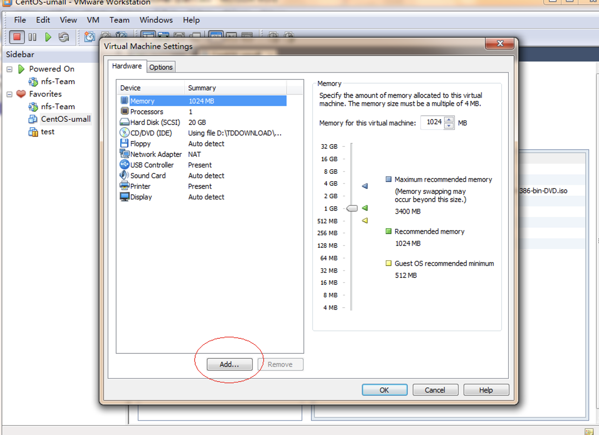
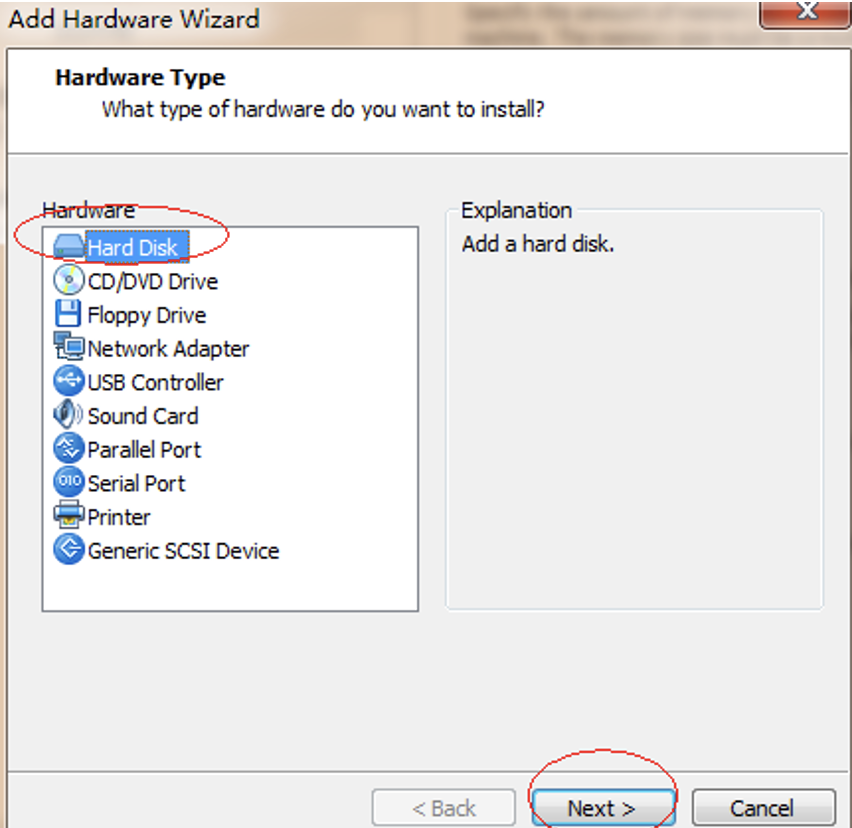
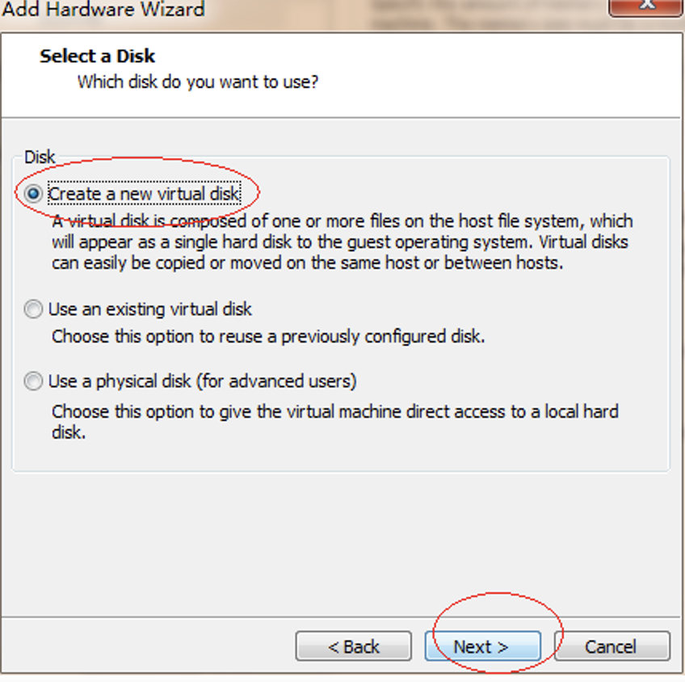
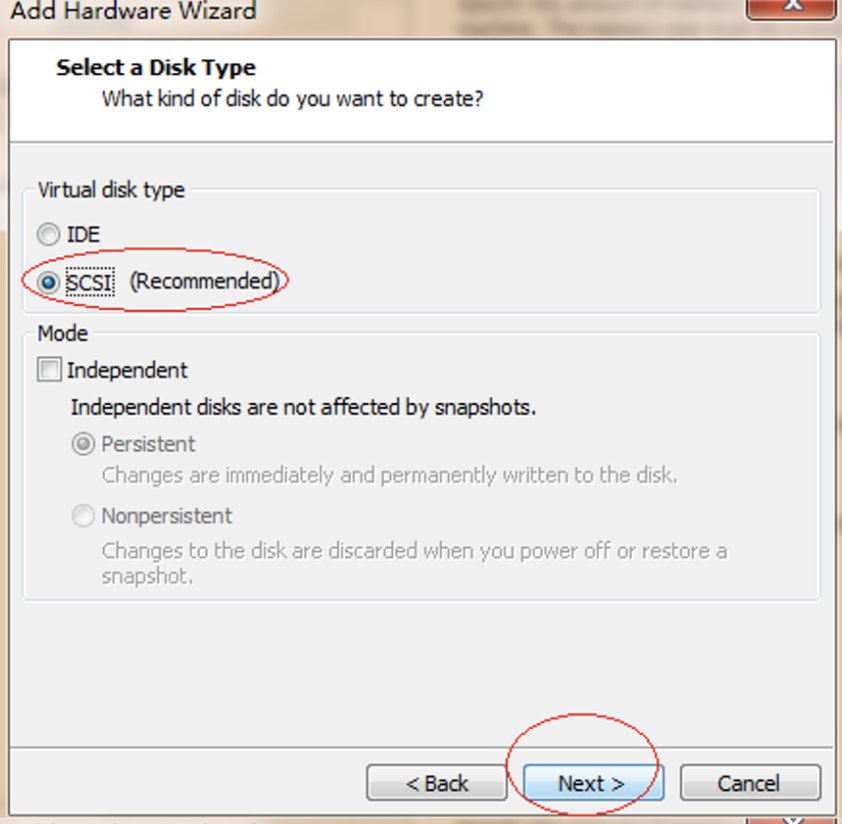
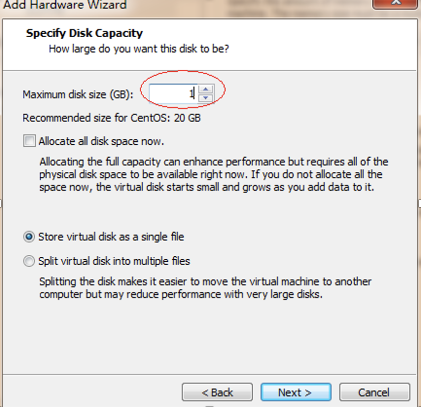
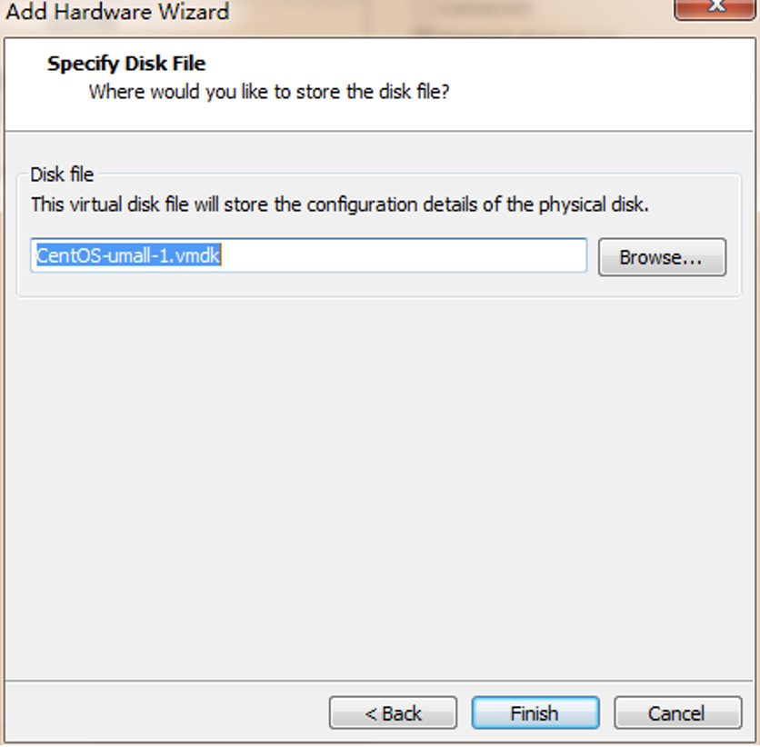
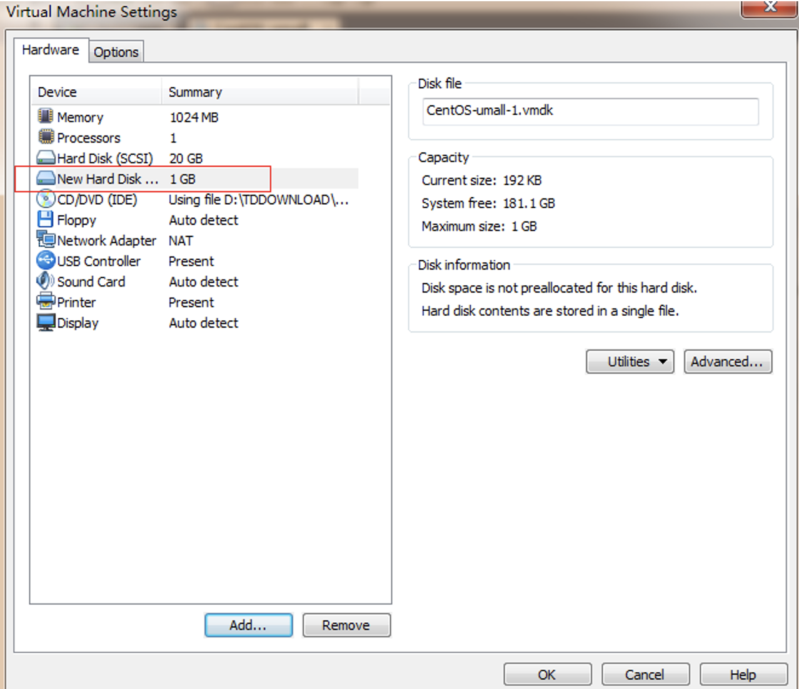

# fdisk分区命令实战讲解

# 题目
```
在虚拟机里添加一块1G的虚拟磁盘，请使用fdisk进行分区
分成2P+E的方式
P1大小200M
P2大小200M
E大小600M，对于E分区，在分两个逻辑驱动器，分别为300M。
提示：对分区格式化方法mkfs.ext3 /dev/sda1（分区名）
```
# 1.	虚拟机添加一块1G的虚拟磁盘
关闭虚拟机，执行如下操作：














重起虚拟机后，即可

# 2.	分区操作
## 2.1.	fdisk分区
```
[root@stu412 ~]# fdisk –l		#查看分区表

Disk /dev/sda: 21.4 GB, 21474836480 bytes
255 heads, 63 sectors/track, 2610 cylinders
Units = cylinders of 16065 * 512 = 8225280 bytes

Device Boot      Start         End      Blocks   Id  System
/dev/sda1   *           1          16      128488+  83  Linux
/dev/sda2              17        2544    20306160   83  Linux
/dev/sda3            2545        2609      522112+  82  Linux swap / Solaris

Disk /dev/sdb: 1073 MB, 1073741824 bytes
255 heads, 63 sectors/track, 130 cylinders
Units = cylinders of 16065 * 512 = 8225280 bytes

Disk /dev/sdb doesn't contain a valid partition table		#注意这里

[root@stu412 ~]# fdisk /dev/sdb
Device contains neither a valid DOS partition table, nor Sun, SGI or OSF disklabel
Building a new DOS disklabel. Changes will remain in memory only,
until you decide to write them. After that, of course, the previous
content won't be recoverable.

Warning: invalid flag 0x0000 of partition table 4 will be corrected by w(rite)

Command (m for help): m
Command action
a   toggle a bootable flag
b   edit bsd disklabel
c   toggle the dos compatibility flag
d   delete a partition
l   list known partition types
m   print this menu
n   add a new partition
o   create a new empty DOS partition table
p   print the partition table
q   quit without saving changes
s   create a new empty Sun disklabel
t   change a partition's system id
u   change display/entry units
v   verify the partition table
w   write table to disk and exit
x   extra functionality (experts only)
Command (m for help): l				#查看分区类型
0  Empty           1e  Hidden W95 FAT1 80  Old Minix       bf  Solaris        
1  FAT12           24  NEC DOS         81  Minix / old Lin c1  DRDOS/sec (FAT-
2  XENIX root      39  Plan 9          82  Linux swap / So c4  DRDOS/sec (FAT-
3  XENIX usr       3c  PartitionMagic  83  Linux           c6  DRDOS/sec (FAT-
4  FAT16 <32M      40  Venix 80286     84  OS/2 hidden C:  c7  Syrinx         
5  Extended        41  PPC PReP Boot   85  Linux extended  da  Non-FS data    
6  FAT16           42  SFS             86  NTFS volume set db  CP/M / CTOS / .
7  HPFS/NTFS       4d  QNX4.x          87  NTFS volume set de  Dell Utility   
8  AIX             4e  QNX4.x 2nd part 88  Linux plaintext df  BootIt         
9  AIX bootable    4f  QNX4.x 3rd part 8e  Linux LVM       e1  DOS access     
a  OS/2 Boot Manag 50  OnTrack DM      93  Amoeba          e3  DOS R/O        
b  W95 FAT32       51  OnTrack DM6 Aux 94  Amoeba BBT      e4  SpeedStor      
c  W95 FAT32 (LBA) 52  CP/M            9f  BSD/OS          eb  BeOS fs        
e  W95 FAT16 (LBA) 53  OnTrack DM6 Aux a0  IBM Thinkpad hi ee  EFI GPT        
f  W95 Ext'd (LBA) 54  OnTrackDM6      a5  FreeBSD         ef  EFI (FAT-12/16/
10  OPUS            55  EZ-Drive        a6  OpenBSD         f0  Linux/PA-RISC b
11  Hidden FAT12    56  Golden Bow      a7  NeXTSTEP        f1  SpeedStor      
12  Compaq diagnost 5c  Priam Edisk     a8  Darwin UFS      f4  SpeedStor      
14  Hidden FAT16 <3 61  SpeedStor       a9  NetBSD          f2  DOS secondary  
16  Hidden FAT16    63  GNU HURD or Sys ab  Darwin boot     fb  VMware VMFS    
17  Hidden HPFS/NTF 64  Novell Netware  b7  BSDI fs         fc  VMware VMKCORE
18  AST SmartSleep  65  Novell Netware  b8  BSDI swap       fd  Linux raid auto
1b  Hidden W95 FAT3 70  DiskSecure Mult bb  Boot Wizard hid fe  LANstep        
1c  Hidden W95 FAT3 75  PC/IX           be  Solaris boot    ff  BBT

Command (m for help): n		#建立一个新分区
Command action
e   extended
p   primary partition (1-4)
p								#建立主分区
Partition number (1-4): 1	#选择分区号
First cylinder (1-130, default 1):
Using default value 1
Last cylinder or +size or +sizeM or +sizeK (1-130, default 130): +200M

Command (m for help): p		#列出当前分区表情况

Disk /dev/sdb: 1073 MB, 1073741824 bytes
255 heads, 63 sectors/track, 130 cylinders
Units = cylinders of 16065 * 512 = 8225280 bytes

Device Boot      Start         End      Blocks   Id  System
/dev/sdb1               1          25      200781   83  Linux
Command (m for help): n		#再建立一个200M主分区
Command action
e   extended
p   primary partition (1-4)
p
Partition number (1-4): 2
First cylinder (26-130, default 26):
Using default value 26
Last cylinder or +size or +sizeM or +sizeK (26-130, default 130): +200M

Command (m for help): p		#列出当前分区表情况

Disk /dev/sdb: 1073 MB, 1073741824 bytes
255 heads, 63 sectors/track, 130 cylinders
Units = cylinders of 16065 * 512 = 8225280 bytes

Device Boot      Start         End      Blocks   Id  System
/dev/sdb1               1          25      200781   83  Linux
/dev/sdb2              26          50      200812+  83  Linux
Command (m for help): n		#建立扩展分区
Command action
e   extended
p   primary partition (1-4)
e
Partition number (1-4): 4
First cylinder (51-130, default 51):
Using default value 51
Last cylinder or +size or +sizeM or +sizeK (51-130, default 130):
#使用默认,将剩余空间分给此分区
Using default value 130

Command (m for help): p

Disk /dev/sdb: 1073 MB, 1073741824 bytes
255 heads, 63 sectors/track, 130 cylinders
Units = cylinders of 16065 * 512 = 8225280 bytes

Device Boot      Start         End      Blocks   Id  System
/dev/sdb1               1          25      200781   83  Linux
/dev/sdb2              26          50      200812+  83  Linux
/dev/sdb4              51         130      642600    5  Extended

Command (m for help): n			#建一个逻辑分区，分别为300M。
Command action
l   logical (5 or over)		#已经没有扩展分区标记了
p   primary partition (1-4)
l
First cylinder (51-130, default 51):
Using default value 51
Last cylinder or +size or +sizeM or +sizeK (51-130, default 130): +300M

Command (m for help): n			#再建一个300M的逻辑分区
Command action
l   logical (5 or over)
p   primary partition (1-4)
l
First cylinder (88-130, default 88):
Using default value 88
Last cylinder or +size or +sizeM or +sizeK (88-130, default 130):
Using default value 130

Command (m for help): p

Disk /dev/sdb: 1073 MB, 1073741824 bytes
255 heads, 63 sectors/track, 130 cylinders
Units = cylinders of 16065 * 512 = 8225280 bytes

Device Boot      Start         End      Blocks   Id  System
/dev/sdb1               1          25      200781   83  Linux
/dev/sdb2              26          50      200812+  83  Linux
/dev/sdb4              51         130      642600    5  Extended
/dev/sdb5              51          87      297171   83  Linux
/dev/sdb6              88         130      345366   83  Linux
```
## 2.2.	将分区表存入磁盘

```
Command (m for help): w			#将分区表存入磁盘
The partition table has been altered!

Calling ioctl() to re-read partition table.
Syncing disks.


[root@stu412 ~]# partprobe		#通知操作系统分区表已经改变了,而不需要重新启动
[root@stu412 ~]# fdisk -l

Disk /dev/sda: 21.4 GB, 21474836480 bytes
255 heads, 63 sectors/track, 2610 cylinders
Units = cylinders of 16065 * 512 = 8225280 bytes

Device Boot      Start         End      Blocks   Id  System
/dev/sda1   *           1          16      128488+  83  Linux
/dev/sda2              17        2544    20306160   83  Linux
/dev/sda3            2545        2609      522112+  82  Linux swap / Solaris

Disk /dev/sdb: 1073 MB, 1073741824 bytes
255 heads, 63 sectors/track, 130 cylinders
Units = cylinders of 16065 * 512 = 8225280 bytes

Device Boot      Start         End      Blocks   Id  System
/dev/sdb1               1          25      200781   83  Linux
/dev/sdb2              26          50      200812+  83  Linux
/dev/sdb4              51         130      642600    5  Extended
/dev/sdb5              51          87      297171   83  Linux
/dev/sdb6              88         130      345366   83  Linux
```
## 2.3.	格式化分区
```
[root@stu412 ~]# mkfs.ext3 /dev/sdb1		#格式化分区
mke2fs 1.39 (29-May-2006)
Filesystem label=
OS type: Linux
Block size=1024 (log=0)
Fragment size=1024 (log=0)
50200 inodes, 200780 blocks
10039 blocks (5.00%) reserved for the super user
First data block=1
Maximum filesystem blocks=67371008
25 block groups
8192 blocks per group, 8192 fragments per group
2008 inodes per group
Superblock backups stored on blocks:
8193, 24577, 40961, 57345, 73729

Writing inode tables: done                            
Creating journal (4096 blocks): done
Writing superblocks and filesystem accounting information: done

This filesystem will be automatically checked every 29 mounts or
180 days, whichever comes first.  Use tune2fs -c or -i to override.
[root@stu412 ~]# dumpe2fs /dev/sdb1 | grep -i "block size"	#查看block大小
dumpe2fs 1.39 (29-May-2006)
Block size:               1024

[root@stu412 ~]# mkfs.ext3 -b 4096 /dev/sdb2	#指定block size大小
mke2fs 1.39 (29-May-2006)
Filesystem label=
OS type: Linux
Block size=4096 (log=2)
Fragment size=4096 (log=2)
50240 inodes, 50203 blocks
2510 blocks (5.00%) reserved for the super user
First data block=0
Maximum filesystem blocks=54525952
2 block groups
32768 blocks per group, 32768 fragments per group
25120 inodes per group
Superblock backups stored on blocks:
32768

Writing inode tables: done                            
Creating journal (4096 blocks): done
Writing superblocks and filesystem accounting information: done

This filesystem will be automatically checked every 39 mounts or
180 days, whichever comes first.  Use tune2fs -c or -i to override.
[root@stu412 ~]# mkfs.ext3 -b 4096 /dev/sdb5	 
[root@stu412 ~]# mkfs.ext3 -b 4096 /dev/sdb6
```
## 2.4.	tune2fs:调整/查看ext2/ext3文件系统的文件系统参数
```
[root@stu412 ~]# tune2fs -c 1 /dev/sdb1
#设置强制自检的挂载次数，如果开启，每挂载一次mount conut就会加1，超过次数就会强制自检
tune2fs 1.39 (29-May-2006)
Setting maximal mount count to 1
[root@stu412 ~]# tune2fs -c 1 /dev/sdb2
tune2fs 1.39 (29-May-2006)
Setting maximal mount count to 1
[root@stu412 ~]# tune2fs -c 1 /dev/sdb5
[root@stu412 ~]# tune2fs -c 1 /dev/sdb6
```

## 2.5.	挂载到目录
```
[root@stu412 data]# mkdir -p /data/disk
[root@stu412 data]# mount /dev/sdb1 /data/disk
[root@stu412 disk]# df -h
Filesystem            Size  Used Avail Use% Mounted on
/dev/sda2              19G  2.4G   16G  13% /
/dev/sda1             122M   12M  104M  10% /boot
tmpfs                 506M     0  506M   0% /dev/shm
/dev/sdb1             190M  5.6M  175M   4% /data/disk

[root@stu412 data]# cd /data/disk/
[root@stu412 disk]# ll
total 12
drwx------ 2 root root 12288 Jul 28 16:24 lost+found
[root@stu412 disk]# touch file1
[root@stu412 disk]# mkdir dir

#但是这样一重启后，挂载信息就会丢失，可以写入/etc/fstab,实现开机时自动挂载
[root@stu412 disk]# cat /etc/fstab
LABEL=/                 /                       ext3    defaults        1 1
LABEL=/boot             /boot                   ext3    defaults        1 2
tmpfs                   /dev/shm                tmpfs   defaults        0 0
devpts                  /dev/pts                devpts  gid=5,mode=620  0 0
sysfs                   /sys                    sysfs   defaults        0 0
proc                    /proc                   proc    defaults        0 0
LABEL=SWAP-sda3         swap                    swap    defaults        0 0
/dev/sdb1               /data/disk              ext3    defaults        0 0
#手动添加最后一行内容

[root@stu412 disk]# mount –a #加载所有的挂载, mount –a测试请看下面
[root@stu412 disk]# df -h
Filesystem            Size  Used Avail Use% Mounted on
/dev/sda2              19G  2.4G   16G  13% /
/dev/sda1             122M   12M  104M  10% /boot
tmpfs                 506M     0  506M   0% /dev/shm
/dev/sdb1             190M  5.6M  175M   4% /data/disk

#mount –a测试,启用/etc/fstab里的挂载
[root@stu412 data]# umount /data/disk/
[root@stu412 data]# df -h
Filesystem            Size  Used Avail Use% Mounted on
/dev/sda2              19G  2.4G   16G  13% /
/dev/sda1             122M   12M  104M  10% /boot
tmpfs                 506M     0  506M   0% /dev/shm
[root@stu412 data]# mount -a
[root@stu412 data]# df -h
Filesystem            Size  Used Avail Use% Mounted on
/dev/sda2              19G  2.4G   16G  13% /
/dev/sda1             122M   12M  104M  10% /boot
tmpfs                 506M     0  506M   0% /dev/shm
/dev/sdb1             190M  5.6M  175M   4% /data/disk
```