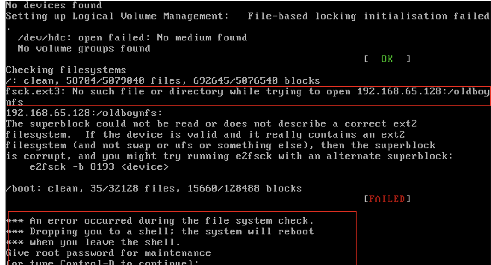
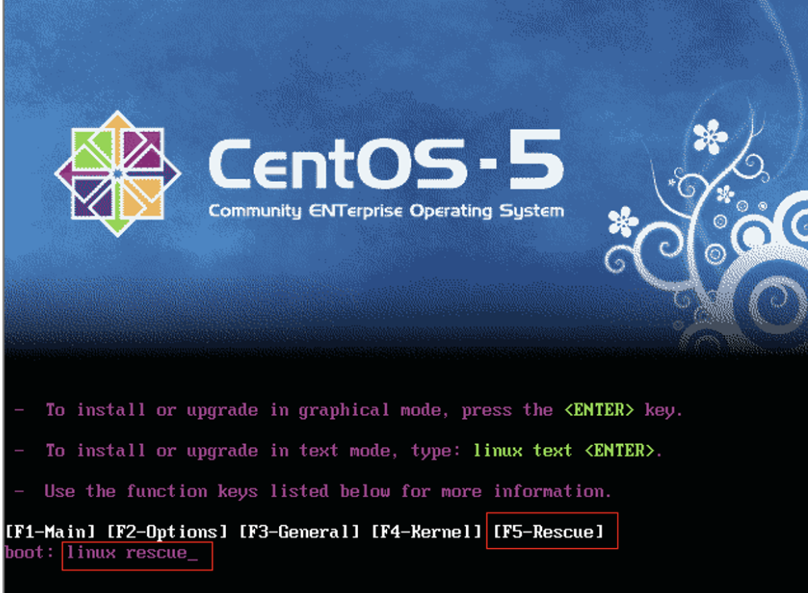
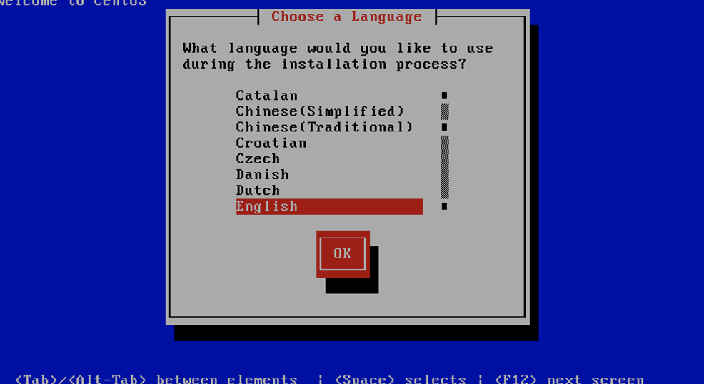
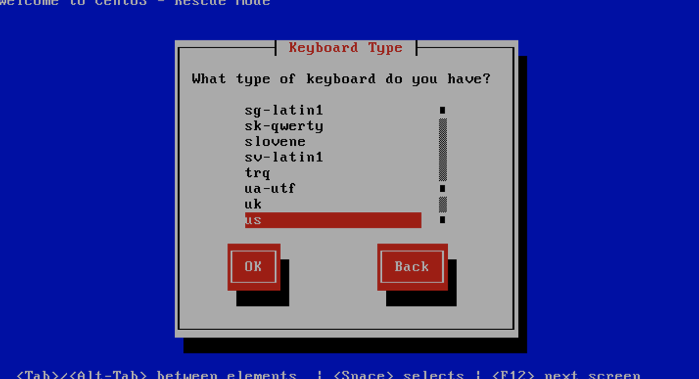
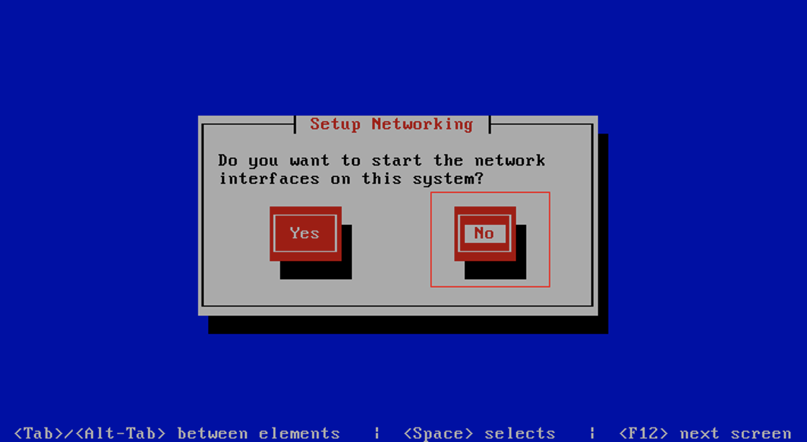
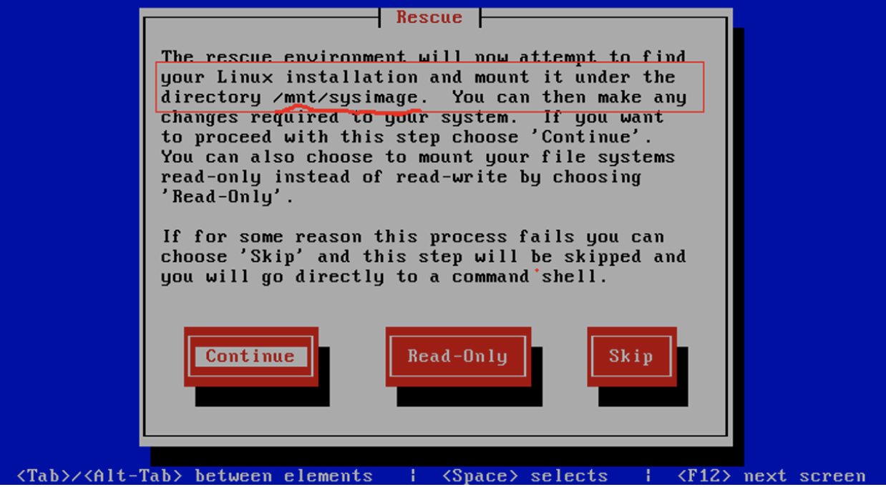
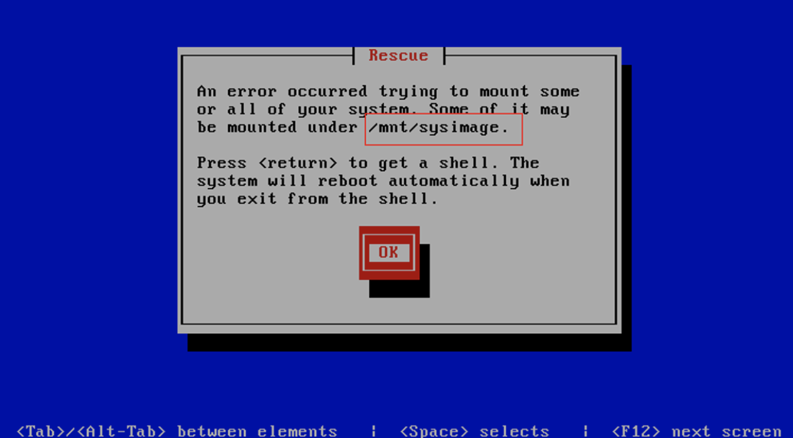
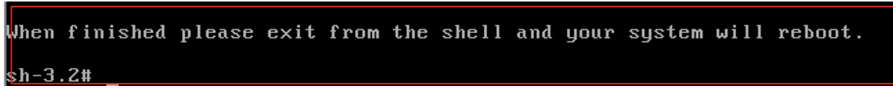
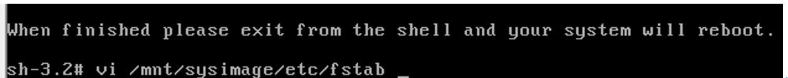
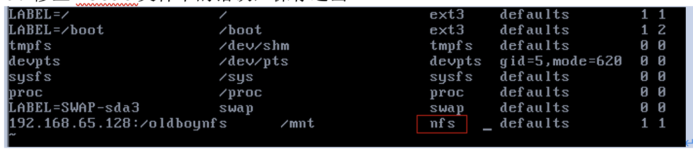

# fstab详细介绍及救援模式修复fstab实战案例


# 1.	fstab简介

fstab - static information about the filesystems

The  file fstab contains descriptive information about the various file systems. fstab is only read by programs, and not written; It is the duty  of  the  system administrator  to  properly  create  and maintain this file.  Each filesystem is described on a separate line; fields on each  line  are  separated  by  tabs  or spaces.  Lines starting with '#' are comments.  The order of records in fstab is important because fsck(8), mount(8), and umount(8) sequentially iterate  through fstab doing their thing.

fstab这个文件包含了系统中各种各样的文件系统的描述信息。正确维护和创建这个文件是一名系统管理员的职责的在。fstab文件可以被特殊的工具修改，fstab中每一个文件系统描述占一行，每一行中的每个列之间由tab键或空格分隔。文件中以#开头的行是注释信息。fstab文件中的记录的排序十分重要。因为fsck,mount或umount等程序在工作时会按此fstab文件内容顺序进行。
```
[root@stu412 ~]# cat /etc/fstab
LABEL=/                 /                       ext3    defaults        1 1
LABEL=/boot             /boot                   ext3    defaults        1 2
tmpfs                   /dev/shm                tmpfs   defaults        0 0
devpts                  /dev/pts                devpts  gid=5,mode=620  0 0
sysfs                   /sys                    sysfs   defaults        0 0
proc                    /proc                   proc    defaults        0 0
LABEL=SWAP-sda3         swap                    swap    defaults        0 0
/dev/sdb1               /data/disk              ext3    defaults        0 0
```
# 2.	fstab文件详细说明
```
第一列：需要挂载的设备或远程的文件系统如NFS
The  first  field,  (fs_spec),  describes  the  block  special  device or remote filesystem to be mounted.
此处的格式有:
普通挂载：格式为/dev/cdrom,/dev/sdb7等
NFS挂载：格式为<host>:<dir>,具体如(10.0.04:/oldboy)
procfs挂载：格式为proc
LABEL或UUID挂载：LABEL=<LABEL> or UUID=<uuid>,如LABEL=SWAP-sda3
第二列：文件系统的挂载点
The second field, (fs_file), describes the mount point for the filesystem.
如将/dev/sdb1挂到/data/disk下，特别说明，man fstab中提到，如果是swap分区挂载点为none,在分区时也是这么分的，但是装完系统后cat /etc/fstab发现挂载点swap，这点要注意。
第三列：要挂载的文件系统类型
The third field, (fs_vfstype), describes the type of the filesystem.
linux支持的文件类型有： adfs, affs, autofs, coda, coherent,cramfs, devpts, efs, ext2, ext3, hfs, hpfs, iso9660, jfs, minix,  msdos,  ncpfs, nfs,  ntfs,  proc,  qnx4, reiserfs, romfs, smbfs, sysv, tmpfs, udf, ufs, umsdos, vfat, xenix, xfs, and possibly others.
```

```
[root@stu412 ~]# cat /proc/filesystems	#当前系统内核支持的文件系统类型
nodev   sysfs
nodev   rootfs
nodev   bdev
nodev   proc
nodev   cpuset
nodev   binfmt_misc
nodev   debugfs
nodev   securityfs
nodev   sockfs
nodev   usbfs
nodev   pipefs
nodev   anon_inodefs
nodev   futexfs
nodev   tmpfs
nodev   inotifyfs
nodev   eventpollfs
nodev   devpts
ext2
nodev   ramfs
nodev   hugetlbfs
iso9660
nodev   mqueue
ext3
nodev   rpc_pipefs
nodev   autofs
nodev   nfsd
第四列：文件系统关联的mount选项
The fourth field, (fs_mntops), describes the mount options associated  with  the filesystem.
此列挂载项至少要包含一个文件系统类型，可以加上其他的符合文件系统类型的相关选项。
noauto  (do not mount when "mount -a" is given, e.g., at boot time)
#启动时不自动挂载
user  (allow a user to mount)	#所有的设备属主用户可以挂载
owner   (allow  device  owner  to mount),
pamconsole  (allow a user at the console to mount)
comment  (e.g.,  for  use  by  fstab-maintaining  programs).

man 8 mount后的-o参数：
提示：底色为绿色或说明翻译为汉字的内容，是大家需要了解的内容，其它的可以不看。
-o     Options are specified with a -o flag followed by a comma separated string of  options.   Some  of these options are only useful when they appear in the /etc/fstab file.  The following options apply to any file system that is  being mounted (but not every file system actually honors them - e.g.,the sync option today has effect only for ext2, ext3, fat, vfat and ufs):
mount 命令 –o 选项后面可以接的参数：
async  All I/O to the file system should be done asynchronously.
所有涉及到文件系统的I/O操作都是异步处理，即不会同步写到硬盘，此参数会提高性能，但会降低数据安全。一般情况生产环境，不推荐使用。除非对性能要求很高，对数据可靠性不要求的场合。
atime  Update inode access time for each access. This is the default.
在每次数据访问时，同步更新每次访问的inode时间，是默认选项，在高并发情况下，建议你通过明确加上noatime,来取消这个默认项，以达到提升性能，优化IO的目的。
auto   Can be mounted with the -a option.
能够被自动挂载通过-a选项。
defaults
Use default options: rw, suid, dev, exec, auto, nouser, and async.
这个缺省值包括：rw, suid, dev, exec, auto, nouser, and async./etc/fstab大部分都是缺省值。

dev    Interpret character or block special devices on the file system.

exec   Permit execution of binaries.
允许执行二进制文件
group  Allow an ordinary (i.e., non-root) user to mount the  file  system
if one of his groups matches the group of the device.  This option
implies the options nosuid and nodev (unless overridden by  subse-
quent options, as in the option line group,dev,suid).

mand   Allow mandatory locks on this filesystem. See fcntl(2).

_netdev
The  filesystem  resides  on a device that requires network access
(used to  prevent  the  system  from  attempting  to  mount  these
filesystems until the network has been enabled on the system).

noatime
Do  not  update  inode  access times on this file system (e.g, for faster access on the news spool to speed up news servers).
不更新文件系统上的inode访问时间，高并发环境，推荐显式应用该选项，可以提高系统IO性能。
nodiratime
Do not update directory inode access times on this filesystem.
不更新文件系统上的directory inode访问时间，高并发环境，推荐显式应用该选项，可以提高系统IO性能。

noauto Can only be mounted explicitly (i.e., the -a option will not cause the file system to be mounted).
不自动挂载文件系统
nodev  Do  not  interpret  character or block special devices on the file
system.

noexec Do not allow direct execution of any binaries on the mounted  file
system.   (Until  recently  it was possible to run binaries anyway
using a command like /lib/ld*.so  /mnt/binary.  This  trick  fails
since Linux 2.4.25 / 2.6.0.)

nomand Do not allow mandatory locks on this filesystem.

nosuid Do  not  allow set-user-identifier or set-group-identifier bits to
take effect. (This seems safe, but is in fact rather unsafe if you
have suidperl(1) installed.)

nouser Forbid an ordinary (i.e., non-root) user to mount the file system.
This is the default.
禁止一个普通用户挂载该文件系统，这是默认挂载时的默认选项。
owner  Allow an ordinary (i.e., non-root) user to mount the  file  system
if he is the owner of the device.  This option implies the options
nosuid and nodev (unless overridden by subsequent options,  as  in
the option line owner,dev,suid).

remount
Attempt  to  remount an already-mounted file system.  This is commonly used to change the mount flags for a file system, especially to  make  a  readonly  file  system  writeable. It does not change  device or mount point.
尝试新挂载一个已经挂载了的文件系统，这通常被用来改变一个文件系统的挂载标志，从而使得一个只读文件变得可写,这个动作不会改变设备或者挂载点。提示：当系统故障时/进入single或resure模式修复系统时，会发现根文件系统经常会变成只读文件系统，不允许修改，此时该命令就派上用场了。具体命令为：mount –o remount,rw / 将根文件系统挂载使得可写。single或rescue模式修复系统时这个命令十分重要。实战案例见linux rescue模式修复/etc/fstab文档。

ro     Mount the file system read-only.
挂载一个只读的文件系统
_rnetdev
Like _netdev, except  "fsck  -a"  checks  this  filesystem  during
rc.sysinit.

rw     Mount the file system read-write.
挂载一个可写的文件系统

suid   Allow  set-user-identifier  or  set-group-identifier  bits to take
effect.

sync   All I/O to the file system should be done synchronously.  In  case
of  media  with  limited  number  of write cycles (e.g. some flash
drives) "sync" may cause life-cycle shortening.
该参数和async相反。即有IO操作时，都会同步处理IO。此参数会牺牲一点IO性能，但是，换来的是掉电后数据的安全性。
dirsync
All directory updates within the file system should be  done  syn-
chronously.  This affects the following system calls: creat, link,
unlink, symlink, mkdir, rmdir, mknod and rename.

user   Allow an ordinary user to mount the file system.  The name of  the
mounting  user  is written to mtab so that he can unmount the file
system again.  This option implies the options noexec, nosuid, and
nodev  (unless  overridden by subsequent options, as in the option
line user,exec,dev,suid).

users  Allow every user to mount  and  unmount  the  file  system.   This
option implies the options noexec, nosuid, and nodev (unless over-
ridden  by   subsequent   options,   as   in   the   option   line
users,exec,dev,suid).
第五列：通过设置数字0或1来决定该列的文件系统是否需要
The fifth field, (fs_freq), is used for these filesystems by the dump(8) command to  determine  which  filesystems  need to be dumped.  If the fifth field is not  present, a value of zero is returned and dump will assume  that  the  filesystem does not need to be dumped.
０表示不需要dump。(dump - ext2/3 filesystem backup)
第六列：通过数字来控制是否在开机时进行fsck检查。
The  sixth  field,  (fs_passno), is used by the fsck(8) program to determine the   order in which filesystem checks are done at reboot time.
0为不检查，根分区一般要设置为1,其它分区一般要设置为2，
如果设置了开机检查，则执行fsck -A
```
# 3.	案例：使用linux rescue(救援模式)修复/etc/fstab
(1)	故障重现
```
[root@B-client1 ~]# cat /etc/fstab
LABEL=/                 /                       ext3    defaults        1 1
LABEL=/boot             /boot                   ext3    defaults        1 2
tmpfs                   /dev/shm                tmpfs   defaults        0 0
devpts                  /dev/pts                devpts  gid=5,mode=620  0 0
sysfs                   /sys                    sysfs   defaults        0 0
proc                    /proc                   proc    defaults        0 0
LABEL=SWAP-sda3         swap                    swap    defaults        0 0
192.168.65.128:/oldboynfs      /mnt             ext3    defaults        1 1

不小心将正确配置中nfs写成ext3,当时未在意，结果重起，发现系统无法正常启动了。正确错误写法对照表如下：
错误配置	192.168.65.128:/oldboynfs      /mnt             ext3    defaults        1 1
正确配置	192.168.65.128:/oldboynfs      /mnt             nfs    defaults        1 1
推荐配置	192.168.65.128:/oldboynfs      /mnt             nfs    defaults        1 0
```
系统重起后报错：


(2)	开始修复/etc/fstab,将配置文件改正确了
1.	插入centos系统光盘到光驱中使其从光驱中引导，引导后界面如下：
注：虚拟机中设置光驱启动：虚拟机是自带光驱,开机马上按F2,进入bios,调一下启动顺序就可以了,但是要速度按。


在引导界面的boot：字符后，输入linux resue,然后按回车，进入下一步


2.	选择语言，默认即可


3.	选择键盘，默认即可




4.	选择不从网络启动，选择NO,按Enter，进入下一步


5.	注意划红线部分，尤其是/mnt/sysimage这个路径,选择Continue




6.	进入命令行的救援模式


7.	根据5，知道根分区被挂载到/mnt/sysimage,于是执行vi /mnt/sysimage/etc/fstab


8.	修正fstab文件中的错误，保存退出


9.	确认无误后，取消光盘启动，重起系统
10.	系统可以正常启动了

建议使用推荐配置：
推荐配置	192.168.65.128:/oldboynfs      /mnt             nfs    defaults        1 0
最后的数字设置为0;

在生产环境中，把整个mount命令放到rc.local里也是一个不错的选择。
