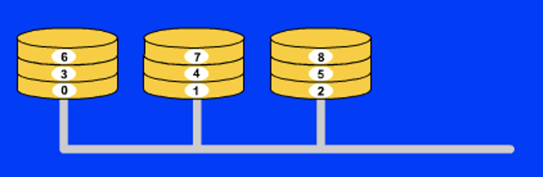
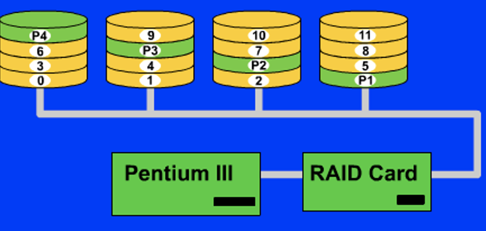
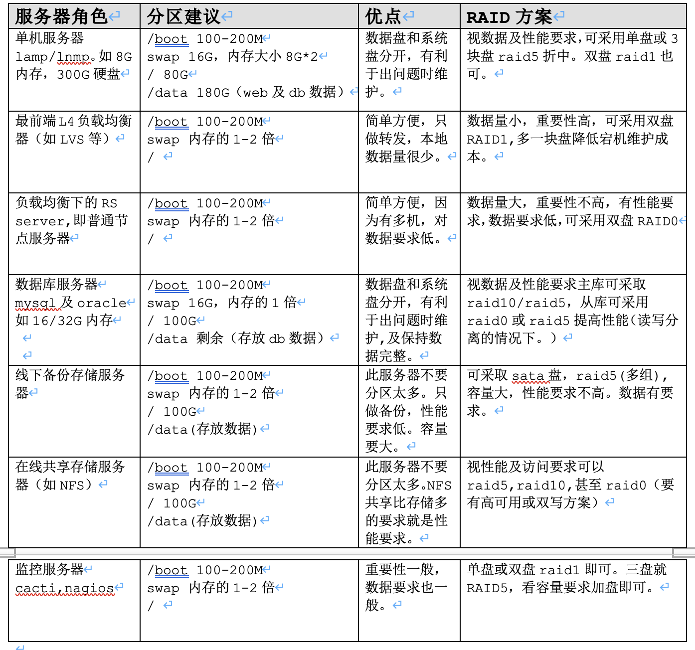

# RAID技术

# 1. RAID定义

RAID(Redundant Array of Independent Disk 独立冗余磁盘阵列)技术是加州大学伯克利分校1987年提出，最初是为了组合小的廉价磁盘来代替大的昂贵磁盘，同时希望磁盘失效时不会使对数据的访问受损失而开发出一定水平的数据保护技术。RAID就是一种由多块廉价磁盘构成的冗余阵列，在操作系统下是作为一个独立的大型存储设备出现。RAID可以充分发挥出多块硬盘的优势，可以提升硬盘速度，增大容量,提供容错功能够确保数据安全性，易于管理的优点，在任何一块硬盘出现问题的情况下都可以继续工作，不会受到损坏硬盘的影响。
# 2. RAID的几种工作模式
## 2.1.	Raid 0

Raid 0利用一定的运算法则将一个文件按照用户自定义的大小分割成若干小部分，当文件被分割之后，Raid 0模式当中的每一块一盘都会存储一定数目的文件碎块。

举例来说，如果Raid 0模式当中有两块硬盘，用户自定义的切割文件大小为64k，此时如果raid控制器接收到一个指令来存储一个大小为128k的文件，这样的话这个文件就会被分割成两个64k大小的文件碎块，然后这两个碎块被同时分别存储在硬盘1和硬盘2当中，存储过程到此完成。

在这个Raid 0模式当中，由于存储数据的时候动用的是不仅仅是一个硬盘，所以大大减少了存储和读取数据所需要的时间，理论上来讲，Raid 0能够实现写入和读取文件的速度加倍。

Raid 0所能够提供的是快速的存储和读取的速度，并没有处于安全性考虑，实际上，如果Raid 0当中的一块硬盘损坏了，整体数据都会损坏，并且没有办法恢复数据。这使得Raid 0的安全性能非常的差，所以很多用户出于安全性能的考虑没有使用Raid 0模式。

Raid 0毕竟是所有raid方式当中速度最快的一种组合方式，如果Raid 0模式当中有两块硬盘的话，那么Raid 0的存储读取数据的速度会是单个硬盘的双倍，如果使用6快硬盘的话，那么理论速率就是单个硬盘的6倍。

## 2.2.	Raid 1

raid 1工作的时候会将每份数据都发送到阵列当中的每个硬盘，当控制器接收到存储64k大小的文件的时候，它会将文件原封不动的发送到这个阵列当中的每个硬盘当中，每个硬盘都会存储这64k大小的文件，当从阵列当中读取文件的时候，控制器会从阵列当中的一个硬盘当中进行读取操作。

raid 1的特点是当阵列当中的一块硬盘损坏了的时候，数据不会丢失，此时控制器会从另外的一个没有故障的硬盘当中来读取数据，当阵列当中加入了一个新的硬盘来修复错误的时候，控制器会使用一个镜像来将好的硬盘上的数据恢复到新加入的硬盘上，如此，raid 1便能够从新形成。

raid 1模式比较适合那些考虑安全性能多于速度性能的用户

## 2.3.	Raid 5

raid 5使用至少三块硬盘来实现阵列，它既能实现raid 0的加速功能也能够实现raid 1的备份数据功能，在阵列当中有三块硬盘的时候，它将会把所需要存储的数据按照用户定义的分割大小分割成文件碎片存储到两块硬盘当中，此时，阵列当中的第三块硬盘不接收文件碎片，它接收到的是用来校验存储在另外两块硬盘当中数据的一部分数据，这部分校验数据是通过一定的算法产生的，可以通过这部分数据来恢复存储在另外两个硬盘上的数据。

另外，这三块硬盘的任务并不是一成不变的，也就是说在这次存储当中可能是1号硬盘和2好硬盘用来存储分割后的文件碎片，那么在下次存储的时候可能就是2号硬盘和3号硬盘来完成这个任务了。

可以说，在每次存储操作当中，每块硬盘的任务是随机分配的，不过，肯定是两块硬盘用来存储分割后的文件碎片另一块硬盘用来存储校验信息。

raid 5同时会实现raid 0的高速存储读取并且也会实现raid 1的数据恢复功能

raid 5模式并不是一切都好，如果阵列当中某块硬盘上的信息发生了改变的话，那么就需要重新计算文件分割碎片，并且，校验信息也需要重新计算，这时，三个硬盘都需要重新调用。

raid 5既能够实现速度上的加倍，同时也能够保证数据的安全性，所以在很多高端系统当中都使用这种raid模式。

## 2.4.	Raid 10

RAID 10是建立在RAID 0和RAID 1基础上的。

由于利用了RAID 0极高的读写效率和RAID 1较高的数据保护、恢复能力，使RAID 10成为了一种性价比较高的等级，目前几乎所有的RAID控制卡都支持这一等级。但是，RAID 10对存储容量的利用率和RAID 1一样低，只有50%。

RAID 10能提供比RAID 5更好的性能。这种新结构的可扩充性不好，这种解决方案被广泛应用，使用此方案比较昂贵。

# 3.	raid 0 1 5 10对比

|       | raid 0 | raid 1  | raid 5    | raid 10 |
|-------|--------|---------|-----------|---------|
| IO性能	 | 读写高    | 读高,写一般	 | 读高写低      | 	读写高    |
| 容错性   | 无      | 有       | 	有        | 有       |  
| 备份冗余	 | 无      | 有       | 	有        | 有       |  
| 可用容量	 | N倍     | N/2倍	   | (N-1)/N倍	 | N/2倍    |
| 数据重构	 | 无      | 低       | 	低        | 	高      |  

# 4.	应用
 