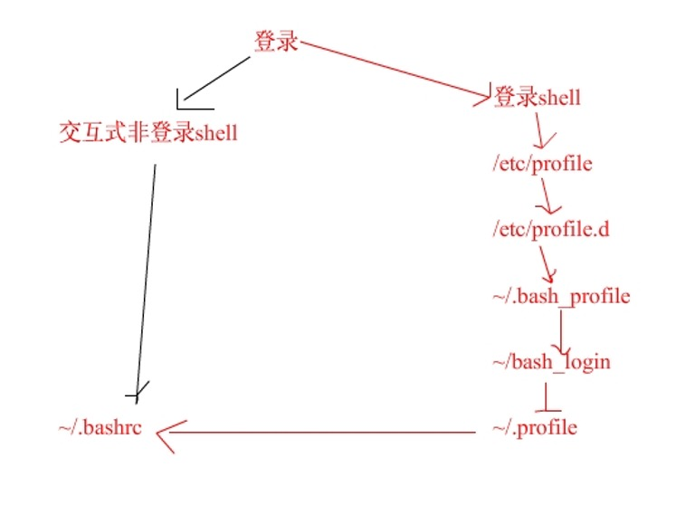

# 系统目录结构及重要路径

# 1.	linux目录结构
```
目录	    放置的文件内容
/bin	放置系统执行文件的目录。/bin放置的是单用户模式下还能够被执行的操作的命令。
/boot	放置开机会用到的文件。如vmlinuz
/dev	设备文件。
/etc	系统主要的配置文件。
/home	用户主文件夹
/lib	系统的函数库
/media	放置可删除的设备。如光盘，dvd等
/mnt	用来挂载某些额外的设备。
/opt	第三方软件
/root	root的主文件夹
/sbin	开机过程中需要的命令，里面包括开机、修复、还原系统所需要的命令。
/tmp	临时文件夹。任何人都可以访问。
```
# 2. ``` ~/bash_profile ``` 与~/bashrc
/etc/profile：此文件为系统的每个用户设置环境信息，当用户第一次登录时，该文件被执行.并从/etc/profile.d目录的配置文件中搜集shell的设置。

/etc/bashrc：为每一个运行bash shell的用户执行此文件。当bash shell被打开时，该文件被读取。

~/.bash_profile：每个用户都可使用该文件输入专用于自己使用的shell信息，当用户登录时，该文件仅仅执行一次！ 默认情况下，他会设置一些环境变量，执行用户的.bashrc文件。

~/.bashrc：该文件包含专用于你的bash shell的bash信息，当登录时以及每次打开新的shell时，该文件被读取。

~/.bash_logout：当每次退出系统(退出bash shell)时，执行该文件。

/etc/profile中设定的变量(全局)的可以作用于任何用户，而~/.bashrc等中设定的变量(局部)只能继承/etc/profile中的变量，他们是"父子"关系。

## 1.1.	.bash_profile .bashrc profile 文件的作用的执行顺序
 

## 2.	eth0网卡配置文件路径及客户端DNS路径

/etc/sysconfig/network-scripts/ifcfg-eth0

/etc/resolv.conf

```
[root@n1 ~]# cat /etc/sysconfig/network-scripts/ifcfg-eth0
# Advanced Micro Devices [AMD] 79c970 [PCnet32 LANCE]
DEVICE=eth0
BOOTPROTO=dhcp
HWADDR=00:0C:29:2B:58:FA
ONBOOT=yes
DHCP_HOSTNAME=n1
[root@n1 ~]# cat /etc/resolv.conf
; generated by /sbin/dhclient-script
search localdomain
nameserver 192.168.84.2
```

# 3.	其它
```
/var/log/messages 系统日志
/var/log/secure 系统安全日志
/var/spool/clientmqueue 邮件临时目录
/proc/interrupts 查看中断文件
/etc/fstab 磁盘文件系统挂载文件
/etc/profile 全局的环境配置文件
```