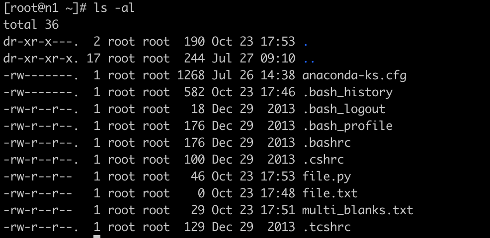

# 命令总结(cat pwd ls rm mkdir touch head tail ln chkconfig)

# cat
## 说明
```
把文件连接后传到基本输出（屏幕或加 > fileName 到另一个文件）
使用方式：cat [-AbeEnstTuv] [--help] [--version] fileName

参数：
-n 或 --number 由 1 开始对所有输出的行数编号
-b 或 --number-nonblank 和 -n 相似，只不过对于空白行不编号
-s 或 --squeeze-blank 当遇到有连续两行以上的空白行，就代换为一行的空白行
-A  ：相当于 -vET 的整合参数，可列出一些特殊字符～
-E  ：将结尾的换行符 $ 显示出来；
-T  ：将 [tab] 按键以 ^I 显示出来；
-v  ：列出一些看不出来的特殊字符：

一般用法：
$ cat file1 file2 file3 ...
 
```
## 范例

范例一：查看 /etc/redhat-release 这个文件的内容
```
[root@n1 ~]# cat /etc/redhat-release
CentOS Linux release 7.9.2009 (Core)
```

范例二：[重要]承上题，顺便打印出行号
```
[root@n1 ~]# cat -n /etc/redhat-release
     1	CentOS Linux release 7.9.2009 (Core)
```
范例三：压缩空白行
```
[root@n1 ~]# cat multi_blanks.txt
line 1


line2


line3
line4
[root@n1 ~]# cat -s multi_blanks.txt
line 1

line2

line3
line4
```

范例四：[重要]制表符显示为^|
```
[root@n1 ~]# cat file.py
def function():
	var = 5
	next = 6
	third = 7
[root@n1 ~]# cat -T file.py
def function():
^Ivar = 5
^Inext = 6
^Ithird = 7
```

范例五：[重要]将文件内容完整的显示出来(包含特殊字节)
```
[root@n1 ~]# cat -A file.py
def function():$
^Ivar = 5$
^Inext = 6$
^Ithird = 7$

# 使用 [tab] 与空格键的效果差不多，都是一堆空白！我们无法知道两者的差别。
此时使用 cat -A 就能够发现那些空白的地方是什么东西了！
[tab]会以 ^I 表示，
换行符则是以$表示，所以你可以发现每一行后面都是 $ ！
不过换行符在Windows/Linux则不太相同，Windows的断行字节是 ^M$ 。
```

# pwd	 (print working directory)
```
功能说明：显示工作目录。
语　　法：pwd [--help][--version]
补充说明：执行pwd指令可立刻得知您目前所在的工作目录的绝对路径名称。

[root@n1 tmp]# pwd
/tmp
```

# ls (list)
## 说明
执行ls指令可列出目录的内容，包括文件和子目录的名称。
```
# ls [-aAdfFhilnrRSt] 目录名称
# ls [--color={never,auto,always}] 目录名称
# ls [--full-time] 目录名称
选项与参数：(绿色要熟练掌握,蓝色要熟悉)
-a  ：全部的文件，连同隐藏文件( 开头为 . 的文件) 一起列出来(常用)
-A  ：全部的文件，连同隐藏文件，但不包括 . 与 .. 这两个目录
-d  ：仅列出目录本身，而不是列出目录内的文件数据(常用)
-f  ：直接列出结果，而不进行排序 (ls 默认会以文件名排序！)
-F  ：根据文件、目录等信息，附加数据结构，例如：*:代表可执行文件； /:代表目录； =:代表 socket 文件； |:代表 FIFO 文件；
-h  ：将文件大小以人类较易读的方式(例如 GB, KB 等等)列出来；
-i  ：列出 inode 号码
-l  ：长数据串列出，包含文件的属性与权限等等数据；(常用)
-n  ：列出 UID 与 GID 而非使用者与群组的名称 (UID与GID会在帐号管理提到！)
-r  ：将排序结果反向输出，例如：原本文件名由小到大，反向则为由大到小；
-R  ：连同子目录内容一起列出来，等于该目录下的所有文件都会显示出来；
-S  ：以文件容量大小排序(默认由大到小)，而不是用文件名排序；
-t  ：依时间排序，而不是用文件名。
--color=never  ：不依据文件特性颜色；
--color=always ：显示颜色
--color=auto   ：让系统自行依据配置来判断是否给予颜色
--full-time    ：以完整时间模式 (包含年、月、日、时、分) 输出
--time={atime,ctime} ：输出 access 时间或改变权限属性时间 (ctime)，而非内容变更时间 (modification time)。
```
## 范例

范例一：将家目录下的所有文件列出来(含属性与隐藏文件)
```
#ls -al
```


范例二：承上题，不显示颜色，但文件名末尾显示出该文件名代表的类型(type)
```
[root@n1 ~]# ls -alF --color=never ~
```

范例三：[重要]完整的显示文件的修改时间 *(modification time)
```
# ls -al --full-time  ~  #等同于ls –l –-time-style=full-iso
[root@n1 ~]# ls -l --full-time
total 12
-rw-------. 1 root root 1268 2023-07-26 14:38:14.953279475 +0800 anaconda-ks.cfg
-rw-r--r--  1 root root   46 2023-10-23 17:53:15.811217005 +0800 file.py
-rw-r--r--  1 root root    0 2023-10-23 17:48:48.336783118 +0800 file.txt
-rw-r--r--  1 root root   29 2023-10-23 17:51:32.744918662 +0800 multi_blanks.txt

[root@n1 ~]# ls -l --time-style=full-iso
total 12
-rw-------. 1 root root 1268 2023-07-26 14:38:14.953279475 +0800 anaconda-ks.cfg
-rw-r--r--  1 root root   46 2023-10-23 17:53:15.811217005 +0800 file.py
-rw-r--r--  1 root root    0 2023-10-23 17:48:48.336783118 +0800 file.txt
-rw-r--r--  1 root root   29 2023-10-23 17:51:32.744918662 +0800 multi_blanks.txt

# 请仔细看，上面的"时间"变成较为完整的格式。
# 一般来说， ls -al 仅列出目前短格式的时间，有时不会列出年份，
# 由 --full-time 可以查阅到比较正确的完整时间格式啊！
说明：--time-style可选的参数有几个：’full-iso’,’long-isso’,’iso’,’locale’。执行ls –l默认情况是locale.在生产环境经常遇到时间显示不一致的问题，故我经常用ls -l --time-style=long-iso。
[root@n1 ~]# ls -l --time-style=long-iso
total 12
-rw-------. 1 root root 1268 2023-07-26 14:38 anaconda-ks.cfg
-rw-r--r--  1 root root   46 2023-10-23 17:53 file.py
-rw-r--r--  1 root root    0 2023-10-23 17:48 file.txt
-rw-r--r--  1 root root   29 2023-10-23 17:51 multi_blanks.txt
```

范例四：以指定的时间(atime,ctime)显示
```
[root@n1 ~]# ls -l --time-style=long-iso --time=atime | grep file.py
-rw-r--r--  1 root root   46 2023-10-23 17:53 file.py
[root@n1 ~]# ls -l --time-style=long-iso --time=ctime | grep file.py
-rw-r--r--  1 root root   46 2023-10-23 17:53 file.py
[root@n1 ~]# chmod 700 file.py
[root@n1 ~]#
[root@n1 ~]# ls -l --time-style=long-iso --time=ctime | grep file.py
-rwx------  1 root root   46 2023-10-23 18:02 file.py
[root@n1 ~]# date
Mon Oct 23 18:02:15 CST 2023
```

范例五：[重要]目录后面加斜线/
```
[root@n1 ~]# ls -F
anaconda-ks.cfg  dir1/  file.py*  file.txt  multi_blanks.txt

生产环境常用此过滤目录（重要）
[root@n1 ~]# ls -F | grep /
dir1/
```

范例六：[重要]文件排序

```
(1)	按文件大小
[root@n1 ~]# ls -Sl
total 12
-rw-------. 1 root root 1268 Jul 26 14:38 anaconda-ks.cfg
-rwx------  1 root root   46 Oct 23 17:53 file.py
-rw-r--r--  1 root root   29 Oct 23 17:51 multi_blanks.txt
drwxr-xr-x  2 root root    6 Oct 23 18:02 dir1
-rw-r--r--  1 root root    0 Oct 23 17:48 file.txt
```
文件从小到大排列

```
[root@n1 ~]# ls -Srl
total 12
-rw-r--r--  1 root root    0 Oct 23 17:48 file.txt
drwxr-xr-x  2 root root    6 Oct 23 18:02 dir1
-rw-r--r--  1 root root   29 Oct 23 17:51 multi_blanks.txt
-rwx------  1 root root   46 Oct 23 17:53 file.py
-rw-------. 1 root root 1268 Jul 26 14:38 anaconda-ks.cfg
```
(2)	时间
```
[root@n1 ~]# ls -lt --time-style=long-iso
total 12
drwxr-xr-x  2 root root    6 2023-10-23 18:02 dir1
-rwx------  1 root root   46 2023-10-23 17:53 file.py
-rw-r--r--  1 root root   29 2023-10-23 17:51 multi_blanks.txt
-rw-r--r--  1 root root    0 2023-10-23 17:48 file.txt
-rw-------. 1 root root 1268 2023-07-26 14:38 anaconda-ks.cfg

# 反向排序(最新的在最下面)
[root@n1 ~]# ls -lrt --time-style=long-iso
total 12
-rw-------. 1 root root 1268 2023-07-26 14:38 anaconda-ks.cfg
-rw-r--r--  1 root root    0 2023-10-23 17:48 file.txt
-rw-r--r--  1 root root   29 2023-10-23 17:51 multi_blanks.txt
-rwx------  1 root root   46 2023-10-23 17:53 file.py
drwxr-xr-x  2 root root    6 2023-10-23 18:02 dir1
```

## ls的别名
系统默认给ls的若干命令加了别名的：
```
[root@n1 ~]# alias | grep color
alias l.='ls -d .* --color=tty'
alias ll='ls -l --color=tty'
alias ls='ls --color=tty'
```

ls命令总结：重点记ls –l, ls –al, ls –lrt, ls –l –time-style=long-iso等组合命令的使用。


# rm (remove)
## 说明
```
功能说明：删除文件或目录。
rm [-fir] 文件或目录
选项与参数：
-f  ：就是 force 的意思，忽略不存在的文件，不会出现警告信息；
-i  ：互动模式，在删除前会询问使用者是否要操作。
-r  ：递回删除！最常用在目录的删除了！这是非常危险的选项！
```

补充说明：执行rm指令可删除文件或目录，要删除目录必须加上参数"-r"，否则默认仅会删除文件。
## 范例
范例一：删除前确认
```
[root@n1 tmp]# rm -i file.py
rm: remove regular file `file.py'? n
```
范例二：通配符删除
```
[root@n1 ~]# rm -i *.py
rm: remove regular file ‘file.py’?
```
范例三：rmdir删除非空目录
```
[root@n1 tmp]# rmdir tdir/
rmdir: tdir/: Directory not empty # 删不掉，因为不是非空目录
[root@n1 tmp]# rm -r tdir/
rm: descend into directory `tdir/'? y # 默认加入了 –i参数
rm: remove regular empty file `tdir//temp'? y
rm: remove directory `tdir/'? y
```

# mkdir
## 说明
```
mkdir [-mp] 目录名称
选项与参数：
-m ：配置文件的权限！直接配置，不需要看默认权限 (umask) !
-p ：[重要]直接递归创建将所需要的目录(包含上一级目录)！
```
## 范例
```
[root@n1 tmp]# mkdir  dir1
[root@n1 tmp]# mkdir  dir1
mkdir: cannot create directory `dir1': File exists
```

范例一：[重要]创建长路径目录
```
[root@n1 tmp]# mkdir -p /tmp/test/hello/child
# 忽略存在的目录，同时建立缺失的目录

# 如果已经存在test文件(不是目录)，则会报错!
[root@n1 tmp]# mkdir -p /tmp/test/hello/child
mkdir: `/tmp/test/hello/child': Not a directory

[root@n1 tmp]# ll | grep test
-rw-r--r-- 1 root root  137 Jun  9 18:35 test
```
范例二：创建权限为rwx--x--x的目录
```
[root@n1 tmp]# mkdir -m 711 test2
[root@n1 tmp]# ll | grep test2
drwx--x--x 2 root root  6 Oct 24 09:48 test2
```

# touch
## 说明
```
改变文件或目录时间。
#touch [-acdmt] 文件
选项与参数：
-a  ：仅更改访问时间(access time)；
-c  ：仅修改文件的时间，若该文件不存在则不创建新文件；
-d  ：后面可以接欲修改的日期而不用目前的日期，也可以使用 --date="日期或时间"
-m  ：仅修改 mtime ；
-t  ：后面可以接欲修改的时间而不用目前的时间，格式为[YYMMDDhhmm]
-r  <参考的文件或目录>：使用指定文件的时间属性而非当前的时间。
```

linux三个主要的时间参数：
- modification time (mtime)：当该文件的"内容数据"修改时，就会更新这个时间！内容数据指的是文件的内容，而不是文件的属性或权限！
- status time (ctime)：当该文件的"状态(status) "改变时，就会更新这个时间，举例来说，像是权限与属性被更改了，都会更新这个时间。
- access time (atime)：当"该文件的内容被取用"时，就会更新这个读取时间 (access)。举例来说，我们使用cat去读取/etc/man.config， 就会更新该文件的atime了。

最常用用法：touch fileA
- 如果fileA存在，使用touch指令可更改这个文件或目录的mtime和atime；
- 如果fileA不存在，touch指令会在当前目录下新建一个空白文件fileA。

## 范例
```
# 观察/etc/issue文件
[root@n1 ~]# ls -l  --time-style=long-iso /etc/issue
-rw-r--r--. 1 root root 23 2023-10-24 09:49 /etc/issue
[root@n1 ~]# ls -l  --time-style=long-iso --time=atime /etc/issue
-rw-r--r--. 1 root root 23 2023-10-24 09:49 /etc/issue
[root@n1 ~]# ls -l  --time-style=long-iso --time=ctime /etc/issue
-rw-r--r--. 1 root root 23 2023-10-24 09:49 /etc/issue
```
范例一：新建一个空的文件并观察时间
```
[root@n1 ~]# touch testtouch
[root@n1 ~]# ls -l testtouch
-rw-r--r-- 1 root root 0 Oct 24 09:51 testtouch
# 注意到，这个文件的大小是 0 呢！在默认的状态下，如果 touch 后面有接文件，
# 则该文件的三个时间 (atime/ctime/mtime) 都会更新为目前的时间。若该文件不存在，
# 则会主动的创建一个新的空的文件！例如上面这个例子！
```

范例二：将 ~/.bashrc 复制成为 bashrc，假设复制完全的属性，检查其日期
```
[root@n1 ~]# cp -a ~/.bashrc bashrc
[root@n1 ~]# ll bashrc; ll --time=atime bashrc; ll --time=ctime bashrc
-rw-r--r--. 1 root root 176 Dec 29  2013 bashrc # 这是 mtime
-rw-r--r--. 1 root root 176 Oct 23 17:44 bashrc # 这是 atime
-rw-r--r--. 1 root root 176 Oct 24 09:51 bashrc # 这是 ctime
```

范例三：修改案例二的bashrc文件，将日期调整为两天前
```
[root@n1 ~]# touch -d "2 days ago" bashrc
[root@n1 ~]# ll bashrc; ll --time=atime bashrc; ll --time=ctime bashrc
-rw-r--r--. 1 root root 176 Oct 22 09:52 bashrc
-rw-r--r--. 1 root root 176 Oct 22 09:52 bashrc
-rw-r--r--. 1 root root 176 Oct 24 09:52 bashrc
# 不过， ctime 并没有改变！
```
范例四：将上个范例的 bashrc日期改为2007/09/15 2:02
```
[root@n1 ~]# touch -t 0709150202 bashrc
[root@n1 ~]# ll bashrc; ll --time=atime bashrc; ll --time=ctime bashrc
-rw-r--r--. 1 root root 176 Sep 15  2007 bashrc
-rw-r--r--. 1 root root 176 Sep 15  2007 bashrc
-rw-r--r--. 1 root root 176 Oct 24 09:53 bashrc
```

# head, tail
## head (取出前面几行)
```
      head [-n number] 文件
      选项与参数：
      -n  ：后面接数字，代表显示几行的意思
```

范例一：打印前10行
```
[root@n1 tmp]# seq 20 > file
[root@n1 tmp]# head file
1
2
3
4
5
6
7
8
9
10
```

范例二：打印前4行
```
[root@n1 tmp]# head -n 4 file
1
2
3
4
```

范例三：打印除了最后N行之外所有的行
```
$head –n -N file
-N表示一个负数
[root@n1 tmp]# head -n -16 file
1
2
3
4

#打印除了最后5行之外所有的行
[root@n1 tmp]# seq 11 | head -n -5
1
2
3
4
5
6
```
# tail (取出后面几行)
```
tail [-n number] 文件
选项与参数：
-n  ：后面接数字，代表显示几行的意思
-f  ：表示持续检测后面所接的文件名，要等到按下[ctrl]-c才会结束tail的检测
--pid=PID
与-f合用,表示在进程ID,PID死掉之后结束.

-s, --sleep-interval=S
与-f合用,表示在每次反复的间隔休眠S秒
```

范例一：打印最后10行
```
[root@n1 tmp]# tail file
11
12
13
14
15
16
17
18
19
20
```

范例二：打印最后5行
```
[root@n1 tmp]# tail -n 5 file
16
17
18
19
20
```
范例三：打印除了前N行之外所有的行
```
$tail –n +(N+1) file

# 打印除了前5行之外所有的行, N+1=6
[root@n1 tmp]# seq 100 | tail -n +6  # 打印第6行至100行
6
7
8
9
10
11
...
```

范例四：持续检测/var/log/messages的内容
```
[root@n1 tmp]# tail -f /var/log/messages
Oct 24 09:46:39 n1 kernel: usb 2-2.1: New USB device strings: Mfr=1, Product=2, SerialNumber=3
Oct 24 09:46:39 n1 kernel: usb 2-2.1: Product: Virtual Bluetooth Adapter
Oct 24 09:46:39 n1 kernel: usb 2-2.1: Manufacturer: VMware
Oct 24 09:46:39 n1 kernel: usb 2-2.1: SerialNumber: 000650268328
Oct 24 09:46:39 n1 systemd: Reached target Bluetooth.
Oct 24 09:46:39 n1 systemd: Starting Load/Save RF Kill Switch Status of rfkill1...
Oct 24 09:46:39 n1 systemd: Started Load/Save RF Kill Switch Status of rfkill1.
Oct 24 09:46:39 n1 nm-dispatcher: req:4 'connectivity-change': start running ordered scripts...
Oct 24 09:46:51 n1 systemd: Started Session 4 of user root.
Oct 24 09:46:51 n1 systemd-logind: New session 4 of user root.
```

# 要等到输入[crtl]-c之后才会离开tail这个命令的检测
tail –f可加入一个睡眠时间间隔 –s,这样就可以设置监视文件更新的时间间隔(单位:秒)。

统合范例：[重要]查看ett.txt文件内第20到第30行的内容
```
[root@n1 tmp]# head -n 30 ett.txt | tail -n 11
# 先取前30行，再取后11行
```


# ln
## 说明
功能：连接文件

两种连接：硬连接(hard link)，软连接(symbolic link)=>快捷方式
```
ln [-sf] 来源文件 目标文件
选项与参数：
-s  ：如果不加任何参数就进行连结，那就是硬连接，至于 -s 就是软连接
-f  ：如果"目标文件"存在时，就主动的将目标文件直接移除后再创建！
```
硬链接通过索引节点(Inode Index)来进行链接。

多个文件名指向同一个索引节点=>硬链接

建立硬链接能防止节点误删。

在linux中，删除文件的条件是与之相关的所有硬链接文件均被删除(与进程占用也有关)。

硬链接相当于文件的另外一个入口。

软链接类似windows的快捷方式。

## 文件示例
```
[root@n1 ~]# mkdir test
[root@n1 ~]# cd test/
[root@n1 test]# touch file
[root@n1 test]# ls
file
[root@n1 test]# ls -ld
drwxr-xr-x 2 root root 18 Oct 24 09:56 .
[root@n1 test]# ls -ld file
-rw-r--r-- 1 root root 0 Oct 24 09:56 file
[root@n1 test]# ln file file_hard_file
[root@n1 test]#
[root@n1 test]# ls -ld file
-rw-r--r-- 2 root root 0 Oct 24 09:56 file
[root@n1 test]#
[root@n1 test]# ln -s file file_soft_link
[root@n1 test]# ls -ld *
-rw-r--r-- 2 root root 0 Oct 24 09:56 file
-rw-r--r-- 2 root root 0 Oct 24 09:56 file_hard_file
lrwxrwxrwx 1 root root 4 Oct 24 09:57 file_soft_link -> file
[root@n1 test]#
[root@n1 test]# ls -li *
652 -rw-r--r-- 2 root root 0 Oct 24 09:56 file
652 -rw-r--r-- 2 root root 0 Oct 24 09:56 file_hard_file
653 lrwxrwxrwx 1 root root 4 Oct 24 09:57 file_soft_link -> file

总结：硬链接的节点编号是一样的，软链接文件的inode节点号与原文件不一样
```

## 目录示例
```
[root@n1 test]# mkdir testdir
[root@n1 test]# ln testdir testdir_hard_link
ln: ‘testdir’: hard link not allowed for directory  #目录无法创建硬链接
[root@n1 test]#
[root@n1 test]# ln -s testdir testdir_soft_link
[root@n1 test]# ls -l
total 0
-rw-r--r-- 2 root root 0 Oct 24 09:56 file
-rw-r--r-- 2 root root 0 Oct 24 09:56 file_hard_file
lrwxrwxrwx 1 root root 4 Oct 24 09:57 file_soft_link -> file
drwxr-xr-x 2 root root 6 Oct 24 09:57 testdir
lrwxrwxrwx 1 root root 7 Oct 24 09:58 testdir_soft_link -> testdir
[root@n1 test]# ls -li
total 0
     652 -rw-r--r-- 2 root root 0 Oct 24 09:56 file
     652 -rw-r--r-- 2 root root 0 Oct 24 09:56 file_hard_file
     653 lrwxrwxrwx 1 root root 4 Oct 24 09:57 file_soft_link -> file
17475462 drwxr-xr-x 2 root root 6 Oct 24 09:57 testdir
     654 lrwxrwxrwx 1 root root 7 Oct 24 09:58 testdir_soft_link -> testdir
     
总结：ln不能对目录建硬链接，但可以创建软链接。目录软链接在生产环境常用。
```

# 删除示例
```
[root@n1 test]# echo "myfile " > file
[root@n1 test]# cat file
myfile
[root@n1 test]# cat file_hard_file
myfile
[root@n1 test]# cat file_soft_link
myfile
[root@n1 test]# rm -f file
[root@n1 test]# ls -lirt
total 4
     653 lrwxrwxrwx 1 root root 4 Oct 24 09:57 file_soft_link -> file
17475462 drwxr-xr-x 2 root root 6 Oct 24 09:57 testdir
     654 lrwxrwxrwx 1 root root 7 Oct 24 09:58 testdir_soft_link -> testdir
     652 -rw-r--r-- 1 root root 8 Oct 24 09:59 file_hard_file
[root@n1 test]# cat file_hard_file
myfile
[root@n1 test]# cat file_soft_link
cat: file_soft_link: No such file or directory

总结：删除原文件file后，其硬链接不受影响，但其软链接失效
```

## 链接总结
有关文件
- (1)	删除软链接file_soft_link后，对file，file_hard_file无影响
- (2)	删除硬链接file_hard_link后，对file，file_soft_link无影响
- (3)	删除原文件file，对硬链接file_hard_link无影响，导致软链接file_soft_link失效。
- (4)	同时删除原文件file、硬链接file_hard_link时，整个文件会真正的被删除。
- (5)	很多硬件设备中的快照功能，就是利用了硬链接的原理。

有关目录
- (1)	目录不可以创建硬链接，但可以创建软链接。
- (2)	目录软链接是生产环境常用技巧。
 