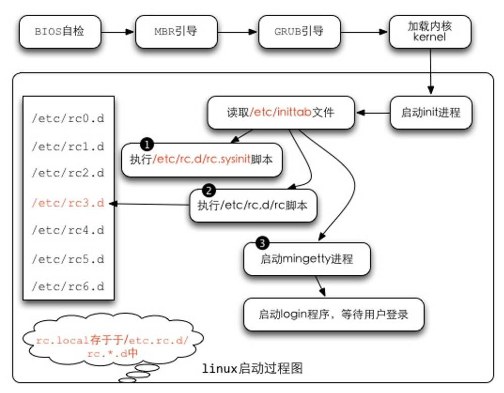
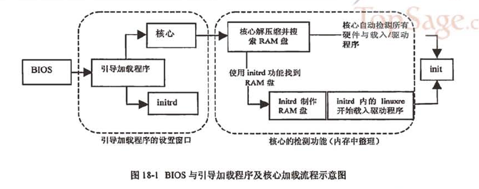

linux系统的开机启动过程 2012-06-16  
----------

# 1.	启动流程
- (1)	BIOS自检--加载 BIOS 的硬件信息与进行自我测试，并根据配置取得第一个可启动的设备；
- (2)	MBR引导--读取并运行第一个启动装置内MBR的boot Loader (即grub, spfdisk 等程序)；
- (3)	加载内核kernel--根据boot loader的配置加载 Kernel ，Kernel会开始检测硬件与加载驱动程序；
- (4)	启动init进程--在硬件驱动成功后，Kernel会主动调init进程，而init会取得run-level信息；
- (5)	init 运行/etc/rc.d/rc.sysinit文件来准备软件运行的操作环境(如网络、时区等)；
- (6)	init 运行run-level的各个服务之启动(script 方式)；
- (7)	init 运行/etc/rc.d/rc.local 文件；
- (8)	init 运行终端机模拟程序mingetty来启动login 程序，最后就等待用户登录；
      
 

## 1.1.	BIOS,boot loader与kernel载入
BIOS，开机自检与MBR
- (1)	主机在开机的时候，读取BIOS。
- (2)	系统会根据读取的BIOS的数据，进行加电自检 (power on self test, POST)， 然后开始执行初始化硬件检测，并设置 PnP 设备，确定可开机的设备后，就开始读取启动设备的数据 (MBR 相关的任务开始)。
- (3)	主机开始尝试由存储媒体加载操作系统。系统开始在第一台启动设备上执行开机程序。以硬盘为例，启动流程读硬盘的过程中，第一个要读取的就是该硬盘的主引导扇区 (Master Boot Record, MBR) ，而系统可以由主引导扇区所安装的引导加载程序 (boot loader) 开始执行核心识别的工作。
boot loader：认识操作系统文件格式并据以加载内核到内存中执行。
- (4)	boot loader开始读取核心文件后，Linux会将内核解压到内存中， 并且利用内核的功能，开始测试与驱动各个外部设备，包括存储设备、CPU、网络卡、声卡等等。内核开始接管BIOS后工作。核心文件一般放在/boot里， 并且取名为/boot/vmlinuz。
- (5)	在加载核心的过程中，系统只会"挂载根目录"而已，而且是以只读的方式挂载的。 此外，有时为了让某些功能可以用文件方式来读取，因此，有的系统在开机的时候， 会建立虚拟硬盘 (RAM Disk)，这就需要 initrd 及 linuxrc了。
- (6)	在核心驱动外部硬件的工作完成之后， initrd 所建立的虚拟磁盘就会被删除了！

boot loader 可以加载 kernel 与 initrd ，然后在内存中让 initrd 解压成为根目录， kernel 就能够借此加载适当的驱动程序，最终释放虚拟文件系统，并挂载实际的根目录文件系统， 就能够开始后续的正常启动流程。
在完整加载内核后，主机开始正确的运行。


 

## 1.2.	第一个程序init及配置文件/etc/inittab与 runlevel
在核心加载完毕之后，整个Linux当中第一个被执行的程序就是/sbin/init。/sbin/init 最主要的功能就是准备软件运行的环境，包括系统的主机名、网络配置、语系处理、文件系统格式及其他服务的启动等。 而所有的动作都会通过init的配置文件，即/etc/inittab 来规划，而 inittab 内还有一个很重要的设置选项，那就是默认的run level (启动运行等级)
run level 分为六个等级，分别是：
- 0 - halt (系统直接关机)
- 1 - single user mode (单人维护模式，用于系统出问题时的维护)
- 2 - Multi-user, without NFS (类似下面的 runlevel 3，但无 NFS 服务)
- 3 - Full multi-user mode (完整网络功能的纯文本模式)
- 4 - unused (系统保留功能)
- 5 - X11 (与 runlevel 3 类似，但加载使用 X Window)
- 6 - reboot (重新启动)

开机时，从/etc/inittab取得系统的 run level的。


```shell
[root@linux ~]# vi /etc/inittab
# 设置系统开机默认的 run level 设置项目：
id:3:initdefault:

# 准备系统软件执行环境的脚本执行文件
si::sysinit:/etc/rc.d/rc.sysinit

# 7 个不同 run level 的，需要启动的服务的脚本放置路径：
l0:0:wait:/etc/rc.d/rc 0    <==runlevel 0 在 /etc/rc.d/rc0.d/
l1:1:wait:/etc/rc.d/rc 1    <==runlevel 1 在 /etc/rc.d/rc1.d/
l2:2:wait:/etc/rc.d/rc 2    <==runlevel 2 在 /etc/rc.d/rc2.d/
l3:3:wait:/etc/rc.d/rc 3    <==runlevel 3 在 /etc/rc.d/rc3.d/
l4:4:wait:/etc/rc.d/rc 4    <==runlevel 4 在 /etc/rc.d/rc4.d/
l5:5:wait:/etc/rc.d/rc 5    <==runlevel 5 在 /etc/rc.d/rc5.d/
l6:6:wait:/etc/rc.d/rc 6    <==runlevel 6 在 /etc/rc.d/rc6.d/

# 是否允许按下 [ctrl]+[alt]+[del] 就重新启动的设置项目：
ca::ctrlaltdel:/sbin/shutdown -t3 -r now

# 下面两个配置则是关于不断电系统的 (UPS)，一个是没电时的关机，一个是复电的处理
pf::powerfail:/sbin/shutdown -f -h +2 "Power Failure; System Shutting Down"
pr:12345:powerokwait:/sbin/shutdown -c "Power Restored; Shutdown Cancelled"

# 本机终端启动的个数：
1:2345:respawn:/sbin/mingetty tty1
2:2345:respawn:/sbin/mingetty tty2
3:2345:respawn:/sbin/mingetty tty3
4:2345:respawn:/sbin/mingetty tty4
5:2345:respawn:/sbin/mingetty tty5
6:2345:respawn:/sbin/mingetty tty6

# 在 X Window (run level 5) 环境下的启动脚本设置项目：
x:5:once:/etc/X11/prefdm –nodaemon

```


/etc/inittab文件的语法如下：
```
[设置项目]:[run level]:[init 的动作行为]:[命令项目]
1. 设置项目：
   最多四个字符，代表 init 的主要工作项目，只是一个简单的代表说明。
2. run level：
   该项目在哪些 run level 下面进行的意思。如果是35则代表 runlevel 3 与 5 都会执行。
3. init 的动作项目：
   主要项目意义如下：
   initdefault：	代表默认的 run level 设置值；
   sysinit	：		代表系统初始化的动作项目；
   ctrlaltdel	：	代表 [ctrl]+[alt]+[del] 三个按键是否可以重新启动的设置；
   wait		：		代表后面接的命令项目必须要执行完毕,才能继续后面的动作；
   respawn	：		代表后面接的init 仍会主动的"重新"启动。
   更多的设置项目请参考 man inittab 的说明。
4. 命令项目：
   即应该可以进行的命令，通常是一些脚本。
```

CentOS中init的处理流程是：
- (1)	先取得 runlevel ，即默认运行等级的相关等级 (以鸟哥的测试机为例，为5号)；
- (2)	使用 /etc/rc.d/rc.sysinit 进行系统初始化
- (3)	由于runlevel是5 ，因此只进行『l5:5:wait:/etc/rc.d/rc 5』，其他行则略过
- (4)	配置好 [ctrl]+[alt]+[del] 这组的组合键功能
- (5)	配置不断电系统的 pf, pr 两种机制；
- (6)	启动 mingetty 的六个终端机 (tty1 ~ tty6)
- (7)	最终以/etc/X11/perfdm -nodaemon 启动图形界面！

## 1.3.	init 处理系统初始化流程/etc/rc.d/rc.sysinit
开始加载各项系统服务之前，先设置好整个系统环境，主要利用 /etc/rc.d/rc.sysinit 这个脚本来设置系统环境。
/etc/rc.d/rc.sysinit主要的工作：
```
1.取得网络环境与主机类型：
首先读取网络配置文件 /etc/sysconfig/network ，取得主机名与默认网关 (gateway) 等网络环境。
2.测试与挂载内存设备/proc及 USB设备/sys：
除挂载内存设备/proc 之外，还会主动检测系统上是否具有usb设备， 若有则会主动加载usb的驱动程序，并且尝试挂载usb的文件系统。
3.决定是否启动 SELinux ：
4.启动系统的随机数产生器
随机数产生器可以帮助系统进行一些密码加密演算的功能，在此需要启动两次随机数产生器。
5.配置终端机 (console) 字体：
6.配置显示于启动过程中的欢迎画面 (text banner)；
7.配置系统时间 (clock) 与时区配置：需读入 /etc/sysconfig/clock 配置值
8.接口设备的检测与 即插即用 (PnP) 参数的测试：
9.用户自定义模块的加载
10.加载核心的相关配置：
11.配置主机名与初始化电源管理模块 (ACPI)
12.初始化软件磁盘阵列：主要是透过 /etc/mdadm.conf 来配置好的。
13.初始化 LVM 的文件系统功能
14.以 fsck 检验磁盘文件系统：会进行 filesystem check
15.进行磁盘配额 quota 的转换 (非必要)：
16.重新以可读写模式挂载系统磁碟：
17.启动 quota 功能：所以我们不需要自订 quotaon 的动作
18.启动系统伪随机数产生器 (pseudo-random)：
19.清除启动过程当中的缓存文件：
20.将启动相关信息加载 /var/log/dmesg 文件中。
```

### 1.3.1.	启动系统服务与相关启动配置文件/etc/rc.d/rc.n 与/etc/sysconfig
```
[root@stu412 ~]# ls -l /etc/rc.d/rc3.d
total 320
lrwxrwxrwx 1 root root 17 Jun  4 03:34 K01dnsmasq -> ../init.d/dnsmasq
lrwxrwxrwx 1 root root 24 Jun  4 03:34 K02avahi-dnsconfd -> ../init.d/avahi-dnsconfd
lrwxrwxrwx 1 root root 24 Jun  4 03:35 K02NetworkManager -> ../init.d/NetworkManager
lrwxrwxrwx 1 root root 17 Jun  4 03:34 K02oddjobd -> ../init.d/oddjobd
lrwxrwxrwx 1 root root 16 Jun  4 03:33 K05conman -> ../init.d/conman
lrwxrwxrwx 1 root root 14 Jun  4 03:34 K05innd -> ../init.d/innd
lrwxrwxrwx 1 root root 19 Jun  4 03:34 K05saslauthd -> ../init.d/saslauthd
...
lrwxrwxrwx 1 root root 25 Jun  4 03:34 K99readahead_later -> ../init.d/readahead_later
lrwxrwxrwx 1 root root 23 Jun  4 03:34 S00microcode_ctl -> ../init.d/microcode_ctl
lrwxrwxrwx 1 root root 25 Jun  4 03:34 S04readahead_early -> ../init.d/readahead_early
lrwxrwxrwx 1 root root 15 Jun  4 03:35 S05kudzu -> ../init.d/kudzu
...
```

一般来说，如果我们想要启动一些系统服务，例如启动 atd ， 需要使用：
```
/etc/rc.d/init.d/atd start	(也可以用 /etc/init.d/atd start)
```
如果是关闭该服务，就是使用：
```
/etc/rc.d/init.d/atd stop
```
(1)	在 /etc/rc.d/rc3.d 内的，以 S 为开头的文件，为开机时，需要"启动, start"的服务；

(2)	在该目录内的 K 为开头的文件，为"关机时需要关闭的服务, stop"的文件连结；

(3)	在 S 与 K 后面接的数字，代表该文件被执行的顺序。

## 1.4.	用户自定义开机启动程序 (/etc/rc.d/rc.local)
有任何想要在开机时就进行的工作时，直接将他写入/etc/rc.d/rc.local ， 那么该工作就会在开机的时候自动被加载！而不必等我们登录系统去启动。

rc.local服务是在/etc/rc.d/rc*.d里执行的
```
[root@stu412 test]# ls -l /etc/rc.d/rc3.d | grep local
lrwxrwxrwx 1 root root 11 Jun  4 03:34 S99local -> ../rc.local
```

## 1.5.	根据/etc/inittab之设置，加载终端或X-Window
在完成了系统所有服务的启动后，接下来 Linux 就会启动终端或者是 X Window 来等待用户登录！ 实际参考的项目是 /etc/inittab 内的这一段：
```
1:2345:respawn:/sbin/mingetty tty1
2:2345:respawn:/sbin/mingetty tty2
3:2345:respawn:/sbin/mingetty tty3
4:2345:respawn:/sbin/mingetty tty4
5:2345:respawn:/sbin/mingetty tty5
6:2345:respawn:/sbin/mingetty tty6

# Run xdm in runlevel 5
x:5:once:/etc/X11/prefdm -nodaemon
```
这一段代表，在 run level 2, 3, 4, 5 时，都会执行 /sbin/mingetty ， 而且执行六个，这也是为何我们 Linux 会提供"六个纯文本终端"的设置！ 因为 mingetty 是启动终端的命令。
