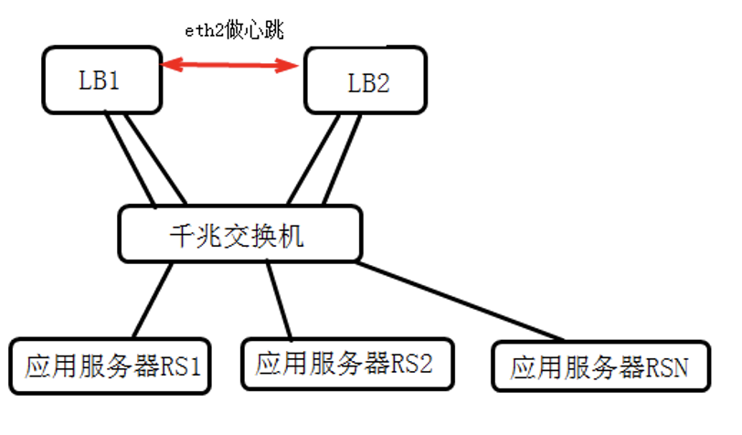

# Lvs+keepalived集群生产实战模拟


# 1.	LVS+keepalived介绍
# 2.	负载均衡方案拓扑图
# 2.1.	系统架构拓扑图


# 2.2.	部署详细拓扑图

| LB负载均衡服务器1                 | LB负载均衡服务器2            |
|----------------------------|-----------------------|
| eth0:0 vip 200.166.188.112 |                       |  
| eth0       200.166.188.107 | 	eth0 200.166.188.106 |
| eth2        192.168.19.107 | 	eth2 192.168.19.106  |
| eth1         192.168.1.107 | 	eth1 192.168.1.106   |
通过eth2做心跳线


# 3.	网卡,ip等资源列表
## 3.1.	硬件:DELL R710 (两台标配)
## 3.2.	系统:centos 5.5 64bit
## 3.3.	ip信息列表


提示：内外网IP分配可采用最后8位相同的方式，这样便于管理

# 4.	安装lvs和keepalived软件包
## 4.1.	下载相关软件包
```
mkdir -p /root/tools
cd /root/tools
wget http://www.linuxvirtualserver.org/software/kernel-2.6/ipvsadm-1.24.tar.gz
wget http://www.keepalived.org/software/keepalived-1.1.17.tar.gz
```
## 4.2.	安装
### 4.2.1.	安装LVS命令
```
lsmod | grep ip_vs
cat /etc/redhat-release
uname -r
ln -s /usr/src/kernels/2.6.18-238.el5-i686/ /usr/src/linux

tar zxf ipvsadm-1.24.tar.gz
cd ipvsadm-1.24
make && make install
lsmod | grep ip_vs
/sbin/ipvsadm
lsmod | grep ip_vs

提示：
此时ipvs模块还没有被加载，可以执行ipvsadm或modprobe ip_vs命令把ip_vs加载到系统内核 ，然后再lsmod | grep ip_vs应该看见ip_vs模块被列出。

注意：
(1)	ln命令的路径要和uname -r输出结果内核版本对应
(2)	如果没有/usr/src/kernels/2.6.18-238.el5-i686,是因为缺少kernel-devel…软件包，可通过yum install kernel-devel -y安装。
(3)	ln这个命令也可以不执行，直接指定内核参数编译即可。
```

### 4.2.2.	安装Keepalived
提示：安装前请确认路径: --with-kernel-dir=/usr/src/kernels/2.6.18-238.el5-i686
方法一：
```
ln -s /usr/src/kernels/2.6.18-238.el5-i686 /usr/src/linux
#如果没有/usr/src/kernels/2.6.18-238.el5-i686,是因为缺少kernel-devel…软件包，可通过yum install kernel-devel -y安装。
tar zxf keepalived-1.1.17.tar.gz
cd  keepalived-1.1.17
./configure
make && make install
```

方法二：
```
tar zxf keepalived-1.1.17.tar.gz
cd  keepalived-1.1.17
./configure \
--with-kernel-dir=/usr/src/kernels/2.6.18-238.el5-i686
make && make install
```
### 4.2.3.	配置keepalived规范启动
```
/bin/cp /usr/local/etc/rc.d/init.d/keepalived /etc/init.d/  #生成启动命令
/bin/cp /usr/local/etc/sysconfig/keepalived /etc/sysconfig/
mkdir /etc/keepalived #创建默认的配置文件路径
/bin/cp /usr/local/etc/keepalived/keepalived.conf /etc/keepalived/
#把keepalived.conf拷贝到/etc/keepalived下

/bin/cp /usr/local/sbin/keepalived /usr/sbin/
/etc/init.d/keepalived start #或/etc/init.d/keepalived stop
```

## 4.3.	常规rpm包安装时的启动方式
# 5.	配置转发和防火墙
## 5.1.	开启linux内核转发功能
```
#开启linux转发开关
sed -i 's#net.ipv4.ip_forward = 0#net.ipv4.ip_forward = 1#' /etc/sysctl.conf

#使上面设置生效
sysctl -p
```
#提示：对于DR模式不需要开启linux转发，此处为了兼容NAT模式的部署增加。
# 6.	配置keepalived实现lvs负载均衡
## 6.1.	LVS NAT/DR模式配置参数说明
from: http://www.keepalived.org/LVS-NAT-Keepalived-HOWTO.html
```
-- cut here -- 
! This is a comment 
! Configuration File for keepalived 

global_defs { 
   ! this is who emails will go to on alerts 
   notification_email { 
        admins@example.com 
    fakepager@example.com 
    ! add a few more email addresses here if you would like 
   } 
   notification_email_from admins@example.com 

   ! I use the local machine to relay mail 
   smtp_server 127.0.0.1 
   smtp_connect_timeout 30 

   ! each load balancer should have a different ID 
   ! this will be used in SMTP alerts, so you should make 
   ! each router easily identifiable 
   lvs_id LVS_EXAMPLE_01 
} 

! vrrp_sync_groups make sure that several router instances 
! stay together on a failure - a good example of this is 
! that the external interface on one router fails and the backup server 
! takes over, you want the internal interface on the failed server 
! to failover as well, otherwise nothing will work. 
! you can have as many vrrp_sync_group blocks as you want. 
vrrp_sync_group VG1 { 
   group { 
      VI_1 
      VI_GATEWAY 
   } 
} 

! each interface needs at least one vrrp_instance 
! each vrrp_instance is a group of VIPs that are logically grouped 
! together 
! you can have as many vrrp_instaces as you want 

vrrp_instance VI_1 { 
        state MASTER 
        interface eth0 
     
        lvs_sync_daemon_inteface eth0 

    ! each virtual router id must be unique per instance name! 
        virtual_router_id 51 

    ! MASTER and BACKUP state are determined by the priority 
    ! even if you specify MASTER as the state, the state will 
    ! be voted on by priority (so if your state is MASTER but your 
    ! priority is lower than the router with BACKUP, you will lose 
    ! the MASTER state) 
    ! I make it a habit to set priorities at least 50 points apart 
    ! note that a lower number is lesser priority - lower gets less vote 
        priority 150 

    ! how often should we vote, in seconds? 
        advert_int 1 

    ! send an alert when this instance changes state from MASTER to BACKUP 
        smtp_alert 

    ! this authentication is for syncing between failover servers 
    ! keepalived supports PASS, which is simple password 
    ! authentication 
    ! or AH, which is the IPSec authentication header. 
    ! I don't use AH 
    ! yet as many people have reported problems with it 
        authentication { 
                auth_type PASS 
                auth_pass example 
        } 

    ! these are the IP addresses that keepalived will setup on this 
    ! machine. Later in the config we will specify which real 
        ! servers  are behind these IPs 
    ! without this block, keepalived will not setup and takedown the 
    ! any IP addresses 
     
        virtual_ipaddress { 
                192.168.1.11 
        ! and more if you want them 
        } 
} 

! now I setup the instance that the real servers will use as a default 
! gateway 
! most of the config is the same as above, but on a different interface 

vrrp_instance VI_GATEWAY { 
        state MASTER 
        interface eth1 
        lvs_sync_daemon_inteface eth1 
        virtual_router_id 52 
        priority 150 
        advert_int 1 
        smtp_alert 
        authentication { 
                auth_type PASS 
                auth_pass example 
        } 
        virtual_ipaddress { 
                10.20.40.1 
        } 
} 

! now we setup more information about are virtual server 
! we are just setting up one for now, listening on port 22 for ssh 
! requests. 

! notice we do not setup a virtual_server block for the 10.20.40.1 
! address in the VI_GATEWAY instance. That's because we are doing NAT 
! on that IP, and nothing else. 

virtual_server 192.168.1.11 22 { 
    delay_loop 6 

    ! use round-robin as a load balancing algorithm 
    lb_algo rr 

    ! we are doing NAT 
    lb_kind NAT 
    nat_mask 255.255.255.0 

    protocol TCP 

    ! there can be as many real_server blocks as you need 

    real_server 10.20.40.10 22 { 

    ! if we used weighted round-robin or a similar lb algo, 
    ! we include the weight of this server 

        weight 1 

    ! here is a health checker for this server. 
    ! we could use a custom script here (see the keepalived docs) 
    ! but we will just make sure we can do a vanilla tcp connect() 
    ! on port 22 
    ! if it fails, we will pull this realserver out of the pool 
    ! and send email about the removal 
        TCP_CHECK { 
                connect_timeout 3 
        connect_port 22 
        } 
    } 
} 

! that's all 

-- cut here --

``` 

## 6.2.	DR模式主从master及backup机器keepalived配置对比
master配置文件路径为/etc/keepalived/keepalived.conf


LVS master
```
! Configuration File for keepalived

global_defs {
   notification_email {
	qxl_work@163.com
   }
   notification_email_from Alexandre.Cassen@firewall.loc
  #smtp_server 192.168.200.1
   smtp_server 127.0.0.1
   smtp_connect_timeout 30
   router_id LVS_oldboy01
}
                                                     
vrrp_instance VI_1 {
state MASTER           	
#备份服务器上MASTER为BACKUP
    interface eth0
    lvs_sync_daemon_inteface eth0
    virtual_router_id 51
priority 100                
#备份服务上优先级要低于100，如改为90
    advert_int 1
    authentication {
        auth_type PASS
        auth_pass 1111
    }
    virtual_ipaddress {
      192.168.65.123
    }
}
#
virtual_server 192.168.65.123 80 {
    delay_loop 6          	
    lb_algo wrr                
    lb_kind DR                
    nat_mask 255.255.255.0
    persistence_timeout 50     
    protocol TCP                

    real_server 192.168.65.156 80 {
        weight 1              
        TCP_CHECK {
        connect_timeout 8       
        nb_get_retry 3
        delay_before_retry 3
        connect_port 80
        }
    }

    real_server 192.168.65.157 80 {
        weight 1              
        TCP_CHECK {
        connect_timeout 8       
        nb_get_retry 3
        delay_before_retry 3
        connect_port 80
        }
    }
}
```

LVS backup
```
! Configuration File for keepalived

global_defs {
   notification_email {
	qxl_work@163.com
   }
   notification_email_from Alexandre.Cassen@firewall.loc
  #smtp_server 192.168.200.1
   smtp_server 127.0.0.1
   smtp_connect_timeout 30
   router_id LVS_oldboy02
}
                                                     
vrrp_instance VI_1 {
state BACKUP           	
#备份服务器上MASTER为BACKUP
    interface eth0
    lvs_sync_daemon_inteface eth0
    virtual_router_id 51
priority 90                
#备份服务上优先级要低于100，如改为90
    advert_int 1
    authentication {
        auth_type PASS
        auth_pass 1111
    }
    virtual_ipaddress {
      192.168.65.123
    }
}
#
virtual_server 192.168.65.123 80 {
    delay_loop 6          	
    lb_algo wrr                
    lb_kind DR                
    nat_mask 255.255.255.0
    persistence_timeout 50     
    protocol TCP                

    real_server 192.168.65.156 80 {
        weight 1              
        TCP_CHECK {
        connect_timeout 8       
        nb_get_retry 3
        delay_before_retry 3
        connect_port 80
        }
    }

    real_server 192.168.65.157 80 {
        weight 1              
        TCP_CHECK {
        connect_timeout 8       
        nb_get_retry 3
        delay_before_retry 3
        connect_port 80
        }
    }
}

```
## 6.3.	master及backup配置对比
三点不同：router_id,state,priority


## 6.4.	启动keepalived服务
```
/etc/init.d/keepalived start
#启动服务

#查看keepalived进程
[root@lvs1 keepalived]# ip add | grep 123
inet 192.168.65.123/32 scope global eth0
[root@lvs1 keepalived]# ipvsadm -L -n
IP Virtual Server version 1.2.1 (size=4096)
Prot LocalAddress:Port Scheduler Flags
-> RemoteAddress:Port           Forward Weight ActiveConn InActConn
TCP  192.168.65.123:80 wrr persistent 50
-> 192.168.65.157:80            Route   1      0          0         
-> 192.168.65.156:80            Route   1      0          0         
[root@lvs1 keepalived]# ipvsadm -L -n --stats
IP Virtual Server version 1.2.1 (size=4096)
Prot LocalAddress:Port               Conns   InPkts  OutPkts  InBytes OutBytes
-> RemoteAddress:Port
TCP  192.168.65.123:80                   0        0        0        0        0
-> 192.168.65.157:80                   0        0        0        0        0
-> 192.168.65.156:80                   0        0        0        0        0
```
# 7.	RS端部署
##  7.1.	RS配置VIP，并执行ipvs脚本

执行ipvs脚本ipvs_client，完成所有客户端的部署
```
#!/bin/bash
# description: Config realserver lo and apply noarp 
VIP=(
        192.168.65.123
     )

. /etc/rc.d/init.d/functions

case "$1" in
start)
        for ((i=0; i<`echo ${#VIP[*]}`; i++))
        do
           interface="lo:`echo ${VIP[$i]}|awk -F . '{print $4}'`"
           /sbin/ifconfig $interface ${VIP[$i]} broadcast ${VIP[$i]} netmask 255.255.255.255 up
        done
        echo "1" >/proc/sys/net/ipv4/conf/lo/arp_ignore
        echo "2" >/proc/sys/net/ipv4/conf/lo/arp_announce
        echo "1" >/proc/sys/net/ipv4/conf/all/arp_ignore
        echo "2" >/proc/sys/net/ipv4/conf/all/arp_announce
	    action "Start LVS of RearServer.by old1boy"
        ;;
stop)
        for ((i=0; i<`echo ${#VIP[*]}`; i++))
        do
            interface="lo:`echo ${VIP[$i]}|awk -F . '{print $4}'`"
            /sbin/ifconfig $interface ${VIP[$i]} broadcast ${VIP[$i]} netmask 255.255.255.255 down
        done
        echo "0" >/proc/sys/net/ipv4/conf/lo/arp_ignore
        echo "0" >/proc/sys/net/ipv4/conf/lo/arp_announce
        echo "0" >/proc/sys/net/ipv4/conf/all/arp_ignore
        echo "0" >/proc/sys/net/ipv4/conf/all/arp_announce
	    action "Close LVS of RearServer.by old2boy"
        ;;
*)
        echo "Usage: $0 {start|stop}"
        exit 1
esac

```
## 7.2.	ipvs脚本说明
## 7.3.	arp抑制参数说明
```
arp抑制技术参数说明
中文说明：
arp_ignore- INTEGER
定义对目标地址为本地IP的ARP询问不同的应答模式
0 -(默认值): 回应任何网络接口上对任何本地IP地址的arp查询请求。
1 -只回答目标IP地址是来访网络接口本地地址的ARP查询请求。
2 -只回答目标IP地址是来访网络接口本地地址的ARP查询请求,且来访IP必须在该网络接口的子网段内。
3 -不回应该网络界面的arp请求，而只对设置的唯一和连接地址做出回应。
4-7 -保留未使用。
8 -不回应所有（本地地址）的arp查询。


arp_announce - INTEGER
对网络接口上，本地IP地址的发出的，ARP回应，作出相应级别的限制:  
确定不同程度的限制,宣布对来自本地源IP地址发出Arp请求的接口
0 -(默认) 在任意网络接口（eth0,eth1，lo）上的任何本地地址
1 -尽量避免不在该网络接口子网段的本地地址做出arp回应. 当发起ARP请求的源IP地址是被设置应该经由路由达到此网络接口的时候很有用.此时会检查来访IP是否为所有接口上的子网段内ip之一。如果该来访IP不属于各个网络接口上的子网段内,那么将采用级别2的方式来进行处理.
2 -对查询目标使用最适当的本地地址.在此模式下将忽略这个IP数据包的源地址并尝试选择与能与该地址通信的本地地址.首要是选择所有的网络接口的子网中外出访问子网中包含该目标IP地址的本地地址. 如果没有合适的地址被发现,将选择当前的发送网络接口或其他的有可能接受到该ARP回应的网络接口来进行发送.限制了使用本地的vip地址作为优先的网络接口
```
# 8.	参考资料
# 9.	有关生产环境的配置说明
      (1)	在生产环境中，一般会部署双主同时服务互为主从模式。这样可满足高可用，高性能，高负载的需求；
      (2)	对流量不特别大的网站可采用本例的单主模式
      (3)	对于流量特别大的网站(2000万pv以上)，除了采用双主模式外，iptables防火墙的开放会影响网站性能。此时可考虑关闭防火墙或采用硬件防火墙。

# 10.	keepalived负载均衡问题排错思考参考
       (1)	iptables问题
       (2)	linux内核转发
       (3)	RS端是否抑制ARP生效，是否绑定了VIP
       (4)	确保RS可访问
       (5)	ipvsam -L -n检查lvs真实服务器情况及VIP设置
       (6)	检查keepalived配置(主从的不同)
       (7)	查看系统日志/var/log/messages

