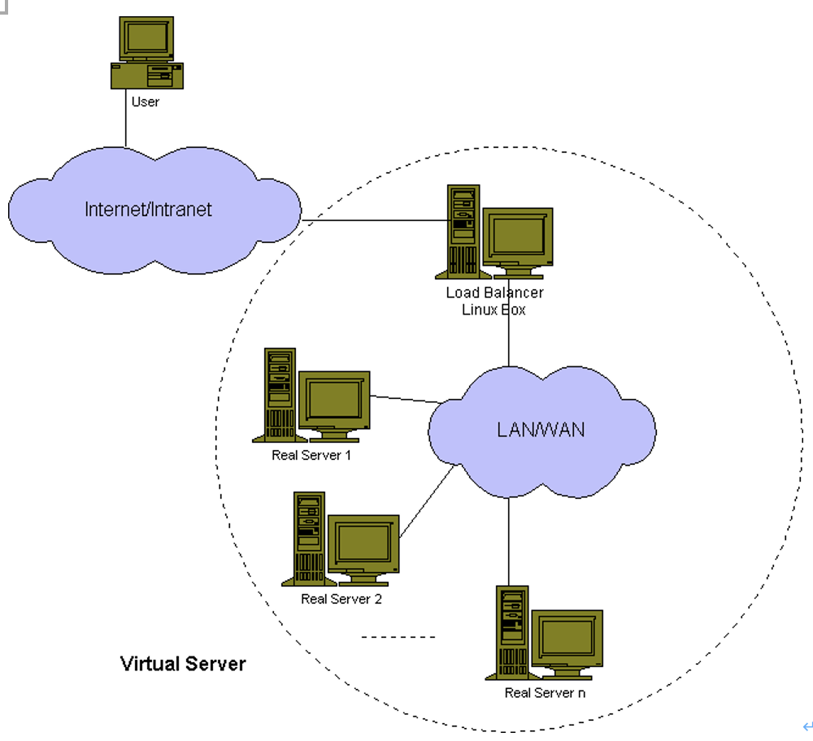
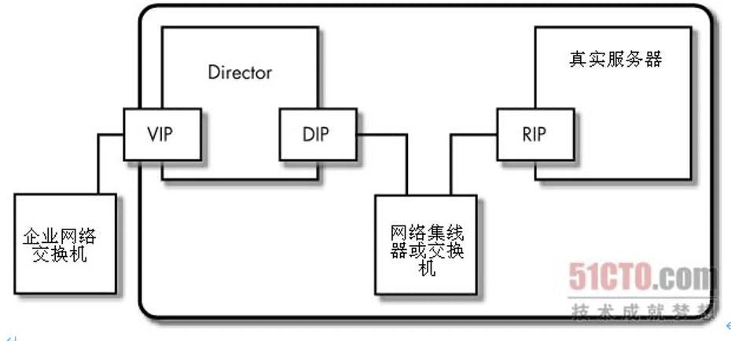
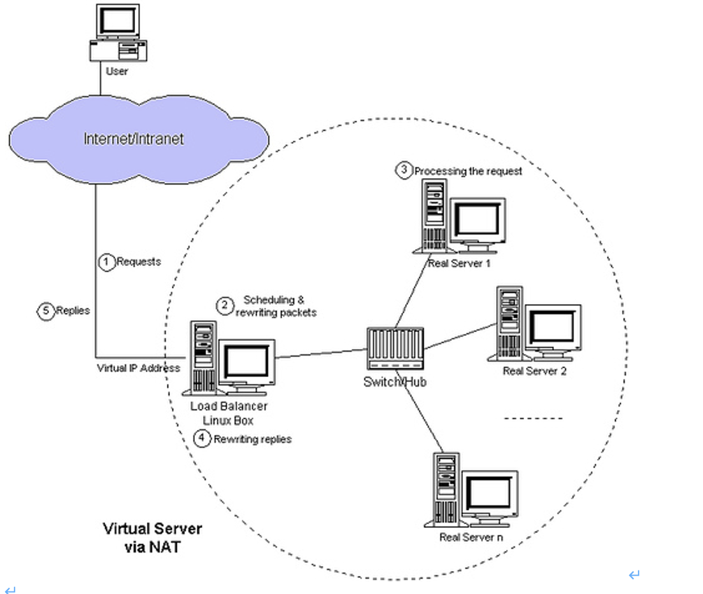
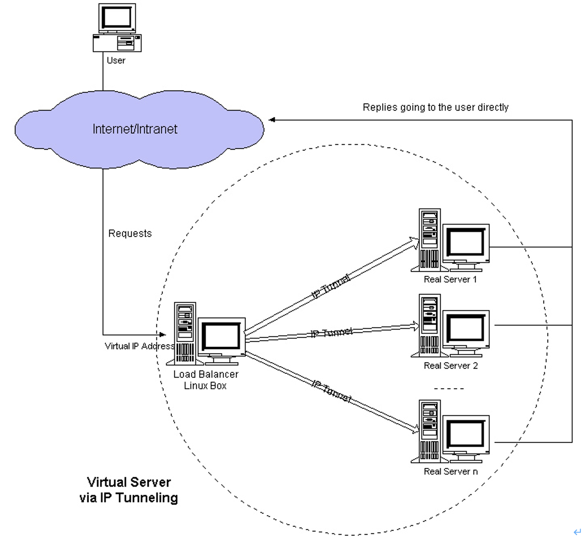
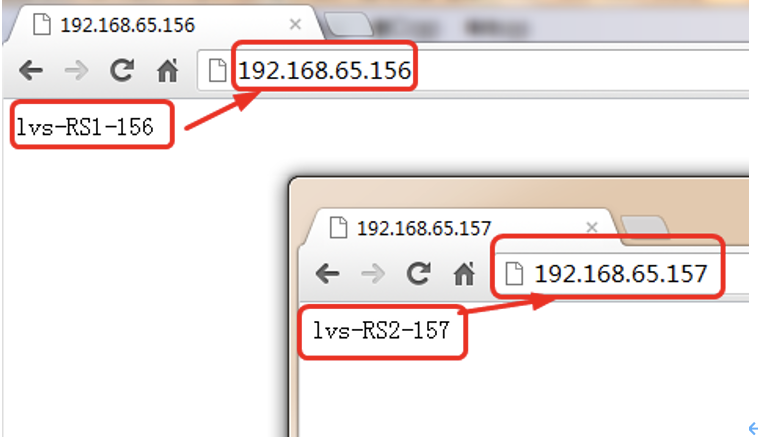
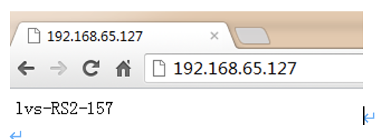
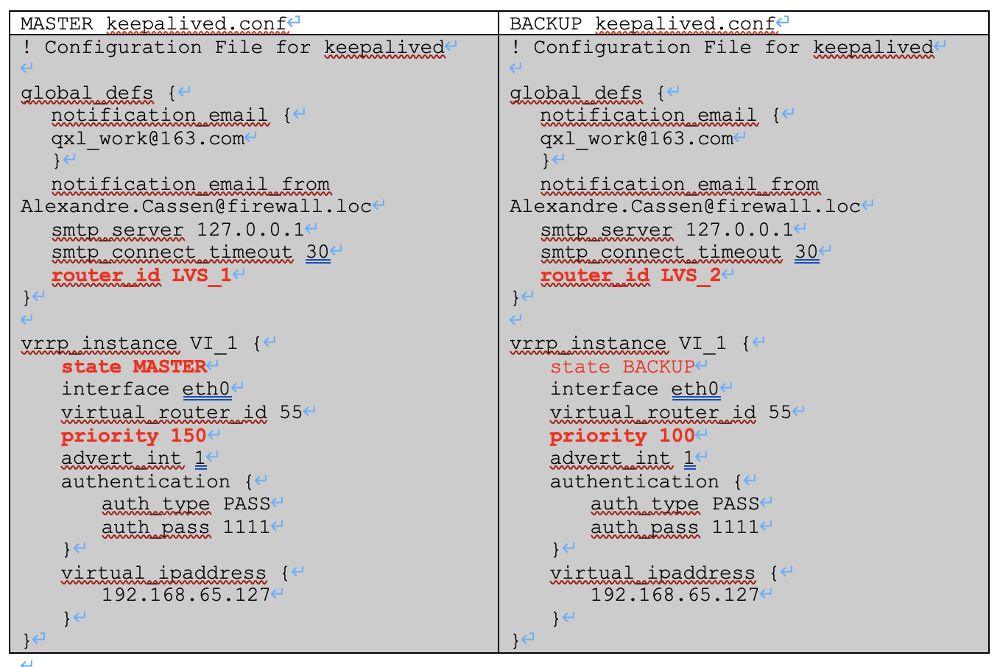
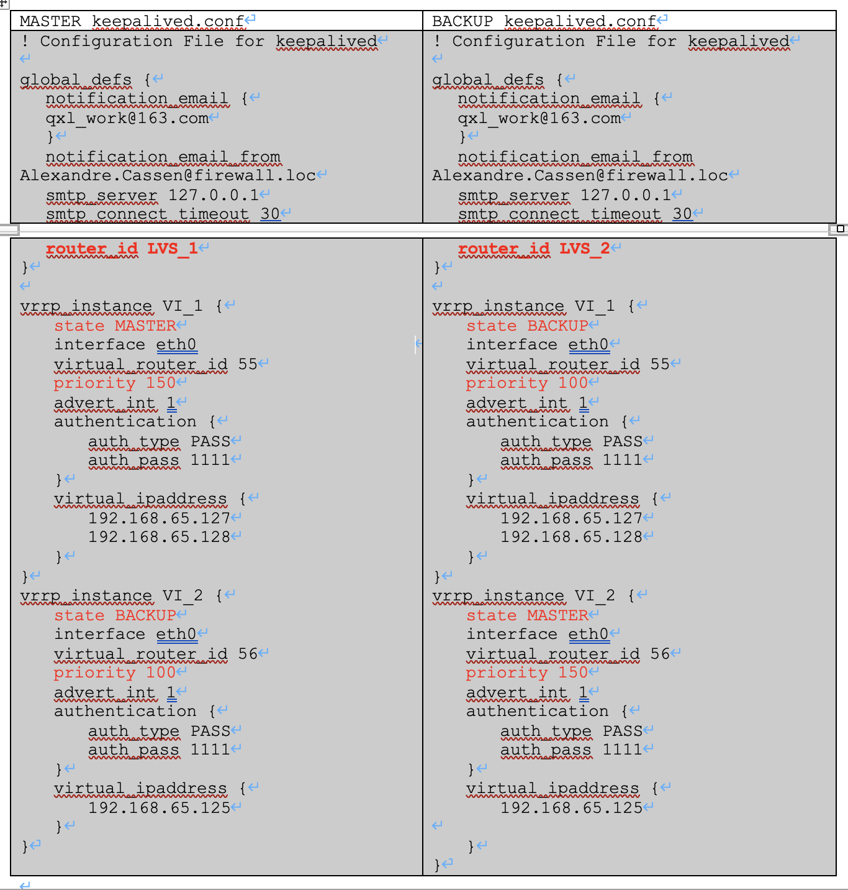

# Lvs负载均衡及Keepalived高可用技术应用详解

# 1.	LVS(linux Virtual Server)介绍
我们使用IPVS配置LVS时，不要直接配置ipvs,需要使用ipvs管理工具ipvsadm。

## 1.1.	IPVS软件工作层次图
## 1.2.	LVS体系结构与工作原理简单描述


## 1.3.	LVS相关术语命名约定

| 名称                                 | 缩写    | 说明                                |
|------------------------------------|-------|-----------------------------------|
| 虚拟IP地址(Virtual IP Address)         | 	VIP	 | Director用于向客户端计算机提供服务的ip地址        | 
| 真实IP地址(Real IP Address)	           | RIP	  | 在集群下面节点上使用的IP地址                   | 
| Director的IP地址(Director IP Address) | 	DIP  | 	Director用于连接内外网络的ip地址，物理网卡上的IP地址 | 
| 客户端主机的IP地址(Client IP Address)	     | CIP	  | 分配给客户端计算机的ip地址，它用作向集群发送请求的源ip地址   | 

(1)	虚拟IP（VIP）

用于客户端计算机连接由集群提供的服务的ip地址叫做虚拟ip地址（VIP），VIP是连接Director到常规公共网络的网卡上的ip别名或从属ip地址[1]。LVS VIP很重要，因为它是客户端计算机连接集群时要用到的，客户端计算机从它们的ip地址向VIP地址发送数据包访问集群服务，然后你告诉客户端计算机使用这个VIP地址的服务名（如DNS、DDNS、WINS、LDAP或NIS），这是客户端计算机要使用集群服务常需要知道的唯一名字或地址。（客户端计算机不知道集群内剩下的ip地址）

单个Director可以配有多个VIP向客户端计算机提供不同的服务，VIP可以是能在因特网上路由的公共ip地址，但这不是必须的。那么什么是必须的呢？是客户端计算机能够访问集群的VIP。（我们将在后面看到，LVS-NAT集群可以在集群内为节点使用一个私有局域网ip地址，即使Director上的VIP是一个公共因特网ip地址）

(2)	真实IP（RIP）

在LVS术语中，向外部世界提供服务的节点叫做真实服务器（本书中我们提到的术语集群节点和真实服务器可相互替换），因此在真实服务器上使用的ip地址叫做真实ip地址（RIP）。

RIP地址是分配给连接真实服务器到同一网络上Director的网卡的永久性ip地址，我叫这个网络为集群网络或Director/真实服务器网络（D/RIP网络），Director使用RIP地址在D/RIP网络上进行正常的网络通讯，但是只有Director需要知道如何与这个ip地址对话。

(3)	Director的IP（DIP）

Director的ip地址（DIP）用在连接Director到D/RIP网络的网卡上的，在Director的VIP上接收访问集群服务的请求，这些请求通过DIP转发出去抵达各个集群节点，如第15章中讨论的那样，DIP和VIP可以处于同一块网卡上。

(4)	客户端计算机的IP（CIP）

客户端计算机的ip地址（CIP）可能是一个本地的、与VIP在同一网络的私有ip地址，或者是一个因特网上的公共ip地址。

下图是一个包括一个集群节点（一台真实服务器）和一个Director的LVS集群的简图



## 1.4.	LVS负载均衡集群的3种工作模式介绍
(1)	NAT模式-网络地址轮换

Virtual Server via Network Address Traslation (VS/NAT)

通过网络地址轮换,调度器重写请求报文的目标地址，根据预设的调度算法，将请求分派给后端的真实服务器；真实服务器的响应报文通过调度器时，报文的源地址被重写，再返回给客户，完成整个负载调度过程。



(2)	TUP模式-隧道模式

Virtual Server via IP Tunneling (VS/TUP)

采用NAT技术时，由于请求和响应报文都必须经过调度器地址重写，当客户请求越来越多时，调试器的处理能力将成为瓶颈。为了解决这个问题，调度器把请求通过IP隧道转发给真实服务器，而真实服务器将响应直接返回给客户，这样调度器只处理请求报文。由于一般网络服务应答数据比请求报文大很多，采用VS/TUN技术后，集群系统的最大吞吐量可以提高10倍。



(3)	DR模式-直接路由

Virtual Server via Direct Routing (VS/DR)

VS/DR通过改写请求报文的MAC地址，将请求发送到真实的服务器，而真实服务器将响应直接返回给客户。同VS/TUP技术一样，VS/DR技术可以极大地提高集群系统的伸缩性。这种方法没有IP隧道的开销，对集群中的真实服务器也没有必须支持IP隧道协议的要求，但是要求调度器与真实服务器都有一块网卡连在同一个物理网段上。


提示：VS/DR模式是互联网使用最多的一种模式。

### 1.4.1.	三种负载均衡技术的优缺点对比

|   | VS/NAT                | VS/TUN        | VS/DR   |
|---|-----------------------|---------------|----|
| Server | 	any                  | 	Tunneling    |  Non-arp device |
| Server network | 	private | 	LAN/WAN | 	LAN |
| Server number	| low (10~20)           | 	High (100)   | 	High (100) |
| Server gateway | 	load balancer        | 	Own router   | 	Own router |

## 1.5.	LVS调度算法
```
算法	说明
rr	轮循调度（Round Robin），调度器通过"轮循"调度算法将外部请求按顺序轮流分配到集群中的真实服务器上，它均等地对待每一台服务器，而不管服务器上实际的连接数和系统负载。只适合于RS处理性能相差不大的情况。
wrr	加权轮循调度（Weighted Round Robin）, 根据RS的不同处理能力来调度访问请求。这样可以保证处理能力强的服务器处理更多的访问流量。调度器可以自动问询真实服务器的负载情况，并动态地调整其权值。相同的RS得到的相同数目的连接数。
dh	Destination hashing:目标地址散列。把同一个IP地址的请求，发送给同一个server。
sh	source hashing,源地址散列。主要实现会话绑定，能够将此前建立的session信息保留了
wlc	加权最少链接（Weighted Least Connections）,在集群系统中的服务器性能差异较大的情况下，调度器采用"加权最少链接"调度算法优化负载均衡性能，具有较高权值的服务器将承受较大比例的活动连接负载。调度器可以自动问询真实服务器的负载情况，并动态地调整其权值。
lc	（Least-Connection）：最少连接调度算法是把新的连接请求分配到当前连接数最小的服务器，最小连接调度是一种动态调度短算法，它通过服务器当前所活跃的连接数来估计服务器的负载均衡，调度器需要记录各个服务器已建立连接的数目，当一个请求被调度到某台服务器，其连接数加1，当连接中止或超时，其连接数减一，在系统实现时，我们也引入当服务器的权值为0时，表示该服务器不可用而不被调度。
lblc	Locality-Based Least Connection）：基于局部性的最少连接
基于局部性的最少连接算法是针对请求报文的目标IP地址的负载均衡调度，不签主要用于Cache集群系统，因为Cache集群中客户请求报文的布标IP地址是变化的，这里假设任何后端服务器都可以处理任何请求，算法的设计目标在服务器的负载基本平衡的情况下，将相同的目标IP地址的请求调度到同一个台服务器，来提高个太服务器的访问局部性和主存Cache命中率，从而调整整个集群系统的处理能力。
SED	(Shortest Expected Delay)：最短期望延迟
基于wlc算法
简单算法：（active+1)*256/weight 【（活动的连接数+1）*256/除以权重】
NQ	never queue）:永不排队（改进的sed）
无需队列，如果有台realserver的连接数＝0就直接分配过去，不需要在进行sed运算。
```
LVS官方文档 TODO

LVS集群之十种调度算法及负载均衡——理论

http://lzysg172.blog.51cto.com/6624306/1199412


## 1.6.	调度算法的生产环境选型
一般的网络服务，如HTTP, mail,mysql等，常用的调度算法有：rr,wlc,wrr。

web cache集群：LBLC,LBLCR

SED和NQ主要对处理时间比较长的网络服务。

## 1.7.	LVS官方中文阅读资料-TODO
http://www.linuxvirtualserver.org/zh/lvs1.html

# 2.	LVS-DR集群介绍
## 2.1.	工作原理简介
首先，来自客户端计算机CIP的请求被发送到Director的VIP。

然后Director使用相同的VIP目的IP地址将请求发送到集群节点或真实服务器。

然后，集群某个点将回复该数据包，并将该数据包直接发送到客户端计算机(不经过Director),并且以此回复数据包使用目的VIP地址作为源IP地址。

因此，实际上是客户计算机被欺骗了，客户计算机始终认为它一在同一台计算机对话，而实际上它正在发送请求数据包给一台计算机(LB),并从另一台计算机(RS)接收回复的数据包。

## 2.2.	调度过程描述
(1)	首先，来自客户端计算机CIP的请求被发送到LVS 调度器的VIP

(2)	LVS调度器收到目标地址为VIP的客户端请求后，将该数据包的MAC地址改成LVS调度器选择的某一台RS的MAC地址，并通过交换机(数据链路层)发给这台RS服务器(因为mac地址是rs服务器，所以rs可以接收到该数据包)。注意：此时数据包的目的及源IP地址没有发生改变。

(3)	RS的链路层收到发来的数据报文后，会从链路层往上传给IP层。此时IP层需要验证请求的目标IP地址。因为包的目标IP(VIP)地址并不是常规数据包那样为RS的本地IP，而仅仅目的MAC地址是RS的。
所以，在RS上需要配置一个VIP的loopback device。这样RS服务器的IP层收到数据包报文验证目的IP为RS本地IP会，才会往上交给传输层。之所以把VIP的loopback device，是因为loopback device是服务器本地使用的网络接口，对外是不可见的，不会跟LVS的VIP冲突(这里还有一个ARP抑制问题).

(4)	RS处理数据包完成后，将应答直接返回给客户端(此时数据包报文的源地址为客户端请求报文的目的地址VIP，而目的地址为客户端的IP(CIP)),回复数据报文不再经过LVS调度器，因此是对外提供LVS负载均衡服务，则RS需要连上互联网(公网IP或网关)才能将应答包返回到客户。不过，RS最好为带有公网IP的服务器，这样不经过网关直接回应客户，如果多个RS使用同一网关出口，网关会成为LVS架构瓶颈，会大大降低LVS的性能。

## 2.3.	应用特点
```
(1)	所有集群节点RS必须和Director在相同的物理网段(即在同一个局域网中)上
(2)	所有客户端入站(而不是出站)请求由Director首先接收，并转发给集群节点RS。
(3)	集群节点RS，通常来说最好带外部IP,而不使用Director及某固定机器作为默认网关，以便将数据包直接回复给客户端计算机，且不会产生回包的瓶颈。
(4)	所有集群节点RS上必须在lo网卡上绑定VIP地址，以便验证通过目的IP非RS的数据包。
(5)	由于所有集群节点RS上必须在lo网卡上绑定VIP地址，因此，带来arp的问题，即集群节点RS默认会响应发往Director VIP的数据包。因此要对所有集群节点RS做ARP抑制处理，把响应VIP的请求交给LVS Director。
(6)	很多操作系统都可以用在集群内容的RS真实服务器上，只要该操作系统能够实现ARP隐藏。如linux,unix,windows。
(7)	LVS/DR模式不需要开启调度器转发功能，这点和LVS/NAT模式是不同的。
(8)	LVS/DR Director(服务器数量可以到100台)可以比LVS-NAT Director(服务器数量10-20台就到瓶颈了)承受更多的并发请求和转发更多的服务器数量。
```

# 3.	安装LVS软件
## 3.1.	安装LVS准备
### 3.1.1.	需要3台服务器或VM虚拟机
(1)	数据库及memcache等负载均衡环境

| 管理IP地址          | 角色                | 备注                          |
|-----------------|-------------------|-----------------------------|
| 192.168.65.155	 | LVS调度器(Director)	 | 	对外提供服务的VIP为192.168.65.127	 | 
| 192.168.65.156	 | RS1(真实服务器)		      | 主机名:lvs-RS1	                | 
| 192.168.65.157	 | 	RS2(真实服务器)		     | 主机名:lvs-RS2	                | 

提示：上面的环境为内部环境负载均衡模式， 即LVS服务是对内部业务的。

(2)	web及web cache等负载均衡环境

| 外部IP地址  | 内部IP地址  | 角色  | 备注  |
|---|---|---|---|
| 192.168.65.155 | 	10.0.0.180 | 	LVS调度器(Director) |  对外提供服务的VIP为192.168.65. 127 |
| 192.168.65.156 | 	10.0.0.181 | 	RS1(真实服务器) | 主机名:lvs-RS1 |
| 192.168.65.157 | 	10.0.0.182 | 	RS2(真实服务器) | 主机名:lvs-RS2 |

提示：此种情况特点为双网卡环境，假设把10.0.0.0/24为内网卡, 192.168.0.0/24为外网卡,

### 3.1.2.	配置简单http服务
安装好apache后，在lvs-RS1和lvs-RS2做如下操作：
```
[root@lvs-RS1 ~]# echo "lvs-RS1-156" >/application/apache/htdocs/index.html
[root@lvs-RS2 ~]# echo "lvs-RS2-157" >/application/apache/htdocs/index.html
```
测试结果：



## 3.2.	安装LVS
以下操作都是在LVS Director上

(1)	下载相关软件包
```
#ipvsadm-1.26.tar.gz (for kernel 2.6.28-rc3 or later) - February 8, 2011
mkdir -p /root/tools
cd /root/tools
wget http://www.linuxvirtualserver.org/software/kernel-2.6/ipvsadm-1.24.tar.gz
```

(2)	安装LVS命令
```
lsmod | grep ip_vs
cat /etc/redhat-release
uname -r
ln -s /usr/src/kernels/2.6.18-238.el5-i686/ /usr/src/linux
```

安装过程：
```
[root@lvs-Director tools]# lsmod | grep ip_vs
[root@lvs-Director tools]# cat /etc/redhat-release
CentOS release 5.6 (Final)
[root@lvs-Director tools]# uname -r
2.6.18-238.el5
[root@lvs-Director tools]# ls  /usr/src/kernels/2.6.18-238.el5-i686/
…省略…
[root@lvs-Director tools]# ln -s /usr/src/kernels/2.6.18-238.el5-i686 /usr/src/linux

注意：
(1)	ln命令的路径要和uname -r输出结果内核版本对应
(2)	如果没有/usr/src/kernels/2.6.18-238.el5-i686,是因为缺少kernel-devel…软件包，可通过yum install kernel-devel -y安装。
(3)	ln这个命令也可以不执行，直接指定内核参数编译即可。
```

```
tar zxf ipvsadm-1.24.tar.gz
cd ipvsadm-1.24
make && make install
lsmod | grep ip_vs
/sbin/ipvsadm
lsmod | grep ip_vs
```
提示：

此时ipvs模块还没有被加载，可以执行ipvsadm或modprobe ip_vs命令把ip_vs加载到系统内核 ，然后再lsmod | grep ip_vs应该看见ip_vs模块被列出。
```
操作过程：
[root@lvs-Director tools]# tar zxf ipvsadm-1.24.tar.gz
[root@lvs-Director tools]# cd ipvsadm-1.24
[root@lvs-Director ipvsadm-1.24]# make && make install
…省略…
[root@lvs-Director ipvsadm-1.24]# lsmod | grep ip_vs
[root@lvs-Director ipvsadm-1.24]# /sbin/ipvsadm
IP Virtual Server version 1.2.1 (size=4096)
Prot LocalAddress:Port Scheduler Flags
-> RemoteAddress:Port           Forward Weight ActiveConn InActConn
[root@lvs-Director ipvsadm-1.24]# lsmod | grep ip_vs
ip_vs                  78081  0
3.3.	手动配置LVS负载均衡服务
(1)	配置DNS(生产环境)
(2)	配置LVS虚拟IP（VIP）
ifconfig eth0:0 192.168.65.127 netmask 255.255.255.0 up

#特别提示：很多朋友在部署时用了如下两条命令(其实是不必要的)
ifconfig eth0:0 192.168.65.127 netmask 255.255.255.255 up
route add -host 192.168.65.127 dev eth0 #添加主机路由,也可不执行
```
(3)	检查结果
```
[root@lvs-Director ~]# ifconfig eth0:0
eth0:0    Link encap:Ethernet  HWaddr 00:0C:29:AF:93:05  
inet addr:192.168.65.127  Bcast:192.168.65.255  Mask:255.255.255.0
UP BROADCAST RUNNING MULTICAST  MTU:1500  Metric:1
Interrupt:67 Base address:0x2000
```
(4)	手工执行配置添加LVS服务并增加两台RS
```
ipvsadm -C
ipvsadm --set 30 5 60
ipvsadm -A -t  192.168.65.127:80 -s wrr -p 20
ipvsadm -a -t  192.168.65.127:80 -r 192.168.65.156:80 -g -w 1
ipvsadm -a -t  192.168.65.127:80 -r 192.168.65.157:80 -g -w 1

删除方法：
ipvsadm -D -t 192.168.65.127:80 -s wrr
ipvsadm -d -t 192.168.65.127:80 -r 192.168.65.157:80
ipvsadm -d -t 192.168.65.127:80 -r 192.168.65.157:80 -g -w 1

相关参数说明：
[root@lvs-Director ~]# ipvsadm -help
ipvsadm v1.24 2005/12/10 (compiled with popt and IPVS v1.2.1)
Usage:
ipvsadm -A|E -t|u|f service-address [-s scheduler] [-p [timeout]] [-M netmask]
ipvsadm -D -t|u|f service-address
ipvsadm -C
ipvsadm -R
ipvsadm -S [-n]
ipvsadm -a|e -t|u|f service-address -r server-address [options]
ipvsadm -d -t|u|f service-address -r server-address
ipvsadm -L|l [options]
ipvsadm -Z [-t|u|f service-address]
ipvsadm --set tcp tcpfin udp
ipvsadm --start-daemon state [--mcast-interface interface] [--syncid sid]
ipvsadm --stop-daemon state
ipvsadm -h

Commands:
Either long or short options are allowed.
--add-service     -A        add virtual service with options
--edit-service    -E        edit virtual service with options
--delete-service  -D        delete virtual service
--clear           -C        clear the whole table
--restore         -R        restore rules from stdin
--save            -S        save rules to stdout
--add-server      -a        add real server with options
--edit-server     -e        edit real server with options
--delete-server   -d        delete real server
--list            -L|-l     list the table
--zero            -Z        zero counters in a service or all services
--set tcp tcpfin udp        set connection timeout values
--start-daemon              start connection sync daemon
--stop-daemon               stop connection sync daemon
--help            -h        display this help message

Options:
--tcp-service  -t service-address   service-address is host[:port]
--udp-service  -u service-address   service-address is host[:port]
--fwmark-service  -f fwmark         fwmark is an integer greater than zero
--scheduler    -s scheduler         one of rr|wrr|lc|wlc|lblc|lblcr|dh|sh|sed|nq,
the default scheduler is wlc.
--persistent   -p [timeout]         persistent service
--netmask      -M netmask           persistent granularity mask
--real-server  -r server-address    server-address is host (and port)
--gatewaying   -g                   gatewaying (direct routing) (default)
--ipip         -i                   ipip encapsulation (tunneling)
--masquerading -m                   masquerading (NAT)
--weight       -w weight            capacity of real server
--u-threshold  -x uthreshold        upper threshold of connections
--l-threshold  -y lthreshold        lower threshold of connections
--mcast-interface interface         multicast interface for connection sync
--syncid sid                        syncid for connection sync (default=255)
--connection   -c                   output of current IPVS connections
--timeout                           output of timeout (tcp tcpfin udp)
--daemon                            output of daemon information
--stats                             output of statistics information
--rate                              output of rate information
--exact                             expand numbers (display exact values)
--thresholds                        output of thresholds information
--persistent-conn                   output of persistent connection info
--sort                              sorting output of service/server entries
--numeric      -n                   numeric output of addresses and ports
```
操作过程：
```
[root@lvs-Director ~]# ipvsadm -C
[root@lvs-Director ~]# ipvsadm --set 30 5 60
[root@lvs-Director ~]# ipvsadm -A -t  192.168.65.127:80 -s wrr -p 20
[root@lvs-Director ~]# ipvsadm -a -t  192.168.65.127:80 -r 192.168.65.156:80 -g -w 1
[root@lvs-Director ~]# ipvsadm -a -t  192.168.65.127:80 -r 192.168.65.157:80 -g -w 1
[root@lvs-Director ~]# ipvsadm -L -n
IP Virtual Server version 1.2.1 (size=4096)
Prot LocalAddress:Port Scheduler Flags
-> RemoteAddress:Port           Forward Weight ActiveConn InActConn
TCP  192.168.65.127:80 wrr persistent 20
-> 192.168.65.157:80            Route   1      0          0         
-> 192.168.65.156:80            Route   1      0          0      
[root@lvs-Director ~]# ipvsadm -L -n --sort
IP Virtual Server version 1.2.1 (size=4096)
Prot LocalAddress:Port Scheduler Flags
-> RemoteAddress:Port           Forward Weight ActiveConn InActConn
TCP  192.168.65.127:80 wrr persistent 20
-> 192.168.65.156:80            Route   1      0          0         
-> 192.168.65.157:80            Route   1      0          0
```
### 3.3.1.	手工在RS端绑定VIP

每台real server端执行
ifconfig lo:127 192.168.65.127 netmask 255.255.255.255 up
route add -host 192.168.65.127 dev lo
每个集群节点上环回接口(lo)设备上被绑定VIP地址(其广播地址是其本身，子网掩码是255.255.255.255,采取可变长掩码方式把网段划分成只含一个主机地址,目的是避免ip地址冲突)允许LVS-DR集群中集群节点接受发向该VIP地址的数据包，这会有严重的问题发生，集群内部真实服务器将尝试回复来自请求VIP客户端的ARP广播，这样所有的真实服务器将声称自己拥有该VIP地址，这时客户端将直接发送请求数据到真实服务器上，从而破坏了DR集群的方法。因此，必须要抑制真实服务器的ARP广播。

### 3.3.2.	手工在RS端抑制ARP
抑制ARP响应的方法如下：
```
echo "1">/proc/sys/net/ipv4/conf/lo/arp_ignore
echo "2">/proc/sys/net/ipv4/conf/lo/arp_announce
echo "1">/proc/sys/net/ipv4/conf/all/arp_ignore
echo "2">/proc/sys/net/ipv4/conf/all/arp_announce
```
操作过程：
```
[root@lvs-RS2 ~]# cat /proc/sys/net/ipv4/conf/lo/arp_ignore
0
[root@lvs-RS2 ~]# cat /proc/sys/net/ipv4/conf/lo/arp_announce
0
[root@lvs-RS2 ~]# cat /proc/sys/net/ipv4/conf/all/arp_ignore
0
[root@lvs-RS2 ~]# cat /proc/sys/net/ipv4/conf/all/arp_announce
0
[root@lvs-RS2 ~]# echo "1" > /proc/sys/net/ipv4/conf/lo/arp_ignore
[root@lvs-RS2 ~]# echo "2" > /proc/sys/net/ipv4/conf/lo/arp_announce
[root@lvs-RS2 ~]# echo "1" > /proc/sys/net/ipv4/conf/all/arp_ignore
[root@lvs-RS2 ~]# echo "2" > /proc/sys/net/ipv4/conf/all/arp_announce
[root@lvs-RS2 ~]# route -n | grep 127
192.168.65.127  0.0.0.0         255.255.255.255 UH    0      0        0 lo
```
### 3.3.3.	检查手工添加LVS结果


```
将ipvsadm -A -t  192.168.65.127:80 -s wrr -p 20中-p 20删除(删除会话保持)完执行如下命令：
[root@lamp ~]# for i in `seq 1 10`;do curl http://192.168.65.127/ ; done
lvs-RS2-157
lvs-RS1-156
lvs-RS2-157
lvs-RS1-156
lvs-RS2-157
lvs-RS1-156
lvs-RS2-157
lvs-RS1-156
lvs-RS2-157
lvs-RS1-156


查看状态信息：
[root@lvs-Director ~]# ipvsadm -L -n --stats
IP Virtual Server version 1.2.1 (size=4096)
Prot LocalAddress:Port               Conns   InPkts  OutPkts  InBytes OutBytes
-> RemoteAddress:Port
TCP  192.168.65.127:80                 422     2645        0   212436        0
-> 192.168.65.157:80                 211     1379        0   126876        0
-> 192.168.65.156:80                 211     1266        0    85560        0
```
### 3.3.4.	arp_ignore和arp_announce内核参数  
```
arp抑制技术参数说明
中文说明：
arp_ignore- INTEGER
定义对目标地址为本地IP的ARP询问不同的应答模式
0 -(默认值): 回应任何网络接口上对任何本地IP地址的arp查询请求。
1 -只回答目标IP地址是来访网络接口本地地址的ARP查询请求。
2 -只回答目标IP地址是来访网络接口本地地址的ARP查询请求,且来访IP必须在该网络接口的子网段内。
3 -不回应该网络界面的arp请求，而只对设置的唯一和连接地址做出回应。
4-7 -保留未使用。
8 -不回应所有（本地地址）的arp查询。


arp_announce - INTEGER
对网络接口上，本地IP地址的发出的，ARP回应，作出相应级别的限制:  
确定不同程度的限制,宣布对来自本地源IP地址发出Arp请求的接口
0 -(默认) 在任意网络接口（eth0,eth1，lo）上的任何本地地址
1 -尽量避免不在该网络接口子网段的本地地址做出arp回应. 当发起ARP请求的源IP地址是被设置应该经由路由达到此网络接口的时候很有用.此时会检查来访IP是否为所有接口上的子网段内ip之一。如果该来访IP不属于各个网络接口上的子网段内,那么将采用级别2的方式来进行处理.
2 -对查询目标使用最适当的本地地址.在此模式下将忽略这个IP数据包的源地址并尝试选择与能与该地址通信的本地地址.首要是选择所有的网络接口的子网中外出访问子网中包含该目标IP地址的本地地址. 如果没有合适的地址被发现,将选择当前的发送网络接口或其他的有可能接受到该ARP回应的网络接口来进行发送.限制了使用本地的vip地址作为优先的网络接口
```
## 3.4.	使用脚本配置LVS负载均衡服务
### 3.4.1.	ipvs_server脚本
```
#!/bin/bash
# this script is created by oldboy.
# e_mail:31333741@qq.com
# qqinfo:31333741
# function:
# version:1.1
. /etc/init.d/functions
VIP=192.168.1.181
SUBNET=eth0:`echo $VIP|cut -d. -f4`
PORT=80
GW=192.168.1.1

#w=3
RIP1=(
        192.168.1.178
     )
#w=1
RIP2=(
        192.168.1.179
     )
IFCONFIG=/sbin/ifconfig
ROUTE=/sbin/route
IPVSADM=/sbin/ipvsadm
ARPING=/sbin/arping

#functions
function usage (){
        local script_name
        script_name=$1
        echo "Usgae : $script_name [ start | stop | restart ]"
        echo ""
        return 1
}

function checkCmd (){
        if [ ! -f $1 ]; then
                echo "Can't find "$1
                return 1
        fi
}

function checkSubnet (){
        $IFCONFIG |grep "$1"|wc -l
}

function ipvsStart (){
        #judge if $SUBNET is exist.
        if [ $(checkSubnet $SUBNET) -ne 0 ]; then
                $IFCONFIG $SUBNET down
        fi
        local rs
        #$IFCONFIG $SUBNET $VIP broadcast $VIP netmask 255.255.255.255 up
        $IFCONFIG $SUBNET $VIP broadcast $VIP netmask 255.255.255.0 up
        #$ROUTE add -host $VIP dev $SUBNET
        $IPVSADM -C
        $IPVSADM -A -t $VIP:$PORT -s wrr -p 60

        for ((i=0; i<`echo ${#RIP1[*]}`; i++))
        do
                $IPVSADM -a -t $VIP:$PORT -r ${RIP1[$i]}:$PORT -g -w 1
        done

        for ((i=0; i<`echo ${#RIP2[*]}`; i++))
        do
                $IPVSADM -a -t $VIP:$PORT -r ${RIP2[$i]}:$PORT -g -w 1
        done
        rs=$?
        $IPVSADM >/tmp/oldboy.log

        # update MAC
	NetIf=$(echo ${SUBNET}|awk -F ":" '{print $1}')
        $ARPING -c 1 -I ${NetIf} -s $VIP $GW >>/tmp/oldboy.log
        [ $rs -eq 0 ] && action "Ipvsadm start." /bin/true
        return $rs
}

function ipvsStop (){
        local rs
	rs=1
        #clean ipvs
	$IFCONFIG $SUBNET down 
        $IPVSADM -C
        $IPVSADM -Z
        
        rs=$?
        #$ROUTE del $VIP
	$ARPING -c 1 -I ${NetIf} -s $VIP $GW  >/dev/null 2>&1
        [ $rs -eq 0 ] && action "Ipvsadm stoped." /bin/true
        return $rs
}

main ()
{
	#judge argv num by oldboy
        if [ $# -ne 1 ]; then
                usage $0
        fi

        case "$1" in
                start)
                        ipvsStart
                        ;;
                stop)
                        ipvsStop
                        ;;
                restart)
                        ipvsStop
                        ipvsStart
                        ;;
                *)
                        usage $0
                        ;;
        esac
}

#start operating
main $*

```


### 3.4.2.	ipvs_client脚本
```
#!/bin/bash
# Written by oldboy （31333741@qq.com）
# QQ:31333741
# description: Config realserver lo and apply noarp 
VIP=(
        192.168.1.181
     )

. /etc/rc.d/init.d/functions

case "$1" in
start)
        for ((i=0; i<`echo ${#VIP[*]}`; i++))
        do
           interface="lo:`echo ${VIP[$i]}|awk -F . '{print $4}'`"
           /sbin/ifconfig $interface ${VIP[$i]} broadcast ${VIP[$i]} netmask 255.255.255.255 up
        done
        echo "1" >/proc/sys/net/ipv4/conf/lo/arp_ignore
        echo "2" >/proc/sys/net/ipv4/conf/lo/arp_announce
        echo "1" >/proc/sys/net/ipv4/conf/all/arp_ignore
        echo "2" >/proc/sys/net/ipv4/conf/all/arp_announce
	    action "Start LVS of RearServer.by old1boy"
        ;;
stop)
        for ((i=0; i<`echo ${#VIP[*]}`; i++))
        do
            interface="lo:`echo ${VIP[$i]}|awk -F . '{print $4}'`"
            /sbin/ifconfig $interface ${VIP[$i]} broadcast ${VIP[$i]} netmask 255.255.255.255 down
        done
        echo "0" >/proc/sys/net/ipv4/conf/lo/arp_ignore
        echo "0" >/proc/sys/net/ipv4/conf/lo/arp_announce
        echo "0" >/proc/sys/net/ipv4/conf/all/arp_ignore
        echo "0" >/proc/sys/net/ipv4/conf/all/arp_announce
	    action "Close LVS of RearServer.by old2boy"
        ;;
*)
        echo "Usage: $0 {start|stop}"
        exit 1
esac

```
# 4.	Keepalived高可用集群介绍
## 4.1.	Keepalived介绍
      keepalived起初是为LVS设计的，专门用来监控集群系统中各个服务节点的状态，后来又加入VRRP的功能，VRRP出现的目的就是为了解决静态路由出现的单点故障问题，它能保征网络的不间隔、稳定的运行。所以,keepalived一方面具有LVS cluster nodes headchecks功能，另一方面也具有lvs directors failover功能
## 4.2.	Keepalived服务两在用途:headthcheck & failover
### 4.2.1.	lvs directors failover

这是针对有两个负载均衡器Director同时工作而采取的故障转移措施。当主负载均衡器(MASTER)失效或出现故障时，

# 5.	Keepalived高可用实战
官网：http://www.keepalived.org/

## 5.1.	下载Keepalived软件包
```
mkdir -p /home/tools
cd /home/tools
wget http://www.keepalived.org/software/keepalived-1.1.17.tar.gz
```

## 5.2.	安装Keepalived
提示：安装前请确认路径: --with-kernel-dir=/usr/src/kernels/2.6.18-238.el5-i686

方法一：
```
ln -s /usr/src/kernels/2.6.18-238.el5-i686 /usr/src/linux
#如果没有/usr/src/kernels/2.6.18-238.el5-i686,是因为缺少kernel-devel…软件包，可通过yum install kernel-devel -y安装。
tar zxf keepalived-1.1.17.tar.gz
cd  keepalived-1.1.17
./configure
make && make install
```

方法二：
```
tar zxf keepalived-1.1.17.tar.gz
cd  keepalived-1.1.17
./configure \
--with-kernel-dir=/usr/src/kernels/2.6.18-238.el5-i686
make && make install

Keepalived configuration后的正确结果
Keepalived configuration
------------------------
Keepalived version       : 1.1.17
Compiler                 : gcc
Compiler flags           : -g -O2
Extra Lib                : -lpopt -lssl -lcrypto
Use IPVS Framework       : Yes
IPVS sync daemon support : Yes
Use VRRP Framework       : Yes
Use LinkWatch            : No
Use Debug flags          : No
```
## 5.3.	./configure --help参数说明
```
#./configure --help
--with-kernel-dir=DIR   path to linux kernel source directory
#很重要的参数，指定使用内核源码的头文件(include目录)。如果使用LVS时，才需要用到此参数，否则不需要。

--disable-lvs-syncd     do not use LVS synchronization daemon
--disable-lvs           do not use the LVS framework
#如果只想做keepalived其它服务(http,db,nginx,haproxy)高可用而不做lvs高可用,可以使用--disable-lvs和--disable-lvs-syncd禁止LVS功能。
```
## 5.4.	配置规范启动
```
/bin/cp /usr/local/etc/rc.d/init.d/keepalived /etc/init.d/  #生成启动命令
/bin/cp /usr/local/etc/sysconfig/keepalived /etc/sysconfig/
mkdir /etc/keepalived #创建默认的配置文件路径
/bin/cp /usr/local/etc/keepalived/keepalived.conf /etc/keepalived/
#把keepalived.conf拷贝到/etc/keepalived下

/bin/cp /usr/local/sbin/keepalived /usr/sbin/
/etc/init.d/keepalived start #或/etc/init.d/keepalived stop
```
## 5.5.	keepalive.conf实现IP接管部分参数说明
```
[root@lvs1 ~]# cat -n /etc/keepalived/keepalived.conf 
     1  ! Configuration File for keepalived
     2
     3  global_defs {
     4     notification_email {
     5       acassen@firewall.loc
     6       failover@firewall.loc
     7       sysadmin@firewall.loc
     8     }
     9     notification_email_from Alexandre.Cassen@firewall.loc
    10     smtp_server 192.168.200.1
    11     smtp_connect_timeout 30
    12     router_id LVS_DEVEL
    13  }
	#全局定义块部分：主要设置keepalived的通知机制和标识
#10行是LVS负载均衡标识(router_id)。在一个局域网内，它应该是唯一的

    15  vrrp_instance VI_1 {
    16      state MASTER
    17      interface eth0
    18      virtual_router_id 51
    19      priority 100
    20      advert_int 1
    21      authentication {
    22          auth_type PASS
    23          auth_pass 1111
    24      }
    25      virtual_ipaddress {
    26          192.168.200.16
    27          192.168.200.17
    28          192.168.200.18
    29      }
    30  }
    31
    32  virtual_server 192.168.200.100 443 {
    33      delay_loop 6
    34      lb_algo rr
    35      lb_kind NAT
    36      nat_mask 255.255.255.0
    37      persistence_timeout 50
    38      protocol TCP
    39
    40      real_server 192.168.201.100 443 {
    41          weight 1
    42          SSL_GET {
    43              url {
    44                path /
    45                digest ff20ad2481f97b1754ef3e12ecd3a9cc
    46              }
    47              url {
    48                path /mrtg/
    49                digest 9b3a0c85a887a256d6939da88aabd8cd
    50              }
    51              connect_timeout 3
    52              nb_get_retry 3
    53              delay_before_retry 3
    54          }
    55      }
    56  }
    57
    58  virtual_server 10.10.10.2 1358 {
    59      delay_loop 6
    60      lb_algo rr 
    61      lb_kind NAT
    62      persistence_timeout 50
    63      protocol TCP
    64
    65      sorry_server 192.168.200.200 1358
    66
    67      real_server 192.168.200.2 1358 {
    68          weight 1
    69          HTTP_GET {
    70              url { 
    71                path /testurl/test.jsp
    72                digest 640205b7b0fc66c1ea91c463fac6334d
    73              }
    74              url { 
    75                path /testurl2/test.jsp
    76                digest 640205b7b0fc66c1ea91c463fac6334d
    77              }
    78              url { 
    79                path /testurl3/test.jsp
    80                digest 640205b7b0fc66c1ea91c463fac6334d
    81              }
    82              connect_timeout 3
    83              nb_get_retry 3
    84              delay_before_retry 3
    85          }
    86      }
    87
    88      real_server 192.168.200.3 1358 {
    89          weight 1
    90          HTTP_GET {
    91              url { 
    92                path /testurl/test.jsp
    93                digest 640205b7b0fc66c1ea91c463fac6334c
    94              }
    95              url { 
    96                path /testurl2/test.jsp
    97                digest 640205b7b0fc66c1ea91c463fac6334c
    98              }
    99              connect_timeout 3
   100              nb_get_retry 3
   101              delay_before_retry 3
   102          }
   103      }
   104  }
   105
   106  virtual_server 10.10.10.3 1358 {
   107      delay_loop 3
   108      lb_algo rr 
   109      lb_kind NAT
   110      nat_mask 255.255.255.0
   111      persistence_timeout 50
   112      protocol TCP
   113
   114      real_server 192.168.200.4 1358 {
   115          weight 1
   116          HTTP_GET {
   117              url { 
   118                path /testurl/test.jsp
   119                digest 640205b7b0fc66c1ea91c463fac6334d
   120              }
   121              url { 
   122                path /testurl2/test.jsp
   123                digest 640205b7b0fc66c1ea91c463fac6334d
   124              }
   125              url { 
   126                path /testurl3/test.jsp
   127                digest 640205b7b0fc66c1ea91c463fac6334d
   128              }
   129              connect_timeout 3
   130              nb_get_retry 3
   131              delay_before_retry 3
   132          }
   133      }
   134
   135      real_server 192.168.200.5 1358 {
   136          weight 1
   137          HTTP_GET {
   138              url { 
   139                path /testurl/test.jsp
   140                digest 640205b7b0fc66c1ea91c463fac6334d
   141              }
   142              url { 
   143                path /testurl2/test.jsp
   144                digest 640205b7b0fc66c1ea91c463fac6334d
   145              }
   146              url { 
   147                path /testurl3/test.jsp
   148                digest 640205b7b0fc66c1ea91c463fac6334d
   149              }
   150              connect_timeout 3
   151              nb_get_retry 3
   152              delay_before_retry 3
   153          }
   154      }
   155  }

```
## 5.6.	配置keepalived.conf实现IP接管(配置双主)
### 5.6.1.	单实例主备模式的keepalived配置文件对比


MASTER keepalived.conf

```
! Configuration File for keepalived

global_defs {
   notification_email {
   qxl_work@163.com
   }
   notification_email_from Alexandre.Cassen@firewall.loc
   smtp_server 127.0.0.1
   smtp_connect_timeout 30
   router_id LVS_1
}

vrrp_instance VI_1 {
    state MASTER
    interface eth0
    virtual_router_id 55
    priority 150
    advert_int 1
    authentication {
        auth_type PASS
        auth_pass 1111
    }
    virtual_ipaddress {
        192.168.65.127
    }
}

```

BACKUP keepalived.conf
```
! Configuration File for keepalived

global_defs {
   notification_email {
   qxl_work@163.com
   }
   notification_email_from Alexandre.Cassen@firewall.loc
   smtp_server 127.0.0.1
   smtp_connect_timeout 30
   router_id LVS_2
}

vrrp_instance VI_1 {
    state BACKUP
    interface eth0
    virtual_router_id 55
    priority 100
    advert_int 1
    authentication {
        auth_type PASS
        auth_pass 1111
    }
    virtual_ipaddress {
        192.168.65.127
    }
}

```

### 5.6.2.	双实例双主模式的keepalived配置文件对比


MASTER keepalived.conf
```
! Configuration File for keepalived

global_defs {
   notification_email {
   qxl_work@163.com
   }
   notification_email_from Alexandre.Cassen@firewall.loc
   smtp_server 127.0.0.1
   smtp_connect_timeout 30
   router_id LVS_1
}

vrrp_instance VI_1 {
    state MASTER
    interface eth0
    virtual_router_id 55
    priority 150
    advert_int 1
    authentication {
        auth_type PASS
        auth_pass 1111
    }
    virtual_ipaddress {
        192.168.65.127
        192.168.65.128
    }
}
vrrp_instance VI_2 {
    state BACKUP
    interface eth0
    virtual_router_id 56
    priority 100
    advert_int 1
    authentication {
        auth_type PASS
        auth_pass 1111
    }
    virtual_ipaddress {
        192.168.65.125
    }
}

```

BACKUP keepalived.conf
```
! Configuration File for keepalived

global_defs {
   notification_email {
   qxl_work@163.com
   }
   notification_email_from Alexandre.Cassen@firewall.loc
   smtp_server 127.0.0.1
   smtp_connect_timeout 30
   router_id LVS_2
}

vrrp_instance VI_1 {
    state BACKUP
    interface eth0
    virtual_router_id 55
    priority 100
    advert_int 1
    authentication {
        auth_type PASS
        auth_pass 1111
    }
    virtual_ipaddress {
        192.168.65.127
        192.168.65.128
    }
}
vrrp_instance VI_2 {
    state MASTER
    interface eth0
    virtual_router_id 56
    priority 150
    advert_int 1
    authentication {
        auth_type PASS
        auth_pass 1111
    }
    virtual_ipaddress {
        192.168.65.125

    }
}

```