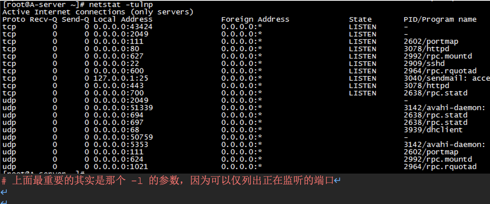
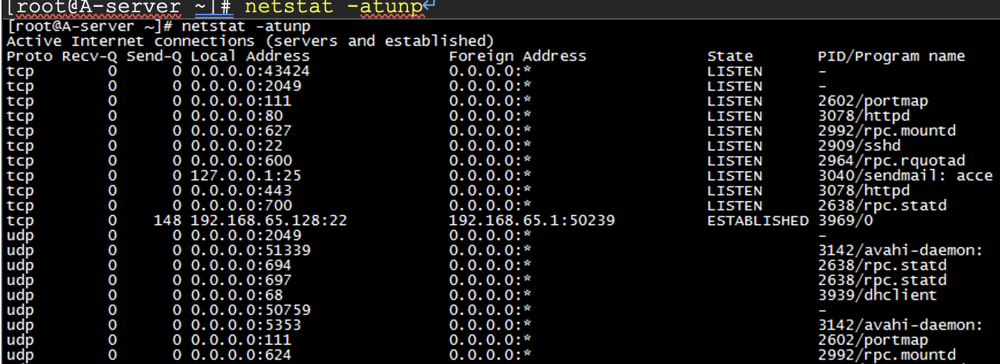

# 命令总结-基本网络操作命令(telnet ssh scp wget ping route ifconfig ifup ifdown netstat)


# 1.	telnet

telnet - user interface to the TELNET protocol #TELNET协议的用户接口

```
语法：
telnet  [-8]  [-E]  [-F]  [-K] [-L] [-S tos] [-X authtype] [-a] [-c] [-d] [-e  
escapechar] [-f] [-k realm] [-l user] [-n tracefile] [-r] [-x] [host [port]]

-8     Specify an 8-bit data path.  This causes an attempt to  negotiate  the
TELNET BINARY option on both input and output.
#允许使用8位字符资料，包括输入与输出。

-E     Stop any character from being recognized as an escape character.

-F     forward a forwardable copy of the local credentials to the remote system.


-K     Specify no automatic login to the remote system.
#不自动登入远端主机。

-L     Specify an 8-bit data path on output.  This causes the  BINARY  option
to be negotiated on output.

-S tos Set  the  IP type-of-service (TOS) option for the telnet connection to
the value tos, which can be a numeric TOS value (in decimal, or a  hex
value  preceded  by 0x, or an octal value preceded by a leading 0) or,
on systems  that  support  it,  a  symbolic  TOS  name  found  in  the
/etc/iptos file.

-X atype
Disable the atype type of authentication. #关闭指定的认证形态

-a     Attempt  automatic login.  This sends the user name via the USER vari-
able of the ENVIRON option, if supported by the  remote  system.   The
name used is that of the current user as returned by getlogin(2) if it
agrees with the current user ID; otherwise it is the  name  associated
with the user ID. #尝试自动登入远端系统, 就目前而言，这个选项用于通过ENVIRON 选项的USER变量发送用户名(如果远程主机支持这种用法的话)。如果函数 getlogin(2)返回的当前用户所用的名字与当前用户ID相一致，那么USER变量就为该命令返回的名字，否则为与当前用户ID对应的用户名。

-c     Disable  the  reading  of  the user's .telnetrc file.  (See the toggle
skiprc command on this man page.)# 不读取用户的.telnetrc文件。

-d     Set the initial value of the debug flag to TRUE	  #设置调试开关的初始值为TRUE

-e escape char
Set the initial telnet escape character or telnet rlogin escape  char-
acter  to  escape char.  If escape char is omitted, then there will be
no escape character.
#把TELNET转义字符的初始值设置为escapechar。如果忽略本选项，则无转义字符。

-f     forward a copy of the local credentials to the remote system.

-k realm
If Kerberos authentication is being used, request that  telnet  obtain
tickets  for  the  remote  host  in  realm realm instead of the remote
host's realm, as determined by krb_realmofhost(3).

-l user
If the remote system understands the ENVIRON option, then user will be
sent  to  the  remote system as the value for the variable USER.  This
option implies the -a option.  This option may also be used  with  the
open command.

-n tracefile
Open tracefile for recording trace information.  See the set tracefile
command below.  #打开tracefile文件以记录跟踪信息。

-r     Specify a user interface similar to rlogin(1).  In this mode, the tel-
net  rlogin escape character is set to the tilde (~) character, unless
modified by the -e option.

-x     Turn on encryption of the data stream.  When this option is turned on,
telnet  will exit with an error if authentication cannot be negotiated
or if encryption cannot be turned on.

host   Indicates the name, alias, or Internet address of the remote host.

port   Indicates a port number (address of an application).  If the  port  is
not specified, the default telnet port (23) is used.

host表示远程主机的正式名称、别名或IP地址。
port端口号，即各种Internet应用程序地址。如未指明端口号，则使用telnet的缺省端口号。

telnet是一种远程连接协议
“telnet ip 端口” 连接 指定的ip和端口的远程主机
[root@stu412 ~]# telnet 123.58.180.6 80
Trying 123.58.180.6...
Connected to 123.58.180.6 (123.58.180.6).
Escape character is '^]'.

[root@stu412 ~]# telnet
telnet> help
Commands may be abbreviated.  Commands are:

#关闭当前连接
close           close current connection

#强制退出远程用户并关闭连接
logout          forcibly logout remote user and close the connection

#display显示当前操作的参数
display         display operating parameters
mode            try to enter line or character mode ('mode ?' for more)
open            connect to a site #连接到某一站点
quit            exit telnet	#退出

# send发送特殊字符
send            transmit special characters ('send ?' for more) set

#设置当前操作的参数
set operating parameters ('set ?' for more)
unset           unset operating parameters ('unset ?' for more)
status          print status information

# 对操作参数进行开关转换
toggle          toggle operating parameters ('toggle ?' for more)

# 改变特殊字符的状态
slc             change state of special charaters ('slc ?' for more)
auth            turn on (off) authentication ('auth ?' for more)
encrypt         turn on (off) encryption ('encrypt ?' for more)
forward         turn on (off) credential forwarding ('forward ?' for more)
z               suspend telnet
!               invoke a subshell
environ         change environment variables ('environ ?' for more)
?               print help information
```
# 2.	ssh
ssh - OpenSSH SSH client (remote login program) #openSSH的ssh客户端(远程登录程序)

```
ssh (SSH client) is a program for logging into a remote machine and for executing commands on a remote machine.		#ssh是可以登录远程机器上并在上面执行命令的程序。

语法：
ssh [-1246AaCfgkMNnqsTtVvXxY] [-b bind_address] [-c cipher_spec]
[-D [bind_address:]port] [-e escape_char] [-F configfile]
[-i identity_file] [-L [bind_address:]port:host:hostport]
[-l login_name] [-m mac_spec] [-O ctl_cmd] [-o option] [-p port]
[-R [bind_address:]port:host:hostport] [-S ctl_path]
[-w tunnel:tunnel] [user@]hostname [command]
```

实例1：连接到远程主机
```
命令格式 ：
ssh name@remoteserver 或者
Ssh remoteserver -l name
说明：以上两种方式都可以远程登录到远程主机，server代表远程主机，name为登录远程主机的用户名。
[root@A-Server ~]# ssh oldboy@192.168.65.129		#连接到129机器，登录用户是oldboy
oldboy@192.168.65.129's password:
[oldboy@B-client1 ~]$	#注意看，主机名和用户已经切换

#ssh的另一种用法
[root@A-Server ~]# ssh 192.168.65.129 -l oldboy
oldboy@192.168.65.129's password:
Last login: Wed Jul 25 23:03:06 2012 from 192.168.65.128
[oldboy@B-client1 ~]$	#注意看，主机名和用户已经切换

[root@A-Server ~]# ssh 192.168.65.129 -l oldboy -p 22	#指定端口
oldboy@192.168.65.129's password:
Last login: Thu Jul 26 07:20:14 2012 from 192.168.65.128
```

实例2：通过远程主机1跳到远程主机2
```
命令格式：
ssh -t remoteserver1 ssh remoteserver2
说明：当远程主机remoteserver2无法直接到达时，可以使用-t参数，然后由remoteserver1跳转到remoteserver2。在此过程中要先输入remoteserver1的密码，然后再输入remoteserver2的密码，然后就可以操作remoteserver2了。
[root@A-Server ~]# ssh -t 192.168.65.129 ssh 192.168.65.130
root@192.168.65.129's password:
The authenticity of host '192.168.65.130 (192.168.65.130)' can't be established.
RSA key fingerprint is 9b:22:03:7f:1d:ad:25:54:2c:78:8e:dc:4d:32:c8:d5.
Are you sure you want to continue connecting (yes/no)? yes
Warning: Permanently added '192.168.65.130' (RSA) to the list of known hosts.
root@192.168.65.130's password:
Last login: Thu Jul 26 07:25:49 2012 from 192.168.65.1
[root@C-clint2 ~]#
```
实例3：通过SSH运行远程shell命令
```
命令格式：
ssh -l name remoteserver 'command'或ssh name@remoteserver　'command'
或
说明：连接到远程主机，并执行远程主机的command命令。

[root@A-Server ~]# ssh oldboy@192.168.65.130 /sbin/ifconfig eth0
#连接到远程服务器，并执行命令
oldboy@192.168.65.130's password:
eth0      Link encap:Ethernet  HWaddr 00:0C:29:89:34:3A  
inet addr:192.168.65.130  Bcast:192.168.65.255  Mask:255.255.255.0
UP BROADCAST RUNNING MULTICAST  MTU:1500  Metric:1
RX packets:720 errors:0 dropped:0 overruns:0 frame:0
TX packets:627 errors:0 dropped:0 overruns:0 carrier:0
collisions:0 txqueuelen:1000
RX bytes:81988 (80.0 KiB)  TX bytes:79603 (77.7 KiB)
Interrupt:67 Base address:0x2000

[root@A-Server ~]#
```
其它SSH 常用用法

来源：http://www.cio69.com/html/201132/106.html

```
1、修改SSH监听端口：
　     默认情况下，SSH监听连接端口22，攻击者使用端口扫描软件就可以看到主机是否
运行有SSH服务，将SSH端口修改为大于1024的端口是一个明智的选择，因为大多数端口扫描软件（包括nmap）默认情况都不扫描高位端口。打开/etc/ssh/sshd_config文件并查找下面这样的行：
Port  22 
　　   去掉该行前面的# 号，然后修改端口号并重新启动SSH服务：
$ /etc/init.d/ssh restart

2、仅允许SSH协议版本2：
　　   有两个SSH协议版本，仅使用SSH协议版本2会更安全，SSH协议版本1有安全问
题，包括中间人攻击（man-in-the-middle）和注入（insertion）攻击。编辑/etc/ssh/sshd_config文件并查找下面这样的行：
　　# Protocol 2,1
　　修改为
Protocol 2

3、禁止root用户登录：
通常情况下，不采用直接用root用户登录到远程主机，由于root用户拥有超级权限，这样会带来安全隐患，所以，一般我们用普通用户登录，当需要管理远程主机时，再切换到root用户下。打开/etc/ssh/sshd_config文件并查找下面这样的行：
#PermitRootLogin yes
将#号去掉，然后将yes修改成no，重启ssh服务，这样就可以禁止root用户登录。

4、设置登录时提示信息
首先编辑一个文件，如bannertest.txt，文件内容自行定义。然后打开/etc/ssh/sshd_config文件并查找下面这样的行：
#Banner /some/path
将#号去掉，然后将bannertest.txt文件的全路径替换/some/path，然后保存，重启ssh服务。当客户端登录时，就会看到bannertest.txt文件中的提示信息。

5、进行端口映射：
假如公司内网有台web服务器，但是只对内不对外，这样，外网就无法访问，可以用ssh进行端口映射来实现外网访问内网的web服务器。假如web服务器名为webserver，webserver可以用ssh访问到远端主机remoteserver，登录到webserver，然后用下面命令进行映射
命令格式：
ssh -R  3000:localhost:80  remoteserver
执行完成后，在remoteserver机器上，执行netstat -an|grep 3000,查看有没有开通3000端口。并执行以下命令观察是否可以打开webserver上的网页
$ w3m http://127.0.0.1:3000
如果能打开界面，说明映射成功.但是，这只限于本机访问web服务器，即只能remoteserver机器访问webserver。因为3000端口绑定的是remoteserver机器的127.0.0.1端口。可以编辑remoteserver机器上的/etc/ssh/sshd_config文件并添加如下内容：
添加 GatewayPorts yes  内容，把监听端口3000绑定到 0.0.0.0 地址上,这样外部的所有机器都能访问到这个监听端口，然后保存退出。并重启ssh服务。完成后其它机器就可以在浏览器中输入 http://remoteserver:3000来访问webserver了。

5、scp命令：
scp命令是SSH中最方便有用的命令，可以在两台服务器之间传送文件。并且在传输过程中仍是使用ssh加密的。
命令格式：
scp -p root@192.168.1.120:/tmp/test /bak
将远程主机的/tmp/test 文件复制到本地的/bak文件夹下

scp -p /bak/1234 root@192.168.1.120:/tmp
将本地/bak/1234 文件复制到远程主机的/tmp路径下
[oldboy@A-Server oldboy]$ scp -P22 -r /tmp/oldboy/ oldboy@192.168.65.130:~
file2                                                       100%    0     0.0KB/s   00:00    
file5                                                       100%    0     0.0KB/s   00:00    
file4                                                       100%    0     0.0KB/s   00:00    
file3                                                       100%    0     0.0KB/s   00:00    
file1                                                       100%    0     0.0KB/s   00:00
```
# 3.	scp
## 3.1.	说明

scp - secure copy (remote file copy program)	#安全拷贝(远程文件拷贝程序)

## 3.1.1.	语法
scp [-1246BCpqrv] [-c cipher] [-F ssh_config] [-i identity_file] [-l limit] [-o ssh_option] [-P port] [-S program] [[user@]host1:]file1 [...]  [[user@]host2:]file2

## 3.1.2.	描述
scp copies files between hosts on a network.  It uses ssh(1) for data transfer, and uses the same authentication and provides the same security as ssh(1). Unlike rcp(1), scp will ask for passwords or passphrases if they are needed for authentication.

#scp在主机间通过网络来传输文件的。数据传输使用 ssh，并且和ssh 使用相同的认证方式，提供相同的安全保证 。 与rcp 不同的是，scp 在需要进行验证时会要求你输入密码或口令。

Any file name may contain a host and user specification to indicate that the file  is  to  be  copied to/from that host.  Copies between two remote hosts are permitted.

When copying a source file to a target file which already exists, scp will replace the contents of the target file (keeping the inode).

#当拷贝到的目标文件已经存在，scp会覆盖目标文件的内容，但会保留inode。

If the target file does not yet exist, an empty file with the target file name is created, then filled with the source file contents.  No attempt is made at "near-atomic" transfer using temporary files.

#当目标文件不存在，会新建一个以目标文件名命名的空文件，然后填充以原文件的内容。

### 3.1.3.	选项
```
-1      Forces scp to use protocol 1. #强制scp命令使用协议ssh1

-2      Forces scp to use protocol 2. #强制scp命令使用协议ssh2

-4      Forces scp to use IPv4 addresses only.

-6      Forces scp to use IPv6 addresses only.

-B      Selects batch mode (prevents asking for passwords or passphrases).
#使用批处理模式（传输过程中不询问传输口令或短语）

-C      Compression enable.  Passes the -C flag to ssh(1) to enable compression.
#允许压缩。（将-C标志传递给ssh，从而打开压缩功能）

-c cipher
Selects the cipher to use for encrypting the data transfer.  This option is directly passed to ssh(1).
#以cipher将数据传输进行加密，这个选项将直接传递给ssh。

-F ssh_config
Specifies an alternative per-user configuration file for ssh.  This option is directly passed to ssh(1).
#指定一个替代的ssh配置文件，此参数直接传递给ssh。

-i identity_file
Selects the file from which the identity (private key) for RSA authentication is read.  This option is directly passed to ssh(1).
#从指定文件中读取传输时使用的密钥文件，此参数直接传递给ssh。

-l limit
Limits the used bandwidth, specified in Kbit/s.
#限定用户所能使用的带宽，以Kbit/s为单位

-o ssh_option
Can be used to pass options to ssh in the format used in ssh_config(5).
This is useful for specifying options for which there is no separate
scp command-line flag.  For full details of the options listed below,
and their possible values, see ssh_config(5).

	   AddressFamily
	   BatchMode
	   BindAddress
	   ChallengeResponseAuthentication
	   CheckHostIP
	   Cipher
	   Ciphers
	   Compression
	   CompressionLevel
	   ConnectionAttempts
	   ConnectTimeout
	   ControlMaster
	   ControlPath
	   GlobalKnownHostsFile
	   GSSAPIAuthentication
	   GSSAPIDelegateCredentials
	   HashKnownHosts
	   Host
	   HostbasedAuthentication
	   HostKeyAlgorithms
	   HostKeyAlias
	   HostName
	   IdentityFile
	   IdentitiesOnly
	   KbdInteractiveDevices
	   LogLevel
	   MACs
	   NoHostAuthenticationForLocalhost
	   NumberOfPasswordPrompts
	   PasswordAuthentication
	   Port
	   PreferredAuthentications
	   Protocol
	   ProxyCommand
	   PubkeyAuthentication
	   RekeyLimit
	   RhostsRSAAuthentication
	   RSAAuthentication
	   SendEnv
	   ServerAliveInterval
	   ServerAliveCountMax
	   SmartcardDevice
	   StrictHostKeyChecking
	   TCPKeepAlive
	   UsePrivilegedPort
	   User
	   UserKnownHostsFile
	   VerifyHostKeyDNS

-P port	#指定连接到远程主机的接口。
Specifies the port to connect to on the remote host.  Note that this option is written with a capital 'P', because -p is already reserved for preserving the times and modes of the file in rcp(1).

-p      Preserves modification times, access times, and modes from the original file.
#保留原文件的修改时间，访问时间和访问权限。

-q      Disables the progress meter.
#不显示传输进度条。

-r      Recursively copy entire directories.
#递归复制整个目录。

-S program
Name of program to use for the encrypted connection.  The program must understand ssh(1) options.
#指定加密传输时所使用的程序。此程序必须能够理解ssh(1)的选项。

-v      Verbose mode.  Causes scp and ssh(1) to print debugging messages about
their progress.  This is helpful in debugging connection, authentica-
tion, and configuration problems.
```
## 3.2.	实例：
来源：http://www.cnblogs.com/xuxm2007/archive/2010/08/04/1792179.html
```
1.	从本地服务器复制到远程服务器
(1) 复制文件：
命令格式：
scp local_file remote_username@remote_ip:remote_folder
或者
scp local_file remote_username@remote_ip:remote_file
或者
scp local_file remote_ip:remote_folder
或者
scp local_file remote_ip:remote_file
第1,2个指定了用户名，命令执行后需要输入用户密码，第1个仅指定了远程的目录，文件名字不变，第2个指定了文件名。第3,4个没有指定用户名，命令执行后需要输入用户名和密码，第3个仅指定了远程的目录，文件名字不变，第4个指定了文件名。
实例：
#格式１：scp local_file remote_username@remote_ip:remote_folder
[root@A-Server ~]# ls -l mysql-5.1.62.tar.gz
-rw-r--r-- 1 root root 24503313 Jun  9 23:22 mysql-5.1.62.tar.gz
[root@A-Server ~]# scp mysql-5.1.62.tar.gz root@192.168.65.129:/tmp/test
root@192.168.65.129's password: #输入远程密码
mysql-5.1.62.tar.gz                                                                                      100%   23MB  23.4MB/s   00:01    
[root@B-client1 test]# ls -l
total 23960
-rw-r--r-- 1 root root 24503313 Jul 26 22:27 mysql-5.1.62.tar.gz

#格式2：scp local_file remote_username@remote_ip:remote_file
[root@A-Server ~]# scp mysql-5.1.62.tar.gz root@192.168.65.129:/tmp/test/mysql.tar.gz
root@192.168.65.129's password:
mysql-5.1.62.tar.gz                                                                                      100%   23MB  23.4MB/s   00:01

[root@B-client1 test]# ls -l
total 47920
-rw-r--r-- 1 root root 24503313 Jul 26 22:27 mysql-5.1.62.tar.gz
-rw-r--r-- 1 root root 24503313 Jul 26 22:33 mysql.tar.gz

#格式3：scp local_file  remote_ip:remote_folder
[root@A-Server ~]# scp mysql-5.1.62.tar.gz 192.168.65.129:/tmp/test/
root@192.168.65.129's password:
mysql-5.1.62.tar.gz                                                                                      100%   23MB  23.4MB/s   00:01

#格式3：scp local_file  remote_ip:remote_file
[root@A-Server ~]# scp mysql-5.1.62.tar.gz 192.168.65.129:/tmp/test/m.tar.gz
root@192.168.65.129's password:
mysql-5.1.62.tar.gz                                                                                      100%   23MB  23.4MB/s   00:01

[root@B-client1 test]# ls -l
total 71880
-rw-r--r-- 1 root root 24503313 Jul 26 22:38 m.tar.gz
-rw-r--r-- 1 root root 24503313 Jul 26 22:37 mysql-5.1.62.tar.gz
-rw-r--r-- 1 root root 24503313 Jul 26 22:33 mysql.tar.gz

(2) 复制目录：
命令格式：
scp -r local_folder remote_username@remote_ip:remote_folder
或者
scp -r local_folder remote_ip:remote_folder
第1个指定了用户名，命令执行后需要输入用户密码；
第2个没有指定用户名，命令执行后需要输入用户名和密码；
例子：
[root@A-Server ~]# ls -l /root/test/
total 4
-rw-r--r-- 1 root root 36 Jul 26 22:42 file
-rw-r--r-- 1 root root  0 Jul 26 22:42 file1
[root@A-Server ~]# scp -r /root/test root@192.168.65.129:~
root@192.168.65.129's password:
file                                          100%   36     0.0KB/s   00:00    
file1                                         100%    0     0.0KB/s   00:00

[root@B-client1 ~]# ls -l /root/test/
total 4
-rw-r--r-- 1 root root 36 Jul 26 22:44 file
-rw-r--r-- 1 root root  0 Jul 26 22:44 file1

2.	从远程服务器复制到本地服务器
      从远程复制到本地的scp命令与上面的命令雷同，只要将从本地复制到远程的命令后面2个参数互换顺序就行了。
      例如：
      scp root@www.mydomain.com:/home/linux/soft/scp.zip /home/linux/others/scp.zip
      scp www.mydomain.com:/home/linux/soft/ -r /home/linux/others/
      linux系统下scp命令中很多参数都和 ssh1 有关 , 还需要看到更原汁原味的参数信息,可以运行man scp 看到更细致的英文说明.
```      
# 4.	wget
## 4.1.	说明
Wget - The non-interactive network downloader.		#非交互式的网络下载器
### 4.1.1.	描述：
```
GNU Wget is a free utility for non-interactive download of files from the Web.  It supports HTTP, HTTPS, and FTP protocols, as well as retrieval through HTTP proxies.
#wget 是一个从网络上自动下载文件的自由工具。它支持HTTP，HTTPS和FTP协议，可以使用HTTP代理。

Wget is non-interactive, meaning that it can work in the background, while the user is not logged on.  This allows you to start a  retrieval and disconnect from the system, letting Wget finish the work.  By contrast, most of the Web browsers require constant user's  presence, which can be a great hindrance when transferring a lot of data.
#wget是非交互式的，意味着当用户未登录时，它能在后台工作。这意味这你可以登录系统，启动一个wget下载任务，然后退出系统，让wget将在后台完成任务。相对于其它大部分浏览器在下载大量数据时需要用户一直的参与，这省去了极大的麻烦。

Wget can follow links in HTML and XHTML pages and create local versions of remote web sites, fully recreating the directory structure of the original site.  This is sometimes referred to as "recursive downloading."  While doing that, Wget respects the Robot Exclusion Standard (/robots.txt).  Wget can be instructed to convert the links in downloaded HTML files to the local files for offline viewing.
#wget可以跟踪HTML/XHTML页面上的链接依次下载来创建远程服务器的本地版本，完全重建原始站点的目录结构。这又常被称作”递归下载”。在递归下载的时候，wget 遵循Robot Exclusion标准(/robots.txt). wget为了方便离线浏览，可以在下载的同时，将链接转换成指向本地文件，。

Wget has been designed for robustness over slow or unstable network connections; if a download fails due to a network problem, it will keep retrying until the whole file has been retrieved.  If the server supports regetting, it will instruct the server to continue the download from where it left off.
#wget 非常稳定,它在带宽很窄的情况下和不稳定网络中有很强的适应性.如果是由于网络的原因下载失败，wget会不断的尝试，直到整个文件下载完毕。如果是服务器打断下载过程，它会再次联到服务器上从停止的地方继续下载。这对从那些限定了链接时间的服务器上下载大文件非常有用。
```

### 4.1.2.	语法与选项：
wget [option]... [URL]...

#### 4.1.2.1.	wget各种选项分类列表汇总
```
启动
-V, --version 显示wget的版本后退出
-h, --help 打印语法帮助
-b, --background 启动后转入后台执行
-e, --execute=COMMAND 执行`.wgetrc"格式的命令，wgetrc格式参见/etc/wgetrc或~/.wgetrc

记录和输入文件
-o, --output-file=FILE 把记录写到FILE文件中
-a, --append-output=FILE 把记录追加到FILE文件中
-d, --debug 打印调试输出
-q, --quiet 安静模式(没有输出)
-v, --verbose 冗长模式(这是缺省设置)
-nv, --non-verbose 关掉冗长模式，但不是安静模式
-i, --input-file=FILE 下载在FILE文件中出现的URLs
-F, --force-html 把输入文件当作HTML格式文件对待
-B, --base=URL 将URL作为在-F -i参数指定的文件中出现的相对链接的前缀
--sslcertfile=FILE 可选客户端证书
--sslcertkey=KEYFILE 可选客户端证书的KEYFILE
--egd-file=FILE 指定EGD socket的文件名

下载
--bind-address=ADDRESS 指定本地使用地址(主机名或IP，当本地有多个IP或名字时使用)
-t, --tries=NUMBER 设定最大尝试链接次数(0 表示无限制).
-O --output-document=FILE 把文档写到FILE文件中
-nc, --no-clobber 不要覆盖存在的文件或使用.#前缀
-c, --continue 接着下载没下载完的文件
--progress=TYPE 设定进程条标记
-N, --timestamping 不要重新下载文件除非比本地文件新
-S, --server-response 打印服务器的回应
--spider 不下载任何东西
-T, --timeout=SECONDS 设定响应超时的秒数
-w, --wait=SECONDS 两次尝试之间间隔SECONDS秒
--waitretry=SECONDS 在重新链接之间等待1...SECONDS秒
--random-wait 在下载之间等待0...2*WAIT秒
-Y, --proxy=on/off 打开或关闭代理
-Q, --quota=NUMBER 设置下载的容量限制
--limit-rate=RATE 限定下载输率

目录
-nd --no-directories 不创建目录
-x, --force-directories 强制创建目录
-nH, --no-host-directories 不创建主机目录
-P, --directory-prefix=PREFIX 将文件保存到目录 PREFIX/...
--cut-dirs=NUMBER 忽略 NUMBER层远程目录

HTTP 选项
--http-user=USER 设定HTTP用户名为 USER.
--http-passwd=PASS 设定http密码为 PASS.
-C, --cache=on/off 允许/不允许服务器端的数据缓存 (一般情况下允许).
-E, --html-extension 将所有text/html文档以.html扩展名保存
--ignore-length 忽略 `Content-Length"头域
--header=STRING 在headers中插入字符串 STRING
--proxy-user=USER 设定代理的用户名为 USER
--proxy-passwd=PASS 设定代理的密码为 PASS
--referer=URL 在HTTP请求中包含 `Referer: URL"头
-s, --save-headers 保存HTTP头到文件
-U, --user-agent=AGENT 设定代理的名称为 AGENT而不是 Wget/VERSION.
--no-http-keep-alive 关闭 HTTP活动链接 (永远链接).
--cookies=off 不使用 cookies.
--load-cookies=FILE 在开始会话前从文件 FILE中加载cookie
--save-cookies=FILE 在会话结束后将 cookies保存到 FILE文件中

FTP 选项
-nr, --dont-remove-listing 不移走 `.listing"文件
-g, --glob=on/off 打开或关闭文件名的 globbing机制
--passive-ftp 使用被动传输模式 (缺省值).
--active-ftp 使用主动传输模式
--retr-symlinks 在递归的时候，将链接指向文件(而不是目录)

递归下载
-r, --recursive 递归下载－－慎用!
-l, --level=NUMBER 最大递归深度 (inf 或 0 代表无穷).
--delete-after 在现在完毕后局部删除文件
-k, --convert-links 转换非相对链接为相对链接
-K, --backup-converted 在转换文件X之前，将之备份为 X.orig
-m, --mirror 等价于 -r -N -l inf -nr.
-p, --page-requisites 下载显示HTML文件的所有图片

递归下载中的包含和不包含(accept/reject)
-A, --accept=LIST 分号分隔的被接受扩展名的列表
-R, --reject=LIST 分号分隔的不被接受的扩展名的列表
-D, --domains=LIST 分号分隔的被接受域的列表
--exclude-domains=LIST 分号分隔的不被接受的域的列表
--follow-ftp 跟踪HTML文档中的FTP链接
--follow-tags=LIST 分号分隔的被跟踪的HTML标签的列表
-G, --ignore-tags=LIST 分号分隔的被忽略的HTML标签的列表
-H, --span-hosts 当递归时转到外部主机
-L, --relative 仅仅跟踪相对链接
-I, --include-directories=LIST 允许目录的列表
-X, --exclude-directories=LIST 不被包含目录的列表
-np, --no-parent 不要追溯到父目录
```
## 4.2.	实例
来源：http://hi.baidu.com/616237138/item/e58e0a332fc7588dc3cf296b

实例1：下载整个http或者ftp站点。
```
[root@A-Server test]# ls -l
total 0
[root@A-Server test]# wget  http://www.baidu.com/	#下载首页到当前目录
...
[root@A-Server test]# ls
index.html
[root@A-Server test]# wget -x  http://www.baidu.com/
#-x会强制建立服务器上一模一样的目录www.baidu.com
...
[root@A-Server test]# ls -l
total 16
-rw-r--r-- 1 root root 8376 Jul 27 20:29 index.html
drwxr-xr-x 2 root root 4096 Jul 27 20:29 www.baidu.com	#这就是-x建立的目录
[root@A-Server test]# ls -l www.baidu.com/
total 12
-rw-r--r-- 1 root root 8368 Jul 27 20:29 index.html

wget -r URL
按照递归的方法，下载服务器上所有的目录和文件，实质就是下载整个网站。这个命令一定要小心使用，因为在下载的时候，被下载网站指向的所有地址 同样会被下载，因此，如果这个网站引用了其他网站，那么被引用的网站也会被下载下来！基于这个原因，这个参数不常用。可以用-l number参数来指定下载的层次。例如只下载两层，那么使用-l 2。

要是您想制作镜像站点，那么可以使用－m参数，例如：
wget -m URL
这时wget会自动判断合适的参数来制作镜像站点。此时，wget会登录到服务器上，读入robots.txt并按robots.txt的规定来执行。
```
实例2：断点续传。
```
wget的断点续传是自动的，只需要使用-c参数，例如：
wget -c http://the.url.of/incomplete/file
使用断点续传要求服务器支持断点续传。-t参数表示重试次数，例如需要重试100次，那么就写-t 100，如果设成-t 0，那么表示无穷次重试，直到连接成功。-T参数表示超时等待时间，例如-T 120，表示等待120秒连接不上就算超时。

wget -t 0 -w 31 -c http://dsec.pku.edu.cn/BBC.avi -o down.log &
-t 0 :  无穷次重试
-w 31 :两次尝试之间间隔31seconds
-c : 断点续传
```
实例3：批量下载。
```
如果有多个文件需要下载，那么可以生成一个文件，把每个文件的URL写一行，例如生成文件download.txt，然后用命令：wget -i download.txt
这样就会把download.txt里面列出的每个URL都下载下来。（如果列的是文件就下载文件，如果列的是网站，那么下载首页）
```
实例4：选择性的下载。
```
可以指定让wget只下载一类文件，或者不下载什么文件。例如：
wget -m –reject=gif http://target.web.site/subdirectory
表示下载http://target.web.site/subdirectory，但是忽略gif文件。–accept=LIST 可以接受的文件类型，–reject=LIST拒绝接受的文件类型。
```
实例5：密码和认证。
```
wget只能处理利用用户名/密码方式限制访问的网站，可以利用两个参数：
–http-user=USER设置HTTP用户
–http-passwd=PASS设置HTTP密码
对于需要证书做认证的网站，就只能利用其他下载工具了，例如curl。
```
# 5.	ping
ping, ping6 - send ICMP ECHO_REQUEST to network hosts

#发送ICMP ECHO_REQUEST 给网络主机
```
功能说明：检测主机。

ping [选项与参数] IP
选项与参数：
-c 数值：后面接的是执行 ping 的次数，例如 -c 5 ；
-n     ：在输出数据时不进行 IP 与主机名的反查，直接使用 IP 输出(速度较快)；
-s 数值：发送出去的 ICMP 封包大小，预设为 56bytes，不过你可以放大此一数值；
-t 数值：TTL 的数值，预设是 255，每经过一个节点就会少一；
-W 数值：等待响应对方主机的秒数。
-M [do|dont] ：主要在侦测网络的 MTU 数值大小，两个常见的项目是：
do  ：代表传送一个 DF (Don't Fragment) 旗标，让封包不能重新拆包与打包；
dont：代表不要传送 DF 旗标，表示封包可以在其他主机上拆包与打包
```
补充说明：执行ping指令会使用ICMP传输协议，发出要求回应的信息，若远端主机的网络功能没有问题，就会回应该信息，因而得知该主机运作正常。

```
[root@stu412 ~]# ping www.google.com
PING www.l.google.com (74.125.71.147) 56(84) bytes of data.
64 bytes from hx-in-f147.1e100.net (74.125.71.147): icmp_seq=1 ttl=128 time=31.7 ms
64 bytes from hx-in-f147.1e100.net (74.125.71.147): icmp_seq=2 ttl=128 time=50.9 ms
64 bytes from hx-in-f147.1e100.net (74.125.71.147): icmp_seq=3 ttl=128 time=23.9 ms
64 bytes from hx-in-f147.1e100.net (74.125.71.147): icmp_seq=4 ttl=128 time=24.3 ms
64 bytes from hx-in-f147.1e100.net (74.125.71.147): icmp_seq=5 ttl=128 time=24.2 ms

…省略…
[root@stu412 ~]# ping -c 3  www.google.com
PING www.l.google.com (74.125.71.99) 56(84) bytes of data.
64 bytes from hx-in-f99.1e100.net (74.125.71.99): icmp_seq=1 ttl=128 time=22.7 ms
64 bytes from hx-in-f99.1e100.net (74.125.71.99): icmp_seq=2 ttl=128 time=348 ms
64 bytes from hx-in-f99.1e100.net (74.125.71.99): icmp_seq=3 ttl=128 time=421 ms

--- www.l.google.com ping statistics ---
3 packets transmitted, 3 received, 0% packet loss, time 2002ms
rtt min/avg/max/mdev = 22.717/264.023/421.321/173.232 ms
6.	route
      route - show / manipulate the IP routing table	#显示和操作ip路由表
      [root@stu412 ~]# route
      Kernel IP routing table
      Destination     Gateway         Genmask         Flags Metric Ref    Use Iface
      192.168.65.0    *                255.255.255.0   U     0      0        0 eth0
      169.254.0.0     *                255.255.0.0     U     0      0        0 eth0
      default         192.168.65.2    0.0.0.0         UG    0      0        0 eth0
      结果是自上而下， 就是说， 哪条在前面， 哪条就有优先， 前面都没有， 就用最后一条default。
      其中Flags为路由标志，标记当前网络节点的状态。
      Flags标志说明:
      U Up表示此路由当前为启动状态
      H Host，表示此网关为一主机
      G Gateway，表示此网关为一路由器
      R Reinstate Route，使用动态路由重新初始化的路由
      D Dynamically,此路由是动态性地写入
      M Modified，此路由是由路由守护程序或导向器动态修改
      ! 表示此路由当前为关闭状态

举例， 添加一条路由(发往192.168.65这个网段的全部要经过网关192.168.1.1)
route add -net 192.168.65.0 netmask 255.255.255.0 gw 192.168.1.1
删除一条路由
route del -net 192.168.122.0 netmask 255.255.255.0
删除的时候不用写网关

[root@stu412 ~]# route
Kernel IP routing table
Destination     Gateway         Genmask         Flags Metric Ref    Use Iface
192.168.65.0    *               255.255.255.0   U     0      0        0 eth0
169.254.0.0     *               255.255.0.0     U     0      0        0 eth0
default         192.168.65.2    0.0.0.0         UG    0      0        0 eth0
[root@stu412 ~]# route add -net 192.168.65.0 netmask 255.255.255.0 gw 192.168.1.1
SIOCADDRT: Network is unreachable
[root@stu412 ~]# route add -net 192.168.65.0 netmask 255.255.255.0 gw 192.168.65.2
#此时ssh登录不了，设置出错了

[root@client1 ~]# ping -c 3 192.168.65.128	#此时使用129的ip  ping 128的机子是能通的，但secure CRT就是连不上
PING 192.168.65.128 (192.168.65.128) 56(84) bytes of data.
64 bytes from 192.168.65.128: icmp_seq=1 ttl=128 time=0.445 ms
64 bytes from 192.168.65.128: icmp_seq=2 ttl=128 time=0.327 ms
64 bytes from 192.168.65.128: icmp_seq=3 ttl=128 time=0.416 ms

--- 192.168.65.128 ping statistics ---
3 packets transmitted, 3 received, 0% packet loss, time 2000ms
rtt min/avg/max/mdev = 0.327/0.396/0.445/0.050 ms


#128 ping 129也是OK的,secure CRT就连不上
[root@client1 ~]# ssh oldboy@192.168.65.128	　#使用主机client1,能ssh连接上128机器
oldboy@192.168.65.128's password:
[oldboy@stu412 ~]$ /sbin/ifconfig eth0
eth0      Link encap:Ethernet  HWaddr 00:0C:29:00:19:DF  
inet addr:192.168.65.128  Bcast:192.168.65.255  Mask:255.255.255.0
UP BROADCAST RUNNING MULTICAST  MTU:1500  Metric:1
RX packets:1630 errors:0 dropped:0 overruns:0 frame:0
TX packets:900 errors:0 dropped:0 overruns:0 carrier:0
collisions:0 txqueuelen:1000
RX bytes:170665 (166.6 KiB)  TX bytes:120461 (117.6 KiB)
Interrupt:67 Base address:0x2000


#既然局域网内ssh,可以连接上，就使用ssh来拯救一下
[root@client1 ~]# ssh 192.168.65.128
root@192.168.65.128's password:
Last login: Sat Jul 28 07:45:59 2012
[root@stu412 ~]# route
Kernel IP routing table
Destination     Gateway         Genmask         Flags Metric Ref    Use Iface
default         192.168.65.2    0.0.0.0         UG    0      0        0 eth0
[root@stu412 ~]# route add -net 169.254.0.0 netmask 255.255.0.0
SIOCADDRT: No such device
[root@stu412 ~]# route add -net 192.168.65.0 netmask 255.255.255.0
SIOCADDRT: No such device
[root@stu412 ~]# route add -net 192.168.65.1 netmask 255.255.255.0
route: netmask doesn't match route address
…省略…

#网上找了一下答案，使用下面格式设置成功
[root@stu412 ~]# route add -net 192.168.65.0 netmask 255.255.255.0 dev eth0
[root@stu412 ~]# route
Kernel IP routing table
Destination     Gateway         Genmask         Flags Metric Ref    Use Iface
192.168.65.0    *               255.255.255.0   U     0      0        0 eth0
default         192.168.65.2    0.0.0.0         UG    0      0        0 eth0
```
linux下添加路由的方法：
```
一：使用 route 命令添加
使用route 命令添加的路由，机器重启或者网卡重启后路由就失效了，方法：
//添加到主机的路由
# route add –host 192.168.168.110 dev eth0
# route add –host 192.168.168.119 gw 192.168.168.1
//添加到网络的路由
# route add –net IP netmask MASK eth0
# route add –net IP netmask MASK gw IP
# route add –net IP/24 eth1
//添加默认网关
# route add default gw IP
//删除路由
# route del –host 192.168.168.110 dev eth0
二：在linux下设置永久路由的方法：
1.在/etc/rc.local里添加
方法：
route add -net 192.168.3.0/24 dev eth0
route add -net 192.168.2.0/24 gw 192.168.3.254
2.在/etc/sysconfig/network里添加到末尾
方法：GATEWAY=gw-ip 或者 GATEWAY=gw-dev
3./etc/sysconfig/static-router :
any net x.x.x.x/24 gw y.y.y.y
```
# 7.	ifconfig

功能说明：显示或设置网络设备。
```
# ifconfig {interface} {up|down}  <== 观察与启动接口
# ifconfig interface {options}    <== 设定与修改接口
选项与参数：
interface：网卡接口代号，包括 eth0, eth1, ppp0 等等
options  ：可以接的参数，包括如下：
up, down ：启动 (up) 或关闭 (down) 该网络接口(不涉及任何参数)
mtu      ：可以设定不同的 MTU 数值，例如 mtu 1500 (单位为 byte)
netmask  ：子网掩码；
broadcast：广播地址
```
实例1:查看设备状态
```
[root@A-server ~]# ifconfig eth0
eth0      Link encap:Ethernet  HWaddr 00:0C:29:00:19:DF  
inet addr:192.168.65.128  Bcast:192.168.65.255  Mask:255.255.255.0
UP BROADCAST RUNNING MULTICAST  MTU:1500  Metric:1
RX packets:75 errors:0 dropped:0 overruns:0 frame:0
TX packets:101 errors:0 dropped:0 overruns:0 carrier:0
collisions:0 txqueuelen:1000
RX bytes:7550 (7.3 KiB)  TX bytes:15172 (14.8 KiB)
Interrupt:67 Base address:0x2000
```

实例2:激活和终止网络接口的连接；
```
#激活和终止网络接口的用 ifconfig 命令，后面接网络接口，然后加上 down或up参数，就可以禁止或激活相应的网络接口了。当然也可以用专用工具ifup和ifdown 工具；
[root@B-client1 ~]# ifconfig eth0 down
[root@B-client1 ~]# ifconfig eth0 up
[root@B-client1 ~]# ifup eth0
[root@B-client1 ~]# ifdown eth0
```

实例3:ifconfig 配置网络端口的方法：
```
ifconfig 网络端口 IP地址 hw <HW> MAC地址 netmask 掩码地址 broadcast 广播地址 [up/down]
# ifconfig eth1 192.168.1.252 hw ether 00:11:00:00:11:11 netmask 255.255.255.0 broadcast 192.168.1.255 up
其中 hw 后面所接的是网络接口类型， ether表示以太网， 同时也支持 ax25 、ARCnet、netrom等
[root@A-server ~]# ifconfig eth0 192.168.65.166
# 如果不加任何其他参数，则系统会依照该 IP 所在的 class 范围，自动的计算出
# netmask 以及 network, broadcast 等 IP 参数，若想改其他参数则：

[root@A-server ~]# ifconfig eth0 192.168.65.166 \
> netmask 255.255.255.0 mtu 8000
SIOCSIFMTU: Invalid argument
[root@A-server ~]# ifconfig eth0 192.168.65.166 netmask 255.255.255.0 mtu 800
# 设定不同参数的网络接口，同时设定 MTU 的数值！

[root@A-server ~]# ifconfig eth0 mtu 1500
# 仅修改该接口的 MTU 数值，其他的保持不动！

[root@A-server ~]# ifconfig eth0:0 192.168.65.128
# eth0:0 ！那就是在该实体网卡上，再仿真一个网络接口，
# 即在一张网络卡上面设定多个 IP 的意思！

[root@A-server ~]# ifconfig
eth0      Link encap:Ethernet  HWaddr 00:0C:29:00:19:DF  
inet addr:192.168.65.166  Bcast:192.168.65.255  Mask:255.255.255.0
UP BROADCAST RUNNING MULTICAST  MTU:1500  Metric:1
RX packets:450 errors:0 dropped:0 overruns:0 frame:0
TX packets:492 errors:0 dropped:0 overruns:0 carrier:0
collisions:0 txqueuelen:1000
RX bytes:40650 (39.6 KiB)  TX bytes:62956 (61.4 KiB)
Interrupt:67 Base address:0x2000

eth0:0    Link encap:Ethernet  HWaddr 00:0C:29:00:19:DF  
inet addr:192.168.65.128  Bcast:192.168.65.255  Mask:255.255.255.0
UP BROADCAST RUNNING MULTICAST  MTU:1500  Metric:1
Interrupt:67 Base address:0x2000
# 因为是同一张网卡，所以与硬件有关的信息都相同啊！

#将手动的处理全部取消，使用原有的设定值重建网络参数
[root@A-server ~]# /etc/init.d/network restart
Shutting down interface eth0:
```
# 8.	ifup,ifdown
实时的手动修改一些网络接口参数，可以利用 ifconfig 来达成，如果是要直接以配置文件， 即/etc/sysconfig/network-scripts 里的 ifcfg-ethx 等文件的设置参数来启动的话， 那就得要通过 ifdown 或 ifup 来完成了。
```
# ifup   {interface}
# ifdown {interface}
# ifup eth0
如果以 ifconfig eth0 .... 来设定或者是修改了网络接口后， 那就无法再以 ifdown eth0 的方式来关闭了！因为 ifdown 会分析比对目前的网络参数与 ifcfg-eth0 是否相符，不符的话，就会放弃该次动作。因此，使用 ifconfig 修改完毕后，应该要以 ifconfig eth0 down 才能够关闭该界面
```
# 9.	netstat
```
# netstat -[rn]       #与路由有关的参数
# netstat -[antulpc]  #与网络接口有关的参数
选项与参数：
与路由 (route) 有关的参数说明：
-r  ：列出路由表(route table)，功能如同 route 这个指令；
-n  ：不使用主机名与服务名称，使用 IP 与 port number ，如同 route -n

与网络接口有关的参数：
-a  ：列出所有的联机状态，包括 tcp/udp/unix socket 等；
-t  ：仅列出 TCP 封包的联机；
-u  ：仅列出 UDP 封包的联机；
-l  ：仅列出有在 Listen (监听) 的服务之网络状态；
-p  ：列出 PID 与 Program 的文件名；
-c  ：可以设定几秒钟后自动更新一次，例如 -c 5 每五秒更新一次网络状态的显示；
```
实例1：列出目前的路由表状态
```
[root@A-server ~]# netstat -rn
Kernel IP routing table
Destination     Gateway         Genmask         Flags   MSS Window  irtt Iface
192.168.65.0    0.0.0.0         255.255.255.0   U         0 0          0 eth0
169.254.0.0     0.0.0.0         255.255.0.0     U         0 0          0 eth0
0.0.0.0         192.168.65.2    0.0.0.0         UG        0 0          0 eth0
```

实例2：列出目前的所有网络联机状态，使用 IP 与 port number
```
[root@A-server ~]# netstat -an
Active Internet connections (servers and established)
Proto Recv-Q Send-Q Local Address               Foreign Address             State      
tcp        0      0 0.0.0.0:43424               0.0.0.0:*                   LISTEN      
tcp        0      0 0.0.0.0:2049                0.0.0.0:*                   LISTEN              
....(中间省略)....
unix  3      [ ]         STREAM     CONNECTED     7745
```

实例3：显示目前已经启动的网络服务
```
[root@A-server ~]# netstat -tulnp

# 上面最重要的其实是那个 -l 的参数，因为可以仅列出正在监听的端口
```


实例4：观察本机上头所有的网络联机状态
```
[root@A-server ~]# netstat -atunp
```
